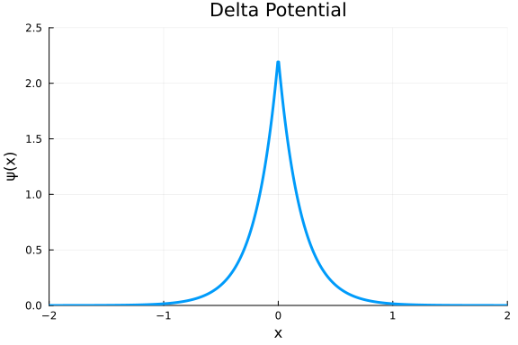

```@meta
CurrentModule = Antique
```

# Delta Potential

The Delta potential is one the simplest models for quantum mechanical system in 1D.
It always has one bound state and its wave function has a cusp at the origin.

## Defitions

``\alpha`` is the potential strength, ``m`` is the mass of particle.

#### Schrödinger Equation
```math
  \hat{H} \psi(x) = E \psi(x)
```

#### Hamiltonian
```math
  \hat{H} = - \frac{\hbar^2}{2m} \frac{\mathrm{d}^2}{\mathrm{d}x ^2} + V(x)
```

#### Potential
`V(model::DeltaPotential; x)`
```math
  V(x) = -\alpha \delta(x).
```

#### Eigen Values
`E(model::DeltaPotential)`
```math
  E = - \frac{m\alpha^2}{2\hbar^2}
```

#### Eigen Functions
`ψ(model::DeltaPotential, x)`
```math
   \psi(x) = \frac{\sqrt{m\alpha}}{\hbar} \mathrm{e}^{-m\alpha |x|/\hbar^2}
```

## Usage & Examples

[Install Antique.jl](@ref Install) for the first use and run `using Antique` before each use. The energy `E()`, wavefunction `ψ()`, potential `V()` and some other functions are suppoted. In this system, the model is generated by `DeltaPotential` and several parameters `α`, `m` and `ℏ` are set as optional arguments.

```julia
using Antique
DP = DeltaPotential(α=1.0, m=1.0, ℏ=1.0)
```


Parameters:

```julia
julia> DP.α
1.0

julia> DP.m
1.0

julia> DP.ℏ
1.0
```


Eigen values:

```julia
julia> E(DP)
-0.5
```


Wave functions:

```julia
DP = DeltaPotential(α=0.1, m=0.5, ℏ=0.1)
x = LinRange(-2,2,500);

using Plots
plot(x, x->ψ(DP,x), linewidth=3)
plot!(xlim=[-2,2], ylim=[0,2.5], legend=false)
plot!(xlabel="x", ylabel="ψ(x)", title="Delta Potential")
```




## Testing

Unit testing and Integration testing were done using numerical integration ([QuadGK.jl](https://juliamath.github.io/QuadGK.jl/stable/)). The test script is [here](https://github.com/ohno/Antique.jl/blob/main/test/DeltaPotential.jl).

#### Normalization of $\psi(x)$

```math
\int_{-\infty}^{\infty} \psi^\ast(x) \psi(x) ~\mathrm{d}x = 1
```

```
  α |   m |   ℏ |        analytical |         numerical 
--- | --- | --- | ----------------- | ----------------- 
0.1 | 0.1 | 0.1 |    1.000000000000 |    1.000000000000 ✔
0.1 | 0.1 | 1.0 |    1.000000000000 |    1.000000000000 ✔
0.1 | 0.1 | 7.0 |    1.000000000000 |    1.000004676239 ✔
0.1 | 1.0 | 0.1 |    1.000000000000 |    1.000000000000 ✔
0.1 | 1.0 | 1.0 |    1.000000000000 |    1.000000000000 ✔
0.1 | 1.0 | 7.0 |    1.000000000000 |    0.999999999999 ✔
0.1 | 7.0 | 0.1 |    1.000000000000 |    1.000000000000 ✔
0.1 | 7.0 | 1.0 |    1.000000000000 |    1.000000000000 ✔
0.1 | 7.0 | 7.0 |    1.000000000000 |    1.000000000000 ✔
1.0 | 0.1 | 0.1 |    1.000000000000 |    1.000000000000 ✔
1.0 | 0.1 | 1.0 |    1.000000000000 |    1.000000000000 ✔
1.0 | 0.1 | 7.0 |    1.000000000000 |    0.999999999999 ✔
1.0 | 1.0 | 0.1 |    1.000000000000 |    1.000000000000 ✔
1.0 | 1.0 | 1.0 |    1.000000000000 |    1.000000000000 ✔
1.0 | 1.0 | 7.0 |    1.000000000000 |    1.000000000000 ✔
1.0 | 7.0 | 0.1 |    1.000000000000 |    1.000000000000 ✔
1.0 | 7.0 | 1.0 |    1.000000000000 |    1.000000000000 ✔
1.0 | 7.0 | 7.0 |    1.000000000000 |    1.000000000000 ✔
7.0 | 0.1 | 0.1 |    1.000000000000 |    1.000000000000 ✔
7.0 | 0.1 | 1.0 |    1.000000000000 |    1.000000000000 ✔
7.0 | 0.1 | 7.0 |    1.000000000000 |    1.000000000000 ✔
7.0 | 1.0 | 0.1 |    1.000000000000 |    1.000000000000 ✔
7.0 | 1.0 | 1.0 |    1.000000000000 |    1.000000000000 ✔
7.0 | 1.0 | 7.0 |    1.000000000000 |    1.000000000000 ✔
7.0 | 7.0 | 0.1 |    1.000000000000 |    1.000000000000 ✔
7.0 | 7.0 | 1.0 |    1.000000000000 |    1.000000000000 ✔
7.0 | 7.0 | 7.0 |    1.000000000000 |    1.000000000000 ✔

```
