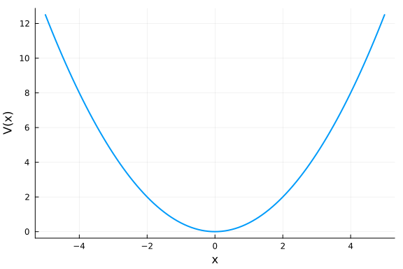
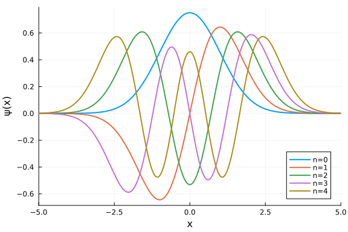

```@meta
CurrentModule = Antique
```

# Harmonic Oscillator

The harmonic oscillator is the most frequently used model in quantum physics.

## Definitions

This model is described with the time-independent Schrödinger equation
```math
  \hat{H} \psi(x) = E \psi(x),
```
and the Hamiltonian
```math
  \hat{H} = - \frac{\hbar^2}{2m} \frac{\mathrm{d}^2}{\mathrm{d}x ^2} + V(x).
```
Parameters are specified with the following struct.

#### Parameters
```@docs; canonical=false
Antique.HarmonicOscillator
```

#### Potential
```@docs; canonical=false
Antique.V(::HarmonicOscillator, ::Any)
```

#### Eigen Values
```@docs; canonical=false
Antique.E(::HarmonicOscillator)
```

#### Eigen Functions
```@docs; canonical=false
Antique.ψ(::HarmonicOscillator, ::Any)
```

#### Hermite Polynomials
```@docs; canonical=false
Antique.H(::HarmonicOscillator, ::Any)
```

#### Reference
- [DLMF 18.5.18](https://dlmf.nist.gov/18.5#E18)
- [cpprefjp](https://cpprefjp.github.io/reference/cmath/hermite.html)
- The Digital Library of Mathematical Functions (DLMF)                                                    [18.3 Table1](https://dlmf.nist.gov/18.3#T1), [18.5 Table1](https://dlmf.nist.gov/18.5#T1), [18.5.13](https://dlmf.nist.gov/18.5#E13), [18.5.18](https://dlmf.nist.gov/18.5#E18)
- L. D. Landau, E. M. Lifshitz, Quantum Mechanics (Pergamon Press, 1965)                                  [p.595 (a.4), (a.6)](https://archive.org/details/ost-physics-landaulifshitz-quantummechanics/page/n607/mode/2up)
- L. I. Schiff, Quantum Mechanics (McGraw-Hill Book Company, 1968)                                        [p.71 (13.12)](https://archive.org/details/ost-physics-schiff-quantummechanics/page/n87/mode/2up)
- A. Messiah, Quanfum Mechanics (Dover Publications, 1999)                                                [p.491 (B.59)](https://archive.org/details/quantummechanics0000mess/page/491/mode/1up)
- W. Greiner, Quantum Mechanics: An Introduction Third Edition (Springer, 1994)                           [p.152 (7.22)](https://archive.org/details/quantummechanics0001grei_u4x0/page/152/mode/1up)
- D. J. Griffiths, Introduction to Quantum Mechanics (Prentice Hall, 1995)                                [p.41 Table 2.1](https://archive.org/details/griffiths-introduction-to-quantum-mechanics/page/41/mode/1up), [p.43 (2.70)](https://archive.org/details/griffiths-introduction-to-quantum-mechanics/page/43/mode/1up)
- D. A. McQuarrie, J. D. Simon, Physical Chemistry: A Molecular Approach (University Science Books, 1997) [p.170 Table 5.2](https://archive.org/details/McQuarrieSimonPhysicalChemistrySolutions/McQuarrie_Simon_Physical_Chemistry1997/page/n193/mode/1up)
- P. W. Atkins, J. De Paula, Atkins' Physical Chemistry, 8th edition (W. H. Freeman, 2008)                [p.293 Table 9.1](https://archive.org/details/atkinsphysicalch00pwat/page/292/mode/2up)
- J. J. Sakurai, J. Napolitano, Modern Quantum Mechanics Third Edition (Cambridge University Press, 2021) [p.524 (B.29)](https://doi.org/10.1017/9781108587280)

## Usage & Examples

[Install Antique.jl](@ref Install) for the first use and run `using Antique` before each use. The energy `E()`, wavefunction `ψ()`, potential `V()` and some other functions are suppoted. In this system, the model is generated by `HarmonicOscillator` and several parameters `k`, `m` and `ℏ` are set as optional arguments.

```julia
using Antique
HO = HarmonicOscillator(k=1.0, m=1.0, ℏ=1.0)
```


Parameters:

```julia
julia> HO.k
1.0

julia> HO.m
1.0

julia> HO.ℏ
1.0
```


Eigen values:

```julia
julia> E(HO, n=0)
0.5

julia> E(HO, n=1)
1.5
```


Potential energy curve:

```julia
using Plots
plot(-5:0.1:5, x -> V(HO, x), lw=2, label="", xlabel="x", ylabel="V(x)")
```




Wave functions:

```julia
using Plots
plot(xlim=(-5,5), xlabel="x", ylabel="ψ(x)")
plot!(x -> ψ(HO, x, n=0), label="n=0", lw=2)
plot!(x -> ψ(HO, x, n=1), label="n=1", lw=2)
plot!(x -> ψ(HO, x, n=2), label="n=2", lw=2)
plot!(x -> ψ(HO, x, n=3), label="n=3", lw=2)
plot!(x -> ψ(HO, x, n=4), label="n=4", lw=2)
```




Potential energy curve, Energy levels, Wave functions:

```julia
using Plots
plot(xlim=(-5.5,5.5), ylim=(-0.2,5.4), xlabel="\$x\$", ylabel="\$V(x),~E_n,~\\psi_n(x)\\times0.5+E_n\$", size=(480,400), dpi=300)
for n in 0:4
  # energy
  hline!([E(HO, n=n)], lc=:black, ls=:dash, label="")
  plot!([-sqrt(2*HO.k*E(HO, n=n)),sqrt(2*HO.k*E(HO, n=n))], fill(E(HO, n=n),2), lc=:black, lw=2, label="")
  # wave function
  plot!(x -> E(HO, n=n) + 0.5*ψ(HO, x,n=n), lc=n+1, lw=2, label="")
end
# potential
plot!(x -> V(HO, x), lc=:black, lw=2, label="")
```


## Testing

Unit testing and Integration testing were done using computer algebra system ([Symbolics.jl](https://symbolics.juliasymbolics.org/stable/)) and numerical integration ([QuadGK.jl](https://juliamath.github.io/QuadGK.jl/stable/)). The test script is [here](https://github.com/ohno/Antique.jl/blob/main/test/HarmonicOscillator.jl).

#### Hermite Polynomials $H_n(x)$

```math
  \begin{aligned}
    H_{n}(x)
    &:= (-1)^n \mathrm{e}^{x^2} \frac{\mathrm{d}^n}{\mathrm{d}x^n} \mathrm{e}^{-x^2} \\
    &= n! \sum_{m=0}^{\lfloor n/2 \rfloor} \frac{(-1)^m}{m! (n-2m)!}(2 x)^{n-2m}.
  \end{aligned}
```

``n=0:`` ✔
```math
\begin{aligned}
  H_{0}(x)
   = e^{ - x^{2}} e^{x^{2}}
  &= 1 \\
  &= 1
\end{aligned}
```

``n=1:`` ✔
```math
\begin{aligned}
  H_{1}(x)
   =  - e^{x^{2}} \frac{\mathrm{d} e^{ - x^{2}}}{\mathrm{d}x}
  &= 2 x \\
  &= 2 x
\end{aligned}
```

``n=2:`` ✔
```math
\begin{aligned}
  H_{2}(x)
   = e^{x^{2}} \frac{\mathrm{d}}{\mathrm{d}x} \frac{\mathrm{d} e^{ - x^{2}}}{\mathrm{d}x}
  &= -2 + 4 x^{2} \\
  &= -2 + 4 x^{2}
\end{aligned}
```

``n=3:`` ✔
```math
\begin{aligned}
  H_{3}(x)
   =  - \frac{\mathrm{d}}{\mathrm{d}x} \frac{\mathrm{d}}{\mathrm{d}x} \frac{\mathrm{d} e^{ - x^{2}}}{\mathrm{d}x} e^{x^{2}}
  &=  - 12 x + 8 x^{3} \\
  &=  - 12 x + 8 x^{3}
\end{aligned}
```

``n=4:`` ✔
```math
\begin{aligned}
  H_{4}(x)
   = e^{x^{2}} \frac{\mathrm{d}}{\mathrm{d}x} \frac{\mathrm{d}}{\mathrm{d}x} \frac{\mathrm{d}}{\mathrm{d}x} \frac{\mathrm{d} e^{ - x^{2}}}{\mathrm{d}x}
  &= 12 - 48 x^{2} + 16 x^{4} \\
  &= 12 - 48 x^{2} + 16 x^{4}
\end{aligned}
```

``n=5:`` ✔
```math
\begin{aligned}
  H_{5}(x)
   =  - \frac{\mathrm{d}}{\mathrm{d}x} \frac{\mathrm{d}}{\mathrm{d}x} \frac{\mathrm{d}}{\mathrm{d}x} \frac{\mathrm{d}}{\mathrm{d}x} \frac{\mathrm{d} e^{ - x^{2}}}{\mathrm{d}x} e^{x^{2}}
  &= 120 x - 160 x^{3} + 32 x^{5} \\
  &= 120 x - 160 x^{3} + 32 x^{5}
\end{aligned}
```

``n=6:`` ✔
```math
\begin{aligned}
  H_{6}(x)
   = e^{x^{2}} \frac{\mathrm{d}}{\mathrm{d}x} \frac{\mathrm{d}}{\mathrm{d}x} \frac{\mathrm{d}}{\mathrm{d}x} \frac{\mathrm{d}}{\mathrm{d}x} \frac{\mathrm{d}}{\mathrm{d}x} \frac{\mathrm{d} e^{ - x^{2}}}{\mathrm{d}x}
  &= -120 + 720 x^{2} - 480 x^{4} + 64 x^{6} \\
  &= -120 + 720 x^{2} - 480 x^{4} + 64 x^{6}
\end{aligned}
```

``n=7:`` ✔
```math
\begin{aligned}
  H_{7}(x)
   =  - e^{x^{2}} \frac{\mathrm{d}}{\mathrm{d}x} \frac{\mathrm{d}}{\mathrm{d}x} \frac{\mathrm{d}}{\mathrm{d}x} \frac{\mathrm{d}}{\mathrm{d}x} \frac{\mathrm{d}}{\mathrm{d}x} \frac{\mathrm{d}}{\mathrm{d}x} \frac{\mathrm{d} e^{ - x^{2}}}{\mathrm{d}x}
  &=  - 1680 x + 3360 x^{3} - 1344 x^{5} + 128 x^{7} \\
  &=  - 1680 x + 3360 x^{3} - 1344 x^{5} + 128 x^{7}
\end{aligned}
```

``n=8:`` ✔
```math
\begin{aligned}
  H_{8}(x)
   = e^{x^{2}} \frac{\mathrm{d}}{\mathrm{d}x} \frac{\mathrm{d}}{\mathrm{d}x} \frac{\mathrm{d}}{\mathrm{d}x} \frac{\mathrm{d}}{\mathrm{d}x} \frac{\mathrm{d}}{\mathrm{d}x} \frac{\mathrm{d}}{\mathrm{d}x} \frac{\mathrm{d}}{\mathrm{d}x} \frac{\mathrm{d} e^{ - x^{2}}}{\mathrm{d}x}
  &= 1680 - 13440 x^{2} + 13440 x^{4} - 3584 x^{6} + 256 x^{8} \\
  &= 1680 - 13440 x^{2} + 13440 x^{4} - 3584 x^{6} + 256 x^{8}
\end{aligned}
```

``n=9:`` ✔
```math
\begin{aligned}
  H_{9}(x)
   =  - e^{x^{2}} \frac{\mathrm{d}}{\mathrm{d}x} \frac{\mathrm{d}}{\mathrm{d}x} \frac{\mathrm{d}}{\mathrm{d}x} \frac{\mathrm{d}}{\mathrm{d}x} \frac{\mathrm{d}}{\mathrm{d}x} \frac{\mathrm{d}}{\mathrm{d}x} \frac{\mathrm{d}}{\mathrm{d}x} \frac{\mathrm{d}}{\mathrm{d}x} \frac{\mathrm{d} e^{ - x^{2}}}{\mathrm{d}x}
  &= 30240 x - 80640 x^{3} + 48384 x^{5} - 9216 x^{7} + 512 x^{9} \\
  &= 30240 x - 80640 x^{3} + 48384 x^{5} - 9216 x^{7} + 512 x^{9}
\end{aligned}
```

```
```

#### Normalization & Orthogonality of $H_n(x)$

```math
\int_{-\infty}^\infty H_j(x) H_i(x) \mathrm{e}^{-x^2} \mathrm{d}x = \sqrt{\pi} 2^j j! \delta_{ij}
```

```
 i |  j |        analytical |         numerical 
-- | -- | ----------------- | ----------------- 
 0 |  0 |    1.772453850906 |    1.772453850906 ✔
 0 |  1 |    0.000000000000 |    0.000000000000 ✔
 0 |  2 |    0.000000000000 |    0.000000000000 ✔
 0 |  3 |    0.000000000000 |    0.000000000000 ✔
 0 |  4 |    0.000000000000 |   -0.000000000000 ✔
 0 |  5 |    0.000000000000 |   -0.000000000000 ✔
 0 |  6 |    0.000000000000 |    0.000000000000 ✔
 0 |  7 |    0.000000000000 |    0.000000000000 ✔
 0 |  8 |    0.000000000000 |   -0.000000000001 ✔
 0 |  9 |    0.000000000000 |    0.000000000000 ✔
 1 |  0 |    0.000000000000 |    0.000000000000 ✔
 1 |  1 |    3.544907701811 |    3.544907701811 ✔
 1 |  2 |    0.000000000000 |    0.000000000000 ✔
 1 |  3 |    0.000000000000 |   -0.000000000000 ✔
 1 |  4 |    0.000000000000 |   -0.000000000000 ✔
 1 |  5 |    0.000000000000 |    0.000000000000 ✔
 1 |  6 |    0.000000000000 |    0.000000000000 ✔
 1 |  7 |    0.000000000000 |   -0.000000000000 ✔
 1 |  8 |    0.000000000000 |   -0.000000000000 ✔
 1 |  9 |    0.000000000000 |    0.000000000014 ✔
 2 |  0 |    0.000000000000 |    0.000000000000 ✔
 2 |  1 |    0.000000000000 |    0.000000000000 ✔
 2 |  2 |   14.179630807244 |   14.179630807244 ✔
 2 |  3 |    0.000000000000 |   -0.000000000000 ✔
 2 |  4 |    0.000000000000 |   -0.000000000000 ✔
 2 |  5 |    0.000000000000 |    0.000000000000 ✔
 2 |  6 |    0.000000000000 |    0.000000000000 ✔
 2 |  7 |    0.000000000000 |    0.000000000000 ✔
 2 |  8 |    0.000000000000 |   -0.000000000011 ✔
 2 |  9 |    0.000000000000 |   -0.000000000002 ✔
 3 |  0 |    0.000000000000 |    0.000000000000 ✔
 3 |  1 |    0.000000000000 |   -0.000000000000 ✔
 3 |  2 |    0.000000000000 |   -0.000000000000 ✔
 3 |  3 |   85.077784843465 |   85.077784843465 ✔
 3 |  4 |    0.000000000000 |   -0.000000000000 ✔
 3 |  5 |    0.000000000000 |    0.000000000000 ✔
 3 |  6 |    0.000000000000 |   -0.000000000000 ✔
 3 |  7 |    0.000000000000 |   -0.000000000000 ✔
 3 |  8 |    0.000000000000 |   -0.000000000000 ✔
 3 |  9 |    0.000000000000 |    0.000000000139 ✔
 4 |  0 |    0.000000000000 |   -0.000000000000 ✔
 4 |  1 |    0.000000000000 |   -0.000000000000 ✔
 4 |  2 |    0.000000000000 |   -0.000000000000 ✔
 4 |  3 |    0.000000000000 |   -0.000000000000 ✔
 4 |  4 |  680.622278747718 |  680.622278747718 ✔
 4 |  5 |    0.000000000000 |   -0.000000000000 ✔
 4 |  6 |    0.000000000000 |    0.000000000002 ✔
 4 |  7 |    0.000000000000 |    0.000000000000 ✔
 4 |  8 |    0.000000000000 |   -0.000000000063 ✔
 4 |  9 |    0.000000000000 |    0.000000000000 ✔
 5 |  0 |    0.000000000000 |   -0.000000000000 ✔
 5 |  1 |    0.000000000000 |    0.000000000000 ✔
 5 |  2 |    0.000000000000 |    0.000000000000 ✔
 5 |  3 |    0.000000000000 |    0.000000000000 ✔
 5 |  4 |    0.000000000000 |   -0.000000000000 ✔
 5 |  5 | 6806.222787477181 | 6806.222787477180 ✔
 5 |  6 |    0.000000000000 |    0.000000000000 ✔
 5 |  7 |    0.000000000000 |    0.000000000009 ✔
 5 |  8 |    0.000000000000 |    0.000000000000 ✔
 5 |  9 |    0.000000000000 |    0.000000001339 ✔
 6 |  0 |    0.000000000000 |    0.000000000000 ✔
 6 |  1 |    0.000000000000 |    0.000000000000 ✔
 6 |  2 |    0.000000000000 |    0.000000000000 ✔
 6 |  3 |    0.000000000000 |   -0.000000000000 ✔
 6 |  4 |    0.000000000000 |    0.000000000002 ✔
 6 |  5 |    0.000000000000 |    0.000000000000 ✔
 6 |  6 | 81674.673449726179 | 81674.673449726135 ✔
 6 |  7 |    0.000000000000 |    0.000000000004 ✔
 6 |  8 |    0.000000000000 |    0.000000000397 ✔
 6 |  9 |    0.000000000000 |   -0.000000000087 ✔
 7 |  0 |    0.000000000000 |    0.000000000000 ✔
 7 |  1 |    0.000000000000 |   -0.000000000000 ✔
 7 |  2 |    0.000000000000 |    0.000000000000 ✔
 7 |  3 |    0.000000000000 |   -0.000000000000 ✔
 7 |  4 |    0.000000000000 |    0.000000000000 ✔
 7 |  5 |    0.000000000000 |    0.000000000009 ✔
 7 |  6 |    0.000000000000 |    0.000000000004 ✔
 7 |  7 | 1143445.428296166472 | 1143445.428296166705 ✔
 7 |  8 |    0.000000000000 |   -0.000000000007 ✔
 7 |  9 |    0.000000000000 |    0.000000011649 ✔
 8 |  0 |    0.000000000000 |   -0.000000000001 ✔
 8 |  1 |    0.000000000000 |   -0.000000000000 ✔
 8 |  2 |    0.000000000000 |   -0.000000000011 ✔
 8 |  3 |    0.000000000000 |   -0.000000000000 ✔
 8 |  4 |    0.000000000000 |   -0.000000000063 ✔
 8 |  5 |    0.000000000000 |    0.000000000000 ✔
 8 |  6 |    0.000000000000 |    0.000000000397 ✔
 8 |  7 |    0.000000000000 |   -0.000000000007 ✔
 8 |  8 | 18295126.852738663554 | 18295126.852738667279 ✔
 8 |  9 |    0.000000000000 |    0.000000001630 ✔
 9 |  0 |    0.000000000000 |    0.000000000000 ✔
 9 |  1 |    0.000000000000 |    0.000000000014 ✔
 9 |  2 |    0.000000000000 |   -0.000000000002 ✔
 9 |  3 |    0.000000000000 |    0.000000000139 ✔
 9 |  4 |    0.000000000000 |    0.000000000000 ✔
 9 |  5 |    0.000000000000 |    0.000000001339 ✔
 9 |  6 |    0.000000000000 |   -0.000000000087 ✔
 9 |  7 |    0.000000000000 |    0.000000011649 ✔
 9 |  8 |    0.000000000000 |    0.000000001630 ✔
 9 |  9 | 329312283.349295914173 | 329312283.349295675755 ✔
```

#### Normalization & Orthogonality of $\psi_n(x)$

```math
\int \psi_i^\ast(x) \psi_j(x) \mathrm{d}x = \delta_{ij}
```

```
 i |  j |        analytical |         numerical 
-- | -- | ----------------- | ----------------- 
 0 |  0 |    1.000000000000 |    1.000000000000 ✔
 0 |  1 |    0.000000000000 |    0.000000000000 ✔
 0 |  2 |    0.000000000000 |    0.000000000000 ✔
 0 |  3 |    0.000000000000 |    0.000000000000 ✔
 0 |  4 |    0.000000000000 |   -0.000000000000 ✔
 0 |  5 |    0.000000000000 |   -0.000000000000 ✔
 0 |  6 |    0.000000000000 |    0.000000000000 ✔
 0 |  7 |    0.000000000000 |    0.000000000000 ✔
 0 |  8 |    0.000000000000 |   -0.000000000000 ✔
 0 |  9 |    0.000000000000 |    0.000000000000 ✔
 1 |  0 |    0.000000000000 |    0.000000000000 ✔
 1 |  1 |    1.000000000000 |    1.000000000000 ✔
 1 |  2 |    0.000000000000 |    0.000000000000 ✔
 1 |  3 |    0.000000000000 |   -0.000000000000 ✔
 1 |  4 |    0.000000000000 |   -0.000000000000 ✔
 1 |  5 |    0.000000000000 |    0.000000000000 ✔
 1 |  6 |    0.000000000000 |    0.000000000000 ✔
 1 |  7 |    0.000000000000 |   -0.000000000000 ✔
 1 |  8 |    0.000000000000 |    0.000000000000 ✔
 1 |  9 |    0.000000000000 |    0.000000000000 ✔
 2 |  0 |    0.000000000000 |    0.000000000000 ✔
 2 |  1 |    0.000000000000 |    0.000000000000 ✔
 2 |  2 |    1.000000000000 |    1.000000000000 ✔
 2 |  3 |    0.000000000000 |   -0.000000000000 ✔
 2 |  4 |    0.000000000000 |   -0.000000000000 ✔
 2 |  5 |    0.000000000000 |   -0.000000000000 ✔
 2 |  6 |    0.000000000000 |    0.000000000000 ✔
 2 |  7 |    0.000000000000 |    0.000000000000 ✔
 2 |  8 |    0.000000000000 |   -0.000000000000 ✔
 2 |  9 |    0.000000000000 |    0.000000000000 ✔
 3 |  0 |    0.000000000000 |    0.000000000000 ✔
 3 |  1 |    0.000000000000 |   -0.000000000000 ✔
 3 |  2 |    0.000000000000 |   -0.000000000000 ✔
 3 |  3 |    1.000000000000 |    1.000000000000 ✔
 3 |  4 |    0.000000000000 |   -0.000000000000 ✔
 3 |  5 |    0.000000000000 |    0.000000000000 ✔
 3 |  6 |    0.000000000000 |    0.000000000000 ✔
 3 |  7 |    0.000000000000 |    0.000000000000 ✔
 3 |  8 |    0.000000000000 |   -0.000000000000 ✔
 3 |  9 |    0.000000000000 |    0.000000000000 ✔
 4 |  0 |    0.000000000000 |   -0.000000000000 ✔
 4 |  1 |    0.000000000000 |   -0.000000000000 ✔
 4 |  2 |    0.000000000000 |   -0.000000000000 ✔
 4 |  3 |    0.000000000000 |   -0.000000000000 ✔
 4 |  4 |    1.000000000000 |    1.000000000000 ✔
 4 |  5 |    0.000000000000 |    0.000000000000 ✔
 4 |  6 |    0.000000000000 |    0.000000000000 ✔
 4 |  7 |    0.000000000000 |    0.000000000000 ✔
 4 |  8 |    0.000000000000 |   -0.000000000000 ✔
 4 |  9 |    0.000000000000 |   -0.000000000000 ✔
 5 |  0 |    0.000000000000 |   -0.000000000000 ✔
 5 |  1 |    0.000000000000 |    0.000000000000 ✔
 5 |  2 |    0.000000000000 |   -0.000000000000 ✔
 5 |  3 |    0.000000000000 |    0.000000000000 ✔
 5 |  4 |    0.000000000000 |    0.000000000000 ✔
 5 |  5 |    1.000000000000 |    1.000000000000 ✔
 5 |  6 |    0.000000000000 |    0.000000000000 ✔
 5 |  7 |    0.000000000000 |    0.000000000000 ✔
 5 |  8 |    0.000000000000 |    0.000000000000 ✔
 5 |  9 |    0.000000000000 |    0.000000000000 ✔
 6 |  0 |    0.000000000000 |    0.000000000000 ✔
 6 |  1 |    0.000000000000 |    0.000000000000 ✔
 6 |  2 |    0.000000000000 |    0.000000000000 ✔
 6 |  3 |    0.000000000000 |    0.000000000000 ✔
 6 |  4 |    0.000000000000 |    0.000000000000 ✔
 6 |  5 |    0.000000000000 |    0.000000000000 ✔
 6 |  6 |    1.000000000000 |    1.000000000000 ✔
 6 |  7 |    0.000000000000 |   -0.000000000000 ✔
 6 |  8 |    0.000000000000 |    0.000000000000 ✔
 6 |  9 |    0.000000000000 |    0.000000000000 ✔
 7 |  0 |    0.000000000000 |    0.000000000000 ✔
 7 |  1 |    0.000000000000 |   -0.000000000000 ✔
 7 |  2 |    0.000000000000 |    0.000000000000 ✔
 7 |  3 |    0.000000000000 |    0.000000000000 ✔
 7 |  4 |    0.000000000000 |    0.000000000000 ✔
 7 |  5 |    0.000000000000 |    0.000000000000 ✔
 7 |  6 |    0.000000000000 |   -0.000000000000 ✔
 7 |  7 |    1.000000000000 |    1.000000000000 ✔
 7 |  8 |    0.000000000000 |    0.000000000000 ✔
 7 |  9 |    0.000000000000 |    0.000000000000 ✔
 8 |  0 |    0.000000000000 |   -0.000000000000 ✔
 8 |  1 |    0.000000000000 |    0.000000000000 ✔
 8 |  2 |    0.000000000000 |   -0.000000000000 ✔
 8 |  3 |    0.000000000000 |   -0.000000000000 ✔
 8 |  4 |    0.000000000000 |   -0.000000000000 ✔
 8 |  5 |    0.000000000000 |    0.000000000000 ✔
 8 |  6 |    0.000000000000 |    0.000000000000 ✔
 8 |  7 |    0.000000000000 |    0.000000000000 ✔
 8 |  8 |    1.000000000000 |    1.000000000000 ✔
 8 |  9 |    0.000000000000 |   -0.000000000000 ✔
 9 |  0 |    0.000000000000 |    0.000000000000 ✔
 9 |  1 |    0.000000000000 |    0.000000000000 ✔
 9 |  2 |    0.000000000000 |    0.000000000000 ✔
 9 |  3 |    0.000000000000 |    0.000000000000 ✔
 9 |  4 |    0.000000000000 |   -0.000000000000 ✔
 9 |  5 |    0.000000000000 |    0.000000000000 ✔
 9 |  6 |    0.000000000000 |    0.000000000000 ✔
 9 |  7 |    0.000000000000 |    0.000000000000 ✔
 9 |  8 |    0.000000000000 |   -0.000000000000 ✔
 9 |  9 |    1.000000000000 |    1.000000000000 ✔
```

#### Virial Theorem

The virial theorem $\langle T \rangle = \langle V \rangle$ and the definition of Hamiltonian $\langle H \rangle = \langle T \rangle + \langle V \rangle$ derive $\langle H \rangle = 2 \langle V \rangle = 2 \langle T \rangle$.

```math
2 \int \psi_n^\ast(x) V(x) \psi_n(x) \mathrm{d}x = E_n
```

```
  k |  n |        analytical |         numerical 
--- | -- | ----------------- | ----------------- 
0.1 |  0 |    0.500000000000 |    0.500000000000 ✔
0.1 |  1 |    1.500000000000 |    1.500000000000 ✔
0.1 |  2 |    2.500000000000 |    2.500000000000 ✔
0.1 |  3 |    3.500000000000 |    3.500000000000 ✔
0.1 |  4 |    4.500000000000 |    4.500000000000 ✔
0.1 |  5 |    5.500000000000 |    5.500000000000 ✔
0.1 |  6 |    6.500000000000 |    6.500000000000 ✔
0.1 |  7 |    7.500000000000 |    7.500000000000 ✔
0.1 |  8 |    8.500000000000 |    8.500000000000 ✔
0.1 |  9 |    9.500000000000 |    9.500000000000 ✔
0.5 |  0 |    0.500000000000 |    0.500000000000 ✔
0.5 |  1 |    1.500000000000 |    1.500000000000 ✔
0.5 |  2 |    2.500000000000 |    2.500000000000 ✔
0.5 |  3 |    3.500000000000 |    3.500000000000 ✔
0.5 |  4 |    4.500000000000 |    4.500000000000 ✔
0.5 |  5 |    5.500000000000 |    5.500000000000 ✔
0.5 |  6 |    6.500000000000 |    6.500000000000 ✔
0.5 |  7 |    7.500000000000 |    7.500000000000 ✔
0.5 |  8 |    8.500000000000 |    8.500000000000 ✔
0.5 |  9 |    9.500000000000 |    9.500000000000 ✔
1.0 |  0 |    0.500000000000 |    0.500000000000 ✔
1.0 |  1 |    1.500000000000 |    1.500000000000 ✔
1.0 |  2 |    2.500000000000 |    2.500000000000 ✔
1.0 |  3 |    3.500000000000 |    3.500000000000 ✔
1.0 |  4 |    4.500000000000 |    4.500000000000 ✔
1.0 |  5 |    5.500000000000 |    5.500000000000 ✔
1.0 |  6 |    6.500000000000 |    6.500000000000 ✔
1.0 |  7 |    7.500000000000 |    7.500000000000 ✔
1.0 |  8 |    8.500000000000 |    8.500000000000 ✔
1.0 |  9 |    9.500000000000 |    9.500000000000 ✔
5.0 |  0 |    0.500000000000 |    0.500000000000 ✔
5.0 |  1 |    1.500000000000 |    1.500000000000 ✔
5.0 |  2 |    2.500000000000 |    2.500000000000 ✔
5.0 |  3 |    3.500000000000 |    3.500000000000 ✔
5.0 |  4 |    4.500000000000 |    4.500000000000 ✔
5.0 |  5 |    5.500000000000 |    5.500000000000 ✔
5.0 |  6 |    6.500000000000 |    6.500000000000 ✔
5.0 |  7 |    7.500000000000 |    7.500000000000 ✔
5.0 |  8 |    8.500000000000 |    8.500000000000 ✔
5.0 |  9 |    9.500000000000 |    9.500000000000 ✔
```

#### Eigen Values

```math
  \begin{aligned}
    E_n
    &=      \int \psi^\ast_n(x) \hat{H} \psi_n(x) \mathrm{d}x \\
    &=      \int \psi^\ast_n(x) \left[ \hat{V} + \hat{T} \right] \psi(x) \mathrm{d}x \\
    &=      \int \psi^\ast_n(x) \left[ V(x) - \frac{\hbar^2}{2m} \frac{\mathrm{d}^{2}}{\mathrm{d} x^{2}} \right] \psi(x) \mathrm{d}x \\
    &\simeq \int \psi^\ast_n(x) \left[ V(x)\psi(x) -\frac{\hbar^2}{2m} \frac{\psi(x+\Delta x) - 2\psi(x) + \psi(x-\Delta x)}{\Delta x^{2}} \right] \mathrm{d}x.
  \end{aligned}
```

Where, the difference formula for the 2nd-order derivative:

```math
\begin{aligned}
  % 2\psi(x)
  % + \frac{\mathrm{d}^{2} \psi(x)}{\mathrm{d} x^{2}} \Delta x^{2}
  % + O\left(\Delta x^{4}\right)
  % &=
  % \psi(x+\Delta x)
  % + \psi(x-\Delta x)
  % \\
  % \frac{\mathrm{d}^{2} \psi(x)}{\mathrm{d} x^{2}} \Delta x^{2}
  % &=
  % \psi(x+\Delta x)
  % - 2\psi(x)
  % + \psi(x-\Delta x)
  % - O\left(\Delta x^{4}\right)
  % \\
  % \frac{\mathrm{d}^{2} \psi(x)}{\mathrm{d} x^{2}}
  % &=
  % \frac{\psi(x+\Delta x) - 2\psi(x) + \psi(x-\Delta x)}{\Delta x^{2}}
  % - \frac{O\left(\Delta x^{4}\right)}{\Delta x^{2}}
  % \\
  \frac{\mathrm{d}^{2} \psi(x)}{\mathrm{d} x^{2}}
  &=
  \frac{\psi(x+\Delta x) - 2\psi(x) + \psi(x-\Delta x)}{\Delta x^{2}}
  + O\left(\Delta x^{2}\right)
\end{aligned}
```

are given by the sum of 2 Taylor series:

```math
\begin{aligned}
\psi(x+\Delta x)
&= \psi(x)
+ \frac{\mathrm{d} \psi(x)}{\mathrm{d} x} \Delta x
+ \frac{1}{2!} \frac{\mathrm{d}^{2} \psi(x)}{\mathrm{d} x^{2}} \Delta x^{2}
+ \frac{1}{3!} \frac{\mathrm{d}^{3} \psi(x)}{\mathrm{d} x^{3}} \Delta x^{3}
+ O\left(\Delta x^{4}\right),
\\
\psi(x-\Delta x)
&= \psi(x)
- \frac{\mathrm{d} \psi(x)}{\mathrm{d} x} \Delta x
+ \frac{1}{2!} \frac{\mathrm{d}^{2} \psi(x)}{\mathrm{d} x^{2}} \Delta x^{2}
- \frac{1}{3!} \frac{\mathrm{d}^{3} \psi(x)}{\mathrm{d} x^{3}} \Delta x^{3}
+ O\left(\Delta x^{4}\right).
\end{aligned}
```

```
  k |  n |        analytical |         numerical 
--- | -- | ----------------- | ----------------- 
0.1 |  0 |    0.158113883008 |    0.158113879883 ✔
0.1 |  1 |    0.474341649025 |    0.474341633410 ✔
0.1 |  2 |    0.790569415042 |    0.790569374409 ✔
0.1 |  3 |    1.106797181059 |    1.106797102928 ✔
0.1 |  4 |    1.423024947076 |    1.423024818987 ✔
0.1 |  5 |    1.739252713093 |    1.739252522506 ✔
0.1 |  6 |    2.055480479109 |    2.055480213500 ✔
0.1 |  7 |    2.371708245126 |    2.371707891950 ✔
0.1 |  8 |    2.687936011143 |    2.687935558100 ✔
0.1 |  9 |    3.004163777160 |    3.004163211450 ✔
0.5 |  0 |    0.353553390593 |    0.353553374944 ✔
0.5 |  1 |    1.060660171780 |    1.060660093649 ✔
0.5 |  2 |    1.767766952966 |    1.767766749878 ✔
0.5 |  3 |    2.474873734153 |    2.474873343556 ✔
0.5 |  4 |    3.181980515339 |    3.181979874817 ✔
0.5 |  5 |    3.889087296526 |    3.889086343463 ✔
0.5 |  6 |    4.596194077713 |    4.596192749665 ✔
0.5 |  7 |    5.303300858899 |    5.303299093519 ✔
0.5 |  8 |    6.010407640086 |    6.010405374197 ✔
0.5 |  9 |    6.717514421272 |    6.717511593266 ✔
1.0 |  0 |    0.500000000000 |    0.499999968773 ✔
1.0 |  1 |    1.500000000000 |    1.499999843774 ✔
1.0 |  2 |    2.500000000000 |    2.499999593764 ✔
1.0 |  3 |    3.500000000000 |    3.499999218732 ✔
1.0 |  4 |    4.500000000000 |    4.499998718747 ✔
1.0 |  5 |    5.500000000000 |    5.499998093755 ✔
1.0 |  6 |    6.500000000000 |    6.499997343602 ✔
1.0 |  7 |    7.500000000000 |    7.499996468887 ✔
1.0 |  8 |    8.500000000000 |    8.499995468843 ✔
1.0 |  9 |    9.500000000000 |    9.499994343445 ✔
5.0 |  0 |    1.118033988750 |    1.118033832523 ✔
5.0 |  1 |    3.354101966250 |    3.354101184969 ✔
5.0 |  2 |    5.590169943749 |    5.590167912524 ✔
5.0 |  3 |    7.826237921249 |    7.826234014984 ✔
5.0 |  4 |   10.062305898749 |   10.062299492494 ✔
5.0 |  5 |   12.298373876249 |   12.298364344997 ✔
5.0 |  6 |   14.534441853749 |   14.534428572309 ✔
5.0 |  7 |   16.770509831248 |   16.770492175222 ✔
5.0 |  8 |   19.006577808748 |   19.006555152416 ✔
5.0 |  9 |   21.242645786248 |   21.242617504750 ✔

```
