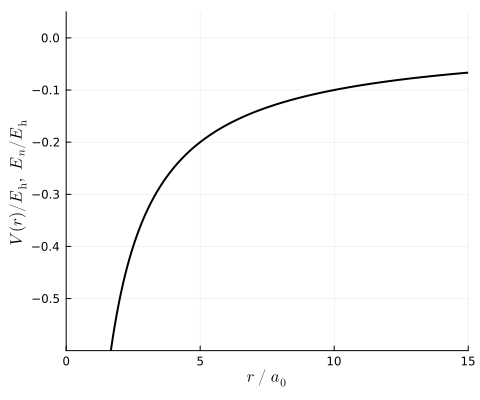
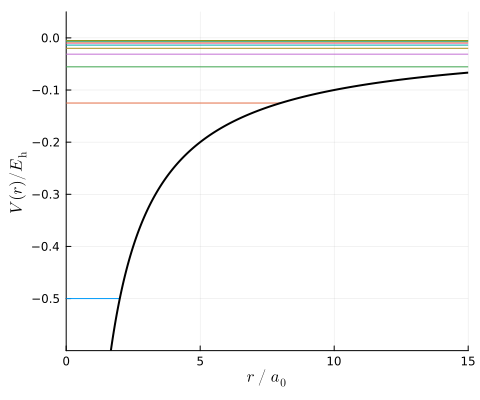
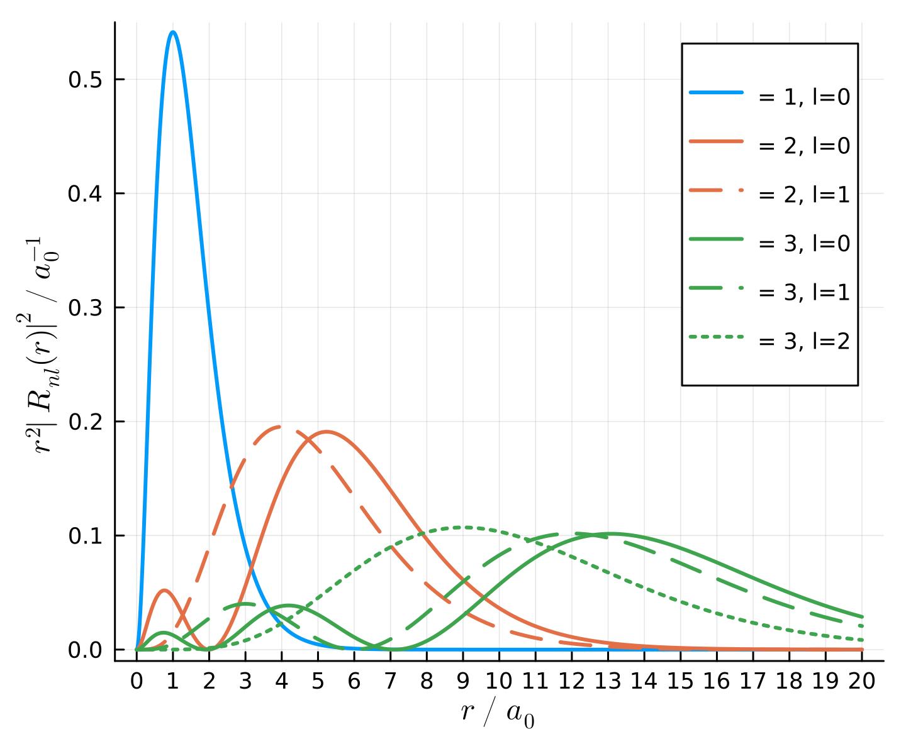

```@meta
CurrentModule = Antique
```

# Hydrogen Atom

The hydrogen atom is the simplest 2-body Coulomb system.

## Definitions

This model is described with the time-independent Schrödinger equation
```math
  \hat{H} \psi(\pmb{r}) = E \psi(\pmb{r}),
```
and the Hamiltonian
```math
  \hat{H} = - \frac{\hbar^2}{2\mu} \frac{\mathrm{d}^2}{\mathrm{d}r ^2} + V(r),
```
where $\mu=\left(\frac{1}{m_\mathrm{e}}+\frac{1}{m_\mathrm{p}}\right)^{-1}$ is the reduced mass of electron $\mathrm{e}$ and proton $\mathrm{p}$. $\mu = m_\mathrm{e}$ holds in the limit $m_\mathrm{p}\rightarrow\infty$. Parameters are specified with the following struct.

#### Parameters
```@docs; canonical=false
Antique.HydrogenAtom
```

#### Potential
```@docs; canonical=false
Antique.V(::HydrogenAtom, ::Any)
```

#### Eigen Values
```@docs; canonical=false
Antique.E(::HydrogenAtom)
```

#### Eigen Functions
```@docs; canonical=false
Antique.ψ(::HydrogenAtom, ::Any, ::Any, ::Any)
```

#### Radial Functions
```@docs; canonical=false
Antique.R(::HydrogenAtom, ::Any)
```

#### Associated Laguerre Polynomials
```@docs; canonical=false
Antique.L(::HydrogenAtom, ::Any)
```

#### Spherical Harmonics
```@docs; canonical=false
Antique.Y(::HydrogenAtom, ::Any, ::Any)
```

#### Associated Legendre Polynomials
```@docs; canonical=false
Antique.P(::HydrogenAtom, ::Any)
```

#### References
- cpprefjp, [legendre](https://cpprefjp.github.io/reference/cmath/legendre.html), [assoc_legendre](https://cpprefjp.github.io/reference/cmath/assoc_legendre.html), [laguerre](https://cpprefjp.github.io/reference/cmath/laguerre.html), [assoc_laguerre](https://cpprefjp.github.io/reference/cmath/assoc_laguerre.html)
- The Digital Library of Mathematical Functions (DLMF), [18.3 Table1](https://dlmf.nist.gov/18.3#T1), [18.5 Table1](https://dlmf.nist.gov/18.5#T1), [18.5.16](https://dlmf.nist.gov/18.5#E16), [18.3 Table1](https://dlmf.nist.gov/18.3#T1), [18.5 Table1](https://dlmf.nist.gov/18.5#T1), [18.5.17](https://dlmf.nist.gov/18.5#E17), [18.3 Table1](https://dlmf.nist.gov/18.3#T1), [18.5 Table1](https://dlmf.nist.gov/18.5#T1), [18.5.12](https://dlmf.nist.gov/18.5#E12)
- L. D. Landau, E. M. Lifshitz, Quantum Mechanics (Pergamon Press, 1965), [p.598 (c.1)](https://archive.org/details/ost-physics-landaulifshitz-quantummechanics/page/n611/mode/2up), [p.598 (c.4)](https://archive.org/details/ost-physics-landaulifshitz-quantummechanics/page/n611/mode/2up), [p.603 (d.13)](https://archive.org/details/ost-physics-landaulifshitz-quantummechanics/page/n615/mode/2up), [p.603 (d.13)](https://archive.org/details/ost-physics-landaulifshitz-quantummechanics/page/n615/mode/2up)
- L. I. Schiff, Quantum Mechanics (McGraw-Hill Book Company, 1968), [p.79 (14.12)](https://archive.org/details/ost-physics-schiff-quantummechanics/page/n95/mode/1up), [p.93 (16.19)](https://archive.org/details/ost-physics-schiff-quantummechanics/page/n109/mode/1up)
- A. Messiah, Quanfum Mechanics (Dover Publications, 1999), [p.493 (B.72)](https://archive.org/details/quantummechanics0000mess/page/491/mode/1up), [p.494 Table](https://archive.org/details/quantummechanics0000mess/page/494/mode/1up), [p.493 (B.72)](https://archive.org/details/quantummechanics0000mess/page/491/mode/1up), [p.483 (B.12)](https://archive.org/details/quantummechanics0000mess/page/483/mode/1up), [p.483 (B.12)](https://archive.org/details/quantummechanics0000mess/page/483/mode/1up)
- W. Greiner, Quantum Mechanics: An Introduction Third Edition (Springer, 1994), [p.83 (4)](https://archive.org/details/quantummechanics0001grei_u4x0/page/83/mode/1up), [p.83 (5)](https://archive.org/details/quantummechanics0001grei_u4x0/page/83/mode/1up), [p.149 (21)](https://archive.org/details/quantummechanics0001grei_u4x0/page/149/mode/1up)
- D. J. Griffiths, Introduction to Quantum Mechanics (Prentice Hall, 1995), [p.126 (4.28)](https://archive.org/details/griffiths-introduction-to-quantum-mechanics/page/126/mode/1up), [p.96 Table3.1](https://archive.org/details/griffiths-introduction-to-quantum-mechanics/page/95/mode/1up), [p.126 (4.27)](https://archive.org/details/griffiths-introduction-to-quantum-mechanics/page/126/mode/1up), [p.139 (4.88)](https://archive.org/details/griffiths-introduction-to-quantum-mechanics/page/139/mode/1up), [p.140 Table4.4](https://archive.org/details/griffiths-introduction-to-quantum-mechanics/page/140/mode/1up), [p.139 (4.87)](https://archive.org/details/griffiths-introduction-to-quantum-mechanics/page/139/mode/1up), [p.140 Table4.5](https://archive.org/details/griffiths-introduction-to-quantum-mechanics/page/140/mode/1up)
- D. A. McQuarrie, J. D. Simon, Physical Chemistry: A Molecular Approach (University Science Books, 1997), [p.195 Table6.1](https://archive.org/details/McQuarrieSimonPhysicalChemistrySolutions/McQuarrie_Simon_Physical_Chemistry1997/page/n218/mode/1up), [p.196 (6.26)](https://archive.org/details/McQuarrieSimonPhysicalChemistrySolutions/McQuarrie_Simon_Physical_Chemistry1997/page/n219/mode/1up), [p.196 Table6.2](https://archive.org/details/McQuarrieSimonPhysicalChemistrySolutions/McQuarrie_Simon_Physical_Chemistry1997/page/n220/mode/1up), [p.207 Table6.4](https://archive.org/details/McQuarrieSimonPhysicalChemistrySolutions/McQuarrie_Simon_Physical_Chemistry1997/page/n230/mode/1up)
- P. W. Atkins, J. De Paula, Atkins' Physical Chemistry, 8th edition (W. H. Freeman, 2008), [p.234](https://archive.org/details/atkinsphysicalch00pwat/page/324/mode/2up?q=Laguerre)
- [J. J. Sakurai, J. Napolitano, Modern Quantum Mechanics Third Edition (Cambridge University Press, 2021)](https://doi.org/10.1017/9781108587280), p.245 Problem 3.30.b, 

## Usage & Examples

[Install Antique.jl](@ref Install) for the first use and run `using Antique` before each use. The energy `E()`, wavefunction `ψ()`, potential `V()` and some other functions are suppoted. In this system, the model is generated by `HydrogenAtom` and several parameters `Z`, `Eₕ`, `mₑ`, `a₀` and `ℏ` are set as optional arguments.

```julia
using Antique
H = HydrogenAtom(Z=1, Eₕ=1.0, a₀=1.0, mₑ=1.0, ℏ=1.0)
```


Parameters:

```julia
julia> H.Z
1

julia> H.Eₕ
1.0

julia> H.mₑ
1.0

julia> H.a₀
1.0

julia> H.ℏ
1.0
```


Eigen values:

```julia
julia> E(H, n=1)
-0.5

julia> E(H, n=2)
-0.125
```


Wave length ($n=2\rightarrow1$, the first line of the Lyman series):

```julia
Eₕ2nm⁻¹ = 2.1947463136320e-2 # https://physics.nist.gov/cgi-bin/cuu/CCValue?hrminv
println("ΔE = ", E(H,n=2) - E(H,n=1), " Eₕ")
println("λ  = ", ((E(H,n=2)-E(H,n=1))*Eₕ2nm⁻¹)^-1, " nm")
```

```
ΔE = 0.375 Eₕ
λ  = 121.50227341098497 nm
```


Hyperfine Splitting:

```julia
# constants: https://doi.org/10.1103/RevModPhys.93.025010
e  = 1.602176634e-19    # C      https://physics.nist.gov/cgi-bin/cuu/Value?e
h  = 6.62607015e-34     # J Hz-1 https://physics.nist.gov/cgi-bin/cuu/Value?h
c  = 299792458          # m s-1  https://physics.nist.gov/cgi-bin/cuu/Value?c
a0 = 5.29177210903e-11  # m      https://physics.nist.gov/cgi-bin/cuu/Value?bohrrada0
µ0 = 1.25663706212e-6   # N A-2  https://physics.nist.gov/cgi-bin/cuu/Value?mu0
µB = 9.2740100783e-24   # J T-1  https://physics.nist.gov/cgi-bin/cuu/Value?mub
µN = 5.0507837461e-27   # J T-1  https://physics.nist.gov/cgi-bin/cuu/Value?mun
ge = 2.00231930436256   #        https://physics.nist.gov/cgi-bin/cuu/Value?gem
gp = 5.5856946893       #        https://physics.nist.gov/cgi-bin/cuu/Value?gp

# calculation: https://doi.org/10.1119/1.12733
δ = abs(ψ(H,0,0,0))^2
ΔE = 2 / 3 * µ0 * µN * µB * gp * ge * δ * a0^(-3)
println("1/π    = ", 1/π)
println("<δ(r)> = ", δ, " a₀⁻³")
println("<δ(r)> = ", δ * a0^(-3), " m⁻³")
println("ΔE = ", ΔE, " J")
println("ν = ΔE/h = ", ΔE / h * 1e-6, " MHz")
println("λ = hc/ΔE = ", h*c/ΔE*100, " cm")
```

```
1/π    = 0.3183098861837907
<δ(r)> = 0.3183098861837908 a₀⁻³
<δ(r)> = 2.1480615849063944e30 m⁻³
ΔE = 9.427622831641132e-25 J
ν = ΔE/h = 1422.8075794882932 MHz
λ = hc/ΔE = 21.070485027063118 cm
```


Potential energy curve:

```julia
using Plots
plot(xlims=(0.0,15.0), ylims=(-0.6,0.05), xlabel="\$r~/~a_0\$", ylabel="\$V(r)/E_\\mathrm{h},~E_n/E_\\mathrm{h}\$", legend=:bottomright, size=(480,400))
plot!(0.1:0.01:15, r -> V(H,r), lc=:black, lw=2, label="") # potential
```




Potential energy curve, Energy levels:

```julia
using Plots
plot(xlims=(0.0,15.0), ylims=(-0.6,0.05), xlabel="\$r~/~a_0\$", ylabel="\$V(r)/E_\\mathrm{h}\$", legend=:bottomright, size=(480,400))
for n in 0:10
  plot!(0.0:0.01:15, r -> E(H,n=n) > V(H,r) ? E(H,n=n) : NaN, lc=n, lw=1, label="") # energy level
end
plot!(0.1:0.01:15, r -> V(H,r), lc=:black, lw=2, label="") # potential
```




Radial functions:

```julia
using Plots
plot(xlabel="\$r~/~a_0\$", ylabel="\$r^2|R_{nl}(r)|^2~/~a_0^{-1}\$", ylims=(-0.01,0.55), xticks=0:1:20, size=(480,400), dpi=300)
for n in 1:3
  for l in 0:n-1
    plot!(0:0.01:20, r->r^2*R(H,r,n=n,l=l)^2, lc=n, lw=2, ls=[:solid,:dash,:dot,:dashdot,:dashdotdot][l+1], label="\n = $n, l=$l\$")
  end
end
plot!()
```




## Testing

Unit testing and Integration testing were done using computer algebra system ([Symbolics.jl](https://symbolics.juliasymbolics.org/stable/)) and numerical integration ([QuadGK.jl](https://juliamath.github.io/QuadGK.jl/stable/)). The test script is [here](https://github.com/ohno/Antique.jl/blob/main/test/HydrogenAtom.jl).

#### Normalization & Orthogonality of $\psi_n(x)$

```math
\int_{0}^{L} \psi_i^\ast(x) \psi_j(x) ~\mathrm{d}x = \delta_{ij}
```

```
 i |  j |        analytical |         numerical 
-- | -- | ----------------- | ----------------- 
 1 |  1 |    1.000000000000 |    1.000000000000 ✔
 1 |  2 |    0.000000000000 |    0.000000000000 ✔
 1 |  3 |    0.000000000000 |   -0.000000000000 ✔
 1 |  4 |    0.000000000000 |    0.000000000000 ✔
 1 |  5 |    0.000000000000 |    0.000000000000 ✔
 1 |  6 |    0.000000000000 |   -0.000000000000 ✔
 1 |  7 |    0.000000000000 |   -0.000000000000 ✔
 1 |  8 |    0.000000000000 |   -0.000000000000 ✔
 1 |  9 |    0.000000000000 |   -0.000000000000 ✔
 1 | 10 |    0.000000000000 |    0.000000000000 ✔
 2 |  1 |    0.000000000000 |    0.000000000000 ✔
 2 |  2 |    1.000000000000 |    1.000000000000 ✔
 2 |  3 |    0.000000000000 |   -0.000000000000 ✔
 2 |  4 |    0.000000000000 |    0.000000000000 ✔
 2 |  5 |    0.000000000000 |   -0.000000000000 ✔
 2 |  6 |    0.000000000000 |    0.000000000000 ✔
 2 |  7 |    0.000000000000 |    0.000000000000 ✔
 2 |  8 |    0.000000000000 |    0.000000000000 ✔
 2 |  9 |    0.000000000000 |   -0.000000000000 ✔
 2 | 10 |    0.000000000000 |    0.000000000000 ✔
 3 |  1 |    0.000000000000 |   -0.000000000000 ✔
 3 |  2 |    0.000000000000 |   -0.000000000000 ✔
 3 |  3 |    1.000000000000 |    1.000000000000 ✔
 3 |  4 |    0.000000000000 |   -0.000000000000 ✔
 3 |  5 |    0.000000000000 |   -0.000000000000 ✔
 3 |  6 |    0.000000000000 |   -0.000000000000 ✔
 3 |  7 |    0.000000000000 |    0.000000000000 ✔
 3 |  8 |    0.000000000000 |    0.000000000000 ✔
 3 |  9 |    0.000000000000 |   -0.000000000000 ✔
 3 | 10 |    0.000000000000 |    0.000000000000 ✔
 4 |  1 |    0.000000000000 |    0.000000000000 ✔
 4 |  2 |    0.000000000000 |    0.000000000000 ✔
 4 |  3 |    0.000000000000 |   -0.000000000000 ✔
 4 |  4 |    1.000000000000 |    1.000000000000 ✔
 4 |  5 |    0.000000000000 |   -0.000000000000 ✔
 4 |  6 |    0.000000000000 |   -0.000000000000 ✔
 4 |  7 |    0.000000000000 |    0.000000000000 ✔
 4 |  8 |    0.000000000000 |    0.000000000000 ✔
 4 |  9 |    0.000000000000 |   -0.000000000000 ✔
 4 | 10 |    0.000000000000 |    0.000000000000 ✔
 5 |  1 |    0.000000000000 |    0.000000000000 ✔
 5 |  2 |    0.000000000000 |   -0.000000000000 ✔
 5 |  3 |    0.000000000000 |   -0.000000000000 ✔
 5 |  4 |    0.000000000000 |   -0.000000000000 ✔
 5 |  5 |    1.000000000000 |    1.000000000000 ✔
 5 |  6 |    0.000000000000 |    0.000000000000 ✔
 5 |  7 |    0.000000000000 |   -0.000000000000 ✔
 5 |  8 |    0.000000000000 |    0.000000000000 ✔
 5 |  9 |    0.000000000000 |    0.000000000000 ✔
 5 | 10 |    0.000000000000 |    0.000000000000 ✔
 6 |  1 |    0.000000000000 |   -0.000000000000 ✔
 6 |  2 |    0.000000000000 |    0.000000000000 ✔
 6 |  3 |    0.000000000000 |   -0.000000000000 ✔
 6 |  4 |    0.000000000000 |   -0.000000000000 ✔
 6 |  5 |    0.000000000000 |    0.000000000000 ✔
 6 |  6 |    1.000000000000 |    1.000000000000 ✔
 6 |  7 |    0.000000000000 |   -0.000000000000 ✔
 6 |  8 |    0.000000000000 |   -0.000000000000 ✔
 6 |  9 |    0.000000000000 |    0.000000000000 ✔
 6 | 10 |    0.000000000000 |   -0.000000000000 ✔
 7 |  1 |    0.000000000000 |   -0.000000000000 ✔
 7 |  2 |    0.000000000000 |    0.000000000000 ✔
 7 |  3 |    0.000000000000 |    0.000000000000 ✔
 7 |  4 |    0.000000000000 |    0.000000000000 ✔
 7 |  5 |    0.000000000000 |   -0.000000000000 ✔
 7 |  6 |    0.000000000000 |   -0.000000000000 ✔
 7 |  7 |    1.000000000000 |    1.000000000000 ✔
 7 |  8 |    0.000000000000 |   -0.000000000000 ✔
 7 |  9 |    0.000000000000 |   -0.000000000000 ✔
 7 | 10 |    0.000000000000 |   -0.000000000000 ✔
 8 |  1 |    0.000000000000 |   -0.000000000000 ✔
 8 |  2 |    0.000000000000 |    0.000000000000 ✔
 8 |  3 |    0.000000000000 |    0.000000000000 ✔
 8 |  4 |    0.000000000000 |    0.000000000000 ✔
 8 |  5 |    0.000000000000 |    0.000000000000 ✔
 8 |  6 |    0.000000000000 |   -0.000000000000 ✔
 8 |  7 |    0.000000000000 |   -0.000000000000 ✔
 8 |  8 |    1.000000000000 |    1.000000000000 ✔
 8 |  9 |    0.000000000000 |   -0.000000000000 ✔
 8 | 10 |    0.000000000000 |    0.000000000000 ✔
 9 |  1 |    0.000000000000 |   -0.000000000000 ✔
 9 |  2 |    0.000000000000 |   -0.000000000000 ✔
 9 |  3 |    0.000000000000 |   -0.000000000000 ✔
 9 |  4 |    0.000000000000 |   -0.000000000000 ✔
 9 |  5 |    0.000000000000 |    0.000000000000 ✔
 9 |  6 |    0.000000000000 |    0.000000000000 ✔
 9 |  7 |    0.000000000000 |   -0.000000000000 ✔
 9 |  8 |    0.000000000000 |   -0.000000000000 ✔
 9 |  9 |    1.000000000000 |    1.000000000000 ✔
 9 | 10 |    0.000000000000 |    0.000000000000 ✔
10 |  1 |    0.000000000000 |    0.000000000000 ✔
10 |  2 |    0.000000000000 |    0.000000000000 ✔
10 |  3 |    0.000000000000 |    0.000000000000 ✔
10 |  4 |    0.000000000000 |    0.000000000000 ✔
10 |  5 |    0.000000000000 |    0.000000000000 ✔
10 |  6 |    0.000000000000 |   -0.000000000000 ✔
10 |  7 |    0.000000000000 |   -0.000000000000 ✔
10 |  8 |    0.000000000000 |    0.000000000000 ✔
10 |  9 |    0.000000000000 |    0.000000000000 ✔
10 | 10 |    1.000000000000 |    1.000000000000 ✔
```

#### Eigen Values

```math
  \begin{aligned}
    E_n
    &=      \int_0^L \psi^\ast_n(x) \hat{H} \psi_n(x) ~\mathrm{d}x \\
    &=      \int_0^L \psi^\ast_n(x) \left[ \hat{V} + \hat{T} \right] \psi(x) ~\mathrm{d}x \\
    &=      \int_0^L \psi^\ast_n(x) \left[ 0 - \frac{\hbar^2}{2m} \frac{\mathrm{d}^{2}}{\mathrm{d} x^{2}} \right] \psi(x) ~\mathrm{d}x \\
    &\simeq \int_0^L \psi^\ast_n(x) \left[ -\frac{\hbar^2}{2m} \frac{\psi(x+\Delta x) - 2\psi(x) + \psi(x-\Delta x)}{\Delta x^{2}} \right] ~\mathrm{d}x.
  \end{aligned}
```

Where, the difference formula for the 2nd-order derivative:

```math
\begin{aligned}
  % 2\psi(x)
  % + \frac{\mathrm{d}^{2} \psi(x)}{\mathrm{d} x^{2}} \Delta x^{2}
  % + O\left(\Delta x^{4}\right)
  % &=
  % \psi(x+\Delta x)
  % + \psi(x-\Delta x)
  % \\
  % \frac{\mathrm{d}^{2} \psi(x)}{\mathrm{d} x^{2}} \Delta x^{2}
  % &=
  % \psi(x+\Delta x)
  % - 2\psi(x)
  % + \psi(x-\Delta x)
  % - O\left(\Delta x^{4}\right)
  % \\
  % \frac{\mathrm{d}^{2} \psi(x)}{\mathrm{d} x^{2}}
  % &=
  % \frac{\psi(x+\Delta x) - 2\psi(x) + \psi(x-\Delta x)}{\Delta x^{2}}
  % - \frac{O\left(\Delta x^{4}\right)}{\Delta x^{2}}
  % \\
  \frac{\mathrm{d}^{2} \psi(x)}{\mathrm{d} x^{2}}
  &=
  \frac{\psi(x+\Delta x) - 2\psi(x) + \psi(x-\Delta x)}{\Delta x^{2}}
  + O\left(\Delta x^{2}\right)
\end{aligned}
```

are given by the sum of 2 Taylor series:

```math
\begin{aligned}
\psi(x+\Delta x)
&= \psi(x)
+ \frac{\mathrm{d} \psi(x)}{\mathrm{d} x} \Delta x
+ \frac{1}{2!} \frac{\mathrm{d}^{2} \psi(x)}{\mathrm{d} x^{2}} \Delta x^{2}
+ \frac{1}{3!} \frac{\mathrm{d}^{3} \psi(x)}{\mathrm{d} x^{3}} \Delta x^{3}
+ O\left(\Delta x^{4}\right),
\\
\psi(x-\Delta x)
&= \psi(x)
- \frac{\mathrm{d} \psi(x)}{\mathrm{d} x} \Delta x
+ \frac{1}{2!} \frac{\mathrm{d}^{2} \psi(x)}{\mathrm{d} x^{2}} \Delta x^{2}
- \frac{1}{3!} \frac{\mathrm{d}^{3} \psi(x)}{\mathrm{d} x^{3}} \Delta x^{3}
+ O\left(\Delta x^{4}\right).
\end{aligned}
```
```
  L |   m |   ℏ |  n |        analytical |         numerical 
--- | --- | --- | -- | ----------------- | ----------------- 
0.1 | 0.1 | 0.1 |  1 |   49.348021579139 |   49.348022005447 ✔
0.1 | 0.1 | 0.1 |  2 |  197.392081461942 |  197.392088021787 ✔
0.1 | 0.1 | 0.1 |  3 |  444.132165131018 |  444.132198049021 ✔
0.1 | 0.1 | 0.1 |  4 |  789.568248175979 |  789.568352087149 ✔
0.1 | 0.1 | 0.1 |  5 | 1233.700296336187 | 1233.700550136170 ✔
0.1 | 0.1 | 0.1 |  6 | 1776.528266243334 | 1776.528792196084 ✔
0.1 | 0.1 | 0.1 |  7 | 2418.052103857080 | 2418.053078266893 ✔
0.1 | 0.1 | 0.1 |  8 | 3158.271745875927 | 3158.273408348594 ✔
0.1 | 0.1 | 0.1 |  9 | 3997.187119264267 | 3997.189782441189 ✔
0.1 | 0.1 | 0.1 | 10 | 4934.798141994514 | 4934.802200544678 ✔
0.1 | 0.1 | 1.0 |  1 | 4934.802157913905 | 4934.802200544678 ✔
0.1 | 0.1 | 1.0 |  2 | 19739.208146194214 | 19739.208802178713 ✔
0.1 | 0.1 | 1.0 |  3 | 44413.216513101754 | 44413.219804902103 ✔
0.1 | 0.1 | 1.0 |  4 | 78956.824817597895 | 78956.835208714852 ✔
0.1 | 0.1 | 1.0 |  5 | 123370.029633618717 | 123370.055013616948 ✔
0.1 | 0.1 | 1.0 |  6 | 177652.826624333364 | 177652.879219608410 ✔
0.1 | 0.1 | 1.0 |  7 | 241805.210385707964 | 241805.307826689212 ✔
0.1 | 0.1 | 1.0 |  8 | 315827.174587592541 | 315827.340834859409 ✔
0.1 | 0.1 | 1.0 |  9 | 399718.711926426622 | 399718.978244118916 ✔
0.1 | 0.1 | 1.0 | 10 | 493479.814199451241 | 493480.220054467791 ✔
0.1 | 1.0 | 0.1 |  1 |    4.934802157914 |    4.934802200545 ✔
0.1 | 1.0 | 0.1 |  2 |   19.739208146194 |   19.739208802179 ✔
0.1 | 1.0 | 0.1 |  3 |   44.413216513102 |   44.413219804902 ✔
0.1 | 1.0 | 0.1 |  4 |   78.956824817598 |   78.956835208715 ✔
0.1 | 1.0 | 0.1 |  5 |  123.370029633619 |  123.370055013617 ✔
0.1 | 1.0 | 0.1 |  6 |  177.652826624333 |  177.652879219608 ✔
0.1 | 1.0 | 0.1 |  7 |  241.805210385708 |  241.805307826689 ✔
0.1 | 1.0 | 0.1 |  8 |  315.827174587593 |  315.827340834859 ✔
0.1 | 1.0 | 0.1 |  9 |  399.718711926427 |  399.718978244119 ✔
0.1 | 1.0 | 0.1 | 10 |  493.479814199451 |  493.480220054468 ✔
0.1 | 1.0 | 1.0 |  1 |  493.480215791390 |  493.480220054468 ✔
0.1 | 1.0 | 1.0 |  2 | 1973.920814619422 | 1973.920880217871 ✔
0.1 | 1.0 | 1.0 |  3 | 4441.321651310176 | 4441.321980490210 ✔
0.1 | 1.0 | 1.0 |  4 | 7895.682481759791 | 7895.683520871485 ✔
0.1 | 1.0 | 1.0 |  5 | 12337.002963361872 | 12337.005501361695 ✔
0.1 | 1.0 | 1.0 |  6 | 17765.282662433339 | 17765.287921960840 ✔
0.1 | 1.0 | 1.0 |  7 | 24180.521038570794 | 24180.530782668924 ✔
0.1 | 1.0 | 1.0 |  8 | 31582.717458759253 | 31582.734083485939 ✔
0.1 | 1.0 | 1.0 |  9 | 39971.871192642662 | 39971.897824411892 ✔
0.1 | 1.0 | 1.0 | 10 | 49347.981419945128 | 49348.022005446779 ✔
1.0 | 0.1 | 0.1 |  1 |    0.493480215948 |    0.493480220054 ✔
1.0 | 0.1 | 0.1 |  2 |    1.973920815419 |    1.973920880218 ✔
1.0 | 0.1 | 0.1 |  3 |    4.441321651944 |    4.441321980490 ✔
1.0 | 0.1 | 0.1 |  4 |    7.895682481265 |    7.895683520871 ✔
1.0 | 0.1 | 0.1 |  5 |   12.337002965030 |   12.337005501362 ✔
1.0 | 0.1 | 0.1 |  6 |   17.765282661715 |   17.765287921961 ✔
1.0 | 0.1 | 0.1 |  7 |   24.180521036064 |   24.180530782669 ✔
1.0 | 0.1 | 0.1 |  8 |   31.582717460023 |   31.582734083486 ✔
1.0 | 0.1 | 0.1 |  9 |   39.971871195191 |   39.971897824412 ✔
1.0 | 0.1 | 0.1 | 10 |   49.347981417827 |   49.348022005447 ✔
1.0 | 0.1 | 1.0 |  1 |   49.348021594816 |   49.348022005447 ✔
1.0 | 0.1 | 1.0 |  2 |  197.392081541864 |  197.392088021787 ✔
1.0 | 0.1 | 1.0 |  3 |  444.132165194438 |  444.132198049021 ✔
1.0 | 0.1 | 1.0 |  4 |  789.568248126463 |  789.568352087149 ✔
1.0 | 0.1 | 1.0 |  5 | 1233.700296503016 | 1233.700550136170 ✔
1.0 | 0.1 | 1.0 |  6 | 1776.528266171473 | 1776.528792196084 ✔
1.0 | 0.1 | 1.0 |  7 | 2418.052103606433 | 2418.053078266892 ✔
1.0 | 0.1 | 1.0 |  8 | 3158.271746002275 | 3158.273408348594 ✔
1.0 | 0.1 | 1.0 |  9 | 3997.187119519121 | 3997.189782441190 ✔
1.0 | 0.1 | 1.0 | 10 | 4934.798141782662 | 4934.802200544679 ✔
1.0 | 1.0 | 0.1 |  1 |    0.049348021595 |    0.049348022005 ✔
1.0 | 1.0 | 0.1 |  2 |    0.197392081542 |    0.197392088022 ✔
1.0 | 1.0 | 0.1 |  3 |    0.444132165194 |    0.444132198049 ✔
1.0 | 1.0 | 0.1 |  4 |    0.789568248126 |    0.789568352087 ✔
1.0 | 1.0 | 0.1 |  5 |    1.233700296503 |    1.233700550136 ✔
1.0 | 1.0 | 0.1 |  6 |    1.776528266171 |    1.776528792196 ✔
1.0 | 1.0 | 0.1 |  7 |    2.418052103606 |    2.418053078267 ✔
1.0 | 1.0 | 0.1 |  8 |    3.158271746002 |    3.158273408349 ✔
1.0 | 1.0 | 0.1 |  9 |    3.997187119519 |    3.997189782441 ✔
1.0 | 1.0 | 0.1 | 10 |    4.934798141783 |    4.934802200545 ✔
1.0 | 1.0 | 1.0 |  1 |    4.934802159482 |    4.934802200545 ✔
1.0 | 1.0 | 1.0 |  2 |   19.739208154186 |   19.739208802179 ✔
1.0 | 1.0 | 1.0 |  3 |   44.413216519444 |   44.413219804902 ✔
1.0 | 1.0 | 1.0 |  4 |   78.956824812646 |   78.956835208715 ✔
1.0 | 1.0 | 1.0 |  5 |  123.370029650302 |  123.370055013617 ✔
1.0 | 1.0 | 1.0 |  6 |  177.652826617147 |  177.652879219608 ✔
1.0 | 1.0 | 1.0 |  7 |  241.805210360643 |  241.805307826689 ✔
1.0 | 1.0 | 1.0 |  8 |  315.827174600228 |  315.827340834859 ✔
1.0 | 1.0 | 1.0 |  9 |  399.718711951912 |  399.718978244119 ✔
1.0 | 1.0 | 1.0 | 10 |  493.479814178266 |  493.480220054468 ✔
```
#### Expected Value of $x$

```math
\langle x \rangle_{n=1}
= \int_{0}^{L} \psi_1^\ast(x) \hat{x} \psi_1(x) ~\mathrm{d}x
= \frac{2(2a)^2}{\pi^3} \left( \frac{\pi^3}{6} - \frac{\pi}{4} \right)
```
for only $n=1$.

Reference:
- [LibreTexts PHYSICS, 6.4: Expectation Values, Observables, and Uncertainty](https://phys.libretexts.org/Bookshelves/Modern_Physics/Book%3A_Spiral_Modern_Physics_(D'Alessandris)/6%3A_The_Schrodinger_Equation/6.4%3A_Expectation_Values_Observables_and_Uncertainty)
```
  L |  n |        analytical |         numerical 
--- | -- | ----------------- | ----------------- 
0.1 |  1 |    0.050000000000 |    0.050000000000 ✔
0.5 |  1 |    0.250000000000 |    0.250000000000 ✔
1.0 |  1 |    0.500000000000 |    0.500000000000 ✔
7.0 |  1 |    3.500000000000 |    3.500000000000 ✔
```
#### Expected Value of $x^2$

```math
\langle x^2 \rangle_{n=1}
= \int_{0}^{L} \psi_1^\ast(x) \hat{x}^2 \psi_1(x) ~\mathrm{d}x
= \frac{2(2a)^2}{\pi^3} \left( \frac{\pi^3}{6} - \frac{\pi}{4} \right)
```

Reference:
- [LibreTexts PHYSICS, 6.4: Expectation Values, Observables, and Uncertainty](https://phys.libretexts.org/Bookshelves/Modern_Physics/Book%3A_Spiral_Modern_Physics_(D'Alessandris)/6%3A_The_Schrodinger_Equation/6.4%3A_Expectation_Values_Observables_and_Uncertainty)
```
  L |  n |        analytical |         numerical 
--- | -- | ----------------- | ----------------- 
0.1 |  1 |    0.002826727415 |    0.002826727415 ✔
0.5 |  1 |    0.070668185378 |    0.070668185378 ✔
1.0 |  1 |    0.282672741512 |    0.282672741512 ✔
7.0 |  1 |   13.850964334096 |   13.850964334096 ✔
```

#### Expected Value of $p$
```math
\langle p \rangle_{n=1}
= \int_{0}^{L} \psi_1^\ast(x) \hat{p} \psi_1(x) ~\mathrm{d}x
= 0
```

Reference:
- [LibreTexts PHYSICS, 6.4: Expectation Values, Observables, and Uncertainty](https://phys.libretexts.org/Bookshelves/Modern_Physics/Book%3A_Spiral_Modern_Physics_(D'Alessandris)/6%3A_The_Schrodinger_Equation/6.4%3A_Expectation_Values_Observables_and_Uncertainty)

---

```math
  \begin{aligned}
    \langle p \rangle_{n=1}
    &= \int_0^L \psi^\ast_n(x) \hat{p} \psi_n(x) ~\mathrm{d}x \\
    &= \int_0^L \psi^\ast_n(x) \left[ -i\hbar\frac{\mathrm{d}}{\mathrm{d} x} \right] \psi(x) ~\mathrm{d}x \\
    &\simeq \int_0^L \psi^\ast_n(x) \left[ -i\hbar \frac{\psi(x+\Delta x) - \psi(x-\Delta x)}{2\Delta x} \right] ~\mathrm{d}x.
  \end{aligned}
```

Where, the difference formula for the 2nd-order derivative:

```math
\begin{aligned}
  % 2\frac{\mathrm{d} \psi(x)}{\mathrm{d}x} \Delta x
  % + O\left(\Delta x^{3}\right)
  % &= 
  % \psi(x+\Delta x)
  % - \psi(x-\Delta x)
  % \\
  % 2\frac{\mathrm{d} \psi(x)}{\mathrm{d}x} \Delta x
  % &= 
  % \psi(x+\Delta x)
  % - \psi(x-\Delta x)
  % - O\left(\Delta x^{3}\right)
  % \\
  % \frac{\mathrm{d} \psi(x)}{\mathrm{d}x}
  % &= 
  % \frac{\psi(x+\Delta x)- \psi(x-\Delta x)}{2\Delta x}
  % - \frac{O\left(\Delta x^{3}\right)}{2\Delta x}
  % \\
  \frac{\mathrm{d} \psi(x)}{\mathrm{d}x}
  &= 
  \frac{\psi(x+\Delta x)- \psi(x-\Delta x)}{2\Delta x}
  + O\left(\Delta x^{2}\right),
\end{aligned}
```

are given by the sum of 2 Taylor series:

```math
\begin{aligned}
  \psi(x+\Delta x)
  &=
  \psi(x)
  + \frac{\mathrm{d} \psi(x)}{\mathrm{d}x} \Delta x
  + \frac{1}{2!} \frac{\mathrm{d}^{2} \psi(x)}{\mathrm{d}x^{2}} \Delta x^{2}
  + O\left(\Delta x^{3}\right),
  \\
  \psi(x-\Delta x)
  &=
  \psi(x)
  - \frac{\mathrm{d} \psi(x)}{\mathrm{d}x} \Delta x
  + \frac{1}{2!} \frac{\mathrm{d}^{2} \psi(x)}{\mathrm{d}x^{2}} \Delta x^{2}
  + O\left(\Delta x^{3}\right).
\end{aligned}
```
```
  L |  n |        analytical |         numerical 
--- | -- | ----------------- | ----------------- 
0.1 |  1 |    0.000000000003 |    0.000000000000 ✔
0.5 |  1 |    0.000000000000 |    0.000000000000 ✔
1.0 |  1 |    0.000000000000 |    0.000000000000 ✔
7.0 |  1 |    0.000000000000 |    0.000000000000 ✔
```
#### Expected Value of $p^2$

```math
\langle p^2 \rangle
= \int_{0}^{L} \psi_1^\ast(x) \hat{p}^2 \psi_1(x) ~\mathrm{d}x
= \frac{\pi^2\hbar^2}{L^2}
```

Reference:
- [LibreTexts PHYSICS, 6.4: Expectation Values, Observables, and Uncertainty](https://phys.libretexts.org/Bookshelves/Modern_Physics/Book%3A_Spiral_Modern_Physics_(D'Alessandris)/6%3A_The_Schrodinger_Equation/6.4%3A_Expectation_Values_Observables_and_Uncertainty)

---

```math
  \begin{aligned}
    \langle p^2 \rangle
    &= \int_0^L \psi^\ast_n(x) \hat{p} \psi_n(x) ~\mathrm{d}x \\
    &= \int_0^L \psi^\ast_n(x) \left[ -\hbar^2\frac{\mathrm{d}^2}{{\mathrm{d}x}^2} \right] \psi(x) ~\mathrm{d}x \\
    &\simeq \int_0^L \psi^\ast_n(x) \left[ -\hbar^2 \frac{\psi(x+\Delta x) - 2\psi(x) + \psi(x-\Delta x)}{\Delta x^{2}} \right] ~\mathrm{d}x.
  \end{aligned}
```

Where, the difference formula for the 2nd-order derivative:

```math
\begin{aligned}
  % 2\psi(x)
  % + \frac{\mathrm{d}^{2} \psi(x)}{\mathrm{d} x^{2}} \Delta x^{2}
  % + O\left(\Delta x^{4}\right)
  % &=
  % \psi(x+\Delta x)
  % + \psi(x-\Delta x)
  % \\
  % \frac{\mathrm{d}^{2} \psi(x)}{\mathrm{d} x^{2}} \Delta x^{2}
  % &=
  % \psi(x+\Delta x)
  % - 2\psi(x)
  % + \psi(x-\Delta x)
  % - O\left(\Delta x^{4}\right)
  % \\
  % \frac{\mathrm{d}^{2} \psi(x)}{\mathrm{d} x^{2}}
  % &=
  % \frac{\psi(x+\Delta x) - 2\psi(x) + \psi(x-\Delta x)}{\Delta x^{2}}
  % - \frac{O\left(\Delta x^{4}\right)}{\Delta x^{2}}
  % \\
  \frac{\mathrm{d}^{2} \psi(x)}{\mathrm{d} x^{2}}
  &=
  \frac{\psi(x+\Delta x) - 2\psi(x) + \psi(x-\Delta x)}{\Delta x^{2}}
  + O\left(\Delta x^{2}\right)
\end{aligned}
```

are given by the sum of 2 Taylor series:

```math
\begin{aligned}
\psi(x+\Delta x)
&= \psi(x)
+ \frac{\mathrm{d} \psi(x)}{\mathrm{d} x} \Delta x
+ \frac{1}{2!} \frac{\mathrm{d}^{2} \psi(x)}{\mathrm{d} x^{2}} \Delta x^{2}
+ \frac{1}{3!} \frac{\mathrm{d}^{3} \psi(x)}{\mathrm{d} x^{3}} \Delta x^{3}
+ O\left(\Delta x^{4}\right),
\\
\psi(x-\Delta x)
&= \psi(x)
- \frac{\mathrm{d} \psi(x)}{\mathrm{d} x} \Delta x
+ \frac{1}{2!} \frac{\mathrm{d}^{2} \psi(x)}{\mathrm{d} x^{2}} \Delta x^{2}
- \frac{1}{3!} \frac{\mathrm{d}^{3} \psi(x)}{\mathrm{d} x^{3}} \Delta x^{3}
+ O\left(\Delta x^{4}\right).
\end{aligned}
```
```
  L |  n |        analytical |         numerical 
--- | -- | ----------------- | ----------------- 
0.1 |  1 |  986.960431582781 |  986.960440108936 ✔
0.5 |  1 |   39.478417274195 |   39.478417604357 ✔
1.0 |  1 |    9.869604318963 |    9.869604401089 ✔
7.0 |  1 |    0.201420496383 |    0.201420497981 ✔

```
