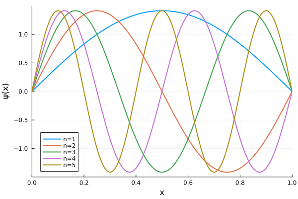
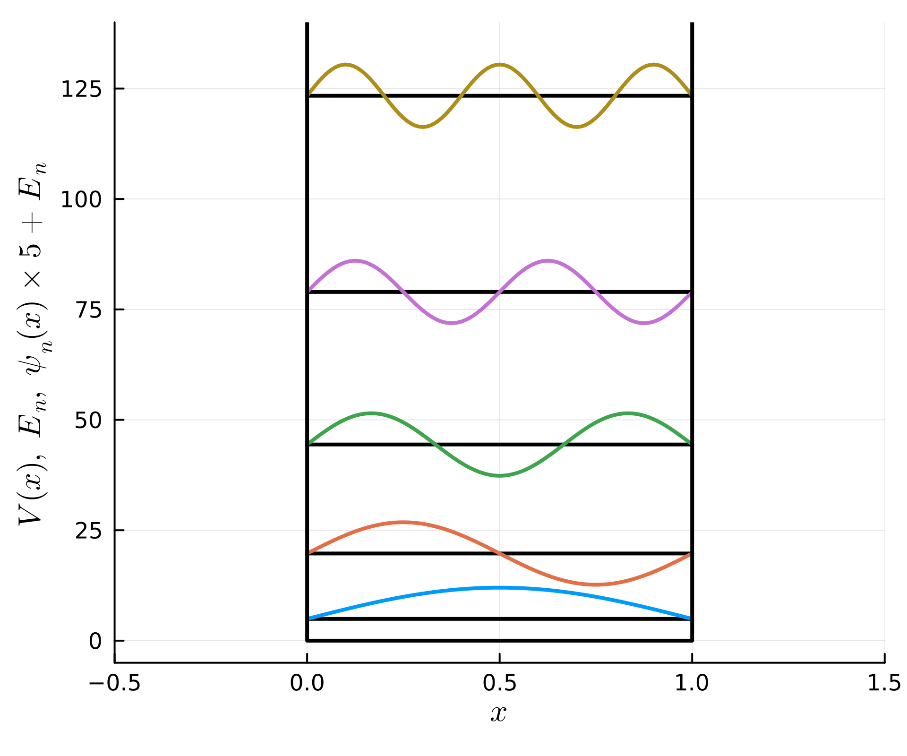

```@meta
CurrentModule = Antiq
```

# Infinite Potential Well (Particle in a Box)

The infinite potential well (particle in a box) is the simplest model for quantum mechanical system.

## Definitions

``L`` is the length of the 1D-box, ``m`` is the mass of particle.

#### Schrödinger Equation
```math
  \hat{H} \psi(x) = E \psi(x)
```

#### Hamiltonian
```math
  \hat{H} = \frac{\hbar^2}{2m} \frac{\mathrm{d}^2}{\mathrm{d}x ^2} + V(x)
```

#### Potential
`V(x; L=L)`
```math
  V(x) =
  \left\{
    \begin{array}{ll}
    \infty & x \lt 0, L \lt x \\
    0      & 0 \leq x \leq L
    \end{array}
  \right.
```

#### Eigen Values
`E(; n=0, L=L, m=m, ℏ=ℏ)`
```math
  E_n = \frac{\hbar^2 n^2 \pi^2}{2 m L^2}
```

#### Eigen Functions
`ψ(x; n=0, L=L)`
```math
   \psi_n(x) = \sqrt{\frac{2}{L}} \sin \frac{n\pi x}{L}
```

#### Proofs
- [Eigen Functions & Eigen Values](https://ja.wolframalpha.com/input?i2d=true&i=D%5B%5C%2840%29Sqrt%5BDivide%5B2%2Ca%5D%5Dsin%5C%2840%29Divide%5Bn%CF%80x%2Ca%5D%5C%2841%29%5C%2841%29%2C%7Bx%2C2%7D%5D)
- [Normalization](https://ja.wolframalpha.com/input?i=Integrate%5B%28%28Sqrt%5B2%2Fa%5Dsin%28%CF%80x%2Fa%29%29%29%5E2%2C+%7Bx%2C0%2Ca%7D%5D)

## Usage & Examples

[Install Antiq.jl](@ref Install) for the first run and run `using Antiq` before each use. The function `antiq(model, parameters...)` returns a module that has `E()`, `ψ(x)`, `V(x)` and some other functions. In this system, the model name is specified by `:InfinitePotentialWell` and several parameters `L`, `m` and `ℏ` are set as optional arguments.

```julia
using Antiq
IPW = antiq(:InfinitePotentialWell, L=1.0, m=1.0, ℏ=1.0)
```


Parameters:

```julia
julia> IPW.L
1.0

julia> IPW.m
1.0

julia> IPW.ℏ
1.0
```


Eigen values:

```julia
julia> IPW.E(n=1)
4.934802200544679

julia> IPW.E(n=2)
19.739208802178716
```


Wave functions:

```julia
using Plots
plot(xlim=(0,1), xlabel="x", ylabel="ψ(x)")
plot!(x -> IPW.ψ(x, n=1), label="n=1", lw=2)
plot!(x -> IPW.ψ(x, n=2), label="n=2", lw=2)
plot!(x -> IPW.ψ(x, n=3), label="n=3", lw=2)
plot!(x -> IPW.ψ(x, n=4), label="n=4", lw=2)
plot!(x -> IPW.ψ(x, n=5), label="n=5", lw=2)
```




Potential energy curve, Energy levels, Wave functions:

```julia
L = 1
using Plots
plot(xlim=(-0.5,1.5), ylim=(-5,140), xlabel="\$x\$", ylabel="\$V(x),~E_n,~\\psi_n(x)\\times5+E_n\$", size=(480,400), dpi=300)
for n in 1:5
  # energy
  plot!([0,L], fill(IPW.E(n=n,L=L),2), lc=:black, lw=2, label="")
  # wave function
  plot!(0:0.01:L, x->IPW.E(n=n,L=L)+5*IPW.ψ(x,n=n,L=L), lc=n, lw=2, label="")
end
# potential
plot!([0,0,L,L], [140,0,0,140], lc=:black, lw=2, label="")
```




## Testing

Unit testing and Integration testing were done using numerical integration ([QuadGK.jl](https://juliamath.github.io/QuadGK.jl/stable/)). The test script is [here](https://github.com/ohno/Antiq.jl/blob/main/test/InfinitePotentialWell.jl).

```julia
include("../../../test/InfinitePotentialWell.jl")
```
#### Normalization & Orthogonality of $\psi_n(x)$

```math
\int_{0}^{L} \psi_i^\ast(x) \psi_j(x) ~\mathrm{d}x = \delta_{ij}
```

```
  i	  j	numerical         	analytical        	|error|
  1	  1	1.0000000000000002	1.0000000000000000	0.0000000000000222%	✔
  1	  2	0.0000000000000000	0.0000000000000000	0.0000000000000000%	✔
  1	  3	-0.0000000000000001	0.0000000000000000	0.0000000000000000%	✔
  1	  4	0.0000000000000000	0.0000000000000000	0.0000000000000000%	✔
  1	  5	0.0000000000000000	0.0000000000000000	0.0000000000000000%	✔
  1	  6	-0.0000000000000000	0.0000000000000000	0.0000000000000000%	✔
  1	  7	-0.0000000000000001	0.0000000000000000	0.0000000000000000%	✔
  1	  8	-0.0000000000000001	0.0000000000000000	0.0000000000000000%	✔
  1	  9	-0.0000000000000000	0.0000000000000000	0.0000000000000000%	✔
  1	 10	0.0000000000000001	0.0000000000000000	0.0000000000000000%	✔
  2	  1	0.0000000000000000	0.0000000000000000	0.0000000000000000%	✔
  2	  2	1.0000000000000000	1.0000000000000000	0.0000000000000000%	✔
  2	  3	-0.0000000000000000	0.0000000000000000	0.0000000000000000%	✔
  2	  4	0.0000000000000000	0.0000000000000000	0.0000000000000000%	✔
  2	  5	-0.0000000000000000	0.0000000000000000	0.0000000000000000%	✔
  2	  6	0.0000000000000000	0.0000000000000000	0.0000000000000000%	✔
  2	  7	0.0000000000000000	0.0000000000000000	0.0000000000000000%	✔
  2	  8	0.0000000000000000	0.0000000000000000	0.0000000000000000%	✔
  2	  9	-0.0000000000000001	0.0000000000000000	0.0000000000000000%	✔
  2	 10	0.0000000000000000	0.0000000000000000	0.0000000000000000%	✔
  3	  1	-0.0000000000000001	0.0000000000000000	0.0000000000000000%	✔
  3	  2	-0.0000000000000000	0.0000000000000000	0.0000000000000000%	✔
  3	  3	1.0000000000000002	1.0000000000000000	0.0000000000000222%	✔
  3	  4	-0.0000000000000001	0.0000000000000000	0.0000000000000000%	✔
  3	  5	-0.0000000000000001	0.0000000000000000	0.0000000000000000%	✔
  3	  6	-0.0000000000000000	0.0000000000000000	0.0000000000000000%	✔
  3	  7	0.0000000000000000	0.0000000000000000	0.0000000000000000%	✔
  3	  8	0.0000000000000000	0.0000000000000000	0.0000000000000000%	✔
  3	  9	-0.0000000000000000	0.0000000000000000	0.0000000000000000%	✔
  3	 10	0.0000000000000000	0.0000000000000000	0.0000000000000000%	✔
  4	  1	0.0000000000000000	0.0000000000000000	0.0000000000000000%	✔
  4	  2	0.0000000000000000	0.0000000000000000	0.0000000000000000%	✔
  4	  3	-0.0000000000000001	0.0000000000000000	0.0000000000000000%	✔
  4	  4	1.0000000000000000	1.0000000000000000	0.0000000000000000%	✔
  4	  5	-0.0000000000000000	0.0000000000000000	0.0000000000000000%	✔
  4	  6	-0.0000000000000000	0.0000000000000000	0.0000000000000000%	✔
  4	  7	0.0000000000000001	0.0000000000000000	0.0000000000000000%	✔
  4	  8	0.0000000000000000	0.0000000000000000	0.0000000000000000%	✔
  4	  9	-0.0000000000000001	0.0000000000000000	0.0000000000000000%	✔
  4	 10	0.0000000000000000	0.0000000000000000	0.0000000000000000%	✔
  5	  1	0.0000000000000000	0.0000000000000000	0.0000000000000000%	✔
  5	  2	-0.0000000000000000	0.0000000000000000	0.0000000000000000%	✔
  5	  3	-0.0000000000000001	0.0000000000000000	0.0000000000000000%	✔
  5	  4	-0.0000000000000000	0.0000000000000000	0.0000000000000000%	✔
  5	  5	1.0000000000000002	1.0000000000000000	0.0000000000000222%	✔
  5	  6	0.0000000000000000	0.0000000000000000	0.0000000000000000%	✔
  5	  7	-0.0000000000000001	0.0000000000000000	0.0000000000000000%	✔
  5	  8	0.0000000000000000	0.0000000000000000	0.0000000000000000%	✔
  5	  9	0.0000000000000000	0.0000000000000000	0.0000000000000000%	✔
  5	 10	0.0000000000000000	0.0000000000000000	0.0000000000000000%	✔
  6	  1	-0.0000000000000000	0.0000000000000000	0.0000000000000000%	✔
  6	  2	0.0000000000000000	0.0000000000000000	0.0000000000000000%	✔
  6	  3	-0.0000000000000000	0.0000000000000000	0.0000000000000000%	✔
  6	  4	-0.0000000000000000	0.0000000000000000	0.0000000000000000%	✔
  6	  5	0.0000000000000000	0.0000000000000000	0.0000000000000000%	✔
  6	  6	1.0000000000000000	1.0000000000000000	0.0000000000000000%	✔
  6	  7	-0.0000000000000000	0.0000000000000000	0.0000000000000000%	✔
  6	  8	-0.0000000000000000	0.0000000000000000	0.0000000000000000%	✔
  6	  9	0.0000000000000000	0.0000000000000000	0.0000000000000000%	✔
  6	 10	-0.0000000000000000	0.0000000000000000	0.0000000000000000%	✔
  7	  1	-0.0000000000000001	0.0000000000000000	0.0000000000000000%	✔
  7	  2	0.0000000000000000	0.0000000000000000	0.0000000000000000%	✔
  7	  3	0.0000000000000000	0.0000000000000000	0.0000000000000000%	✔
  7	  4	0.0000000000000001	0.0000000000000000	0.0000000000000000%	✔
  7	  5	-0.0000000000000001	0.0000000000000000	0.0000000000000000%	✔
  7	  6	-0.0000000000000000	0.0000000000000000	0.0000000000000000%	✔
  7	  7	0.9999999999999998	1.0000000000000000	0.0000000000000222%	✔
  7	  8	-0.0000000000000001	0.0000000000000000	0.0000000000000000%	✔
  7	  9	-0.0000000000000001	0.0000000000000000	0.0000000000000000%	✔
  7	 10	-0.0000000000000000	0.0000000000000000	0.0000000000000000%	✔
  8	  1	-0.0000000000000001	0.0000000000000000	0.0000000000000000%	✔
  8	  2	0.0000000000000000	0.0000000000000000	0.0000000000000000%	✔
  8	  3	0.0000000000000000	0.0000000000000000	0.0000000000000000%	✔
  8	  4	0.0000000000000000	0.0000000000000000	0.0000000000000000%	✔
  8	  5	0.0000000000000000	0.0000000000000000	0.0000000000000000%	✔
  8	  6	-0.0000000000000000	0.0000000000000000	0.0000000000000000%	✔
  8	  7	-0.0000000000000001	0.0000000000000000	0.0000000000000000%	✔
  8	  8	1.0000000000000007	1.0000000000000000	0.0000000000000666%	✔
  8	  9	-0.0000000000000001	0.0000000000000000	0.0000000000000000%	✔
  8	 10	0.0000000000000000	0.0000000000000000	0.0000000000000000%	✔
  9	  1	-0.0000000000000000	0.0000000000000000	0.0000000000000000%	✔
  9	  2	-0.0000000000000001	0.0000000000000000	0.0000000000000000%	✔
  9	  3	-0.0000000000000000	0.0000000000000000	0.0000000000000000%	✔
  9	  4	-0.0000000000000001	0.0000000000000000	0.0000000000000000%	✔
  9	  5	0.0000000000000000	0.0000000000000000	0.0000000000000000%	✔
  9	  6	0.0000000000000000	0.0000000000000000	0.0000000000000000%	✔
  9	  7	-0.0000000000000001	0.0000000000000000	0.0000000000000000%	✔
  9	  8	-0.0000000000000001	0.0000000000000000	0.0000000000000000%	✔
  9	  9	1.0000000000000000	1.0000000000000000	0.0000000000000000%	✔
  9	 10	0.0000000000000001	0.0000000000000000	0.0000000000000000%	✔
 10	  1	0.0000000000000001	0.0000000000000000	0.0000000000000000%	✔
 10	  2	0.0000000000000000	0.0000000000000000	0.0000000000000000%	✔
 10	  3	0.0000000000000000	0.0000000000000000	0.0000000000000000%	✔
 10	  4	0.0000000000000000	0.0000000000000000	0.0000000000000000%	✔
 10	  5	0.0000000000000000	0.0000000000000000	0.0000000000000000%	✔
 10	  6	-0.0000000000000000	0.0000000000000000	0.0000000000000000%	✔
 10	  7	-0.0000000000000000	0.0000000000000000	0.0000000000000000%	✔
 10	  8	0.0000000000000000	0.0000000000000000	0.0000000000000000%	✔
 10	  9	0.0000000000000001	0.0000000000000000	0.0000000000000000%	✔
 10	 10	1.0000000000000002	1.0000000000000000	0.0000000000000222%	✔
Test Summary:            | Pass  Total  Time
<ψᵢ|ψⱼ> = ∫ψₙ*ψₙdx = δᵢⱼ |  100    100  2.3s
```

#### Eigen Values

```math
  \begin{aligned}
    E_n
    &=      \int_0^L \psi^\ast_n(x) \hat{H} \psi_n(x) ~\mathrm{d}x \\
    &=      \int_0^L \psi^\ast_n(x) \left[ \hat{V} + \hat{T} \right] \psi(x) ~\mathrm{d}x \\
    &=      \int_0^L \psi^\ast_n(x) \left[ 0 - \frac{\hbar^2}{2m} \frac{\mathrm{d}^{2}}{\mathrm{d} x^{2}} \right] \psi(x) ~\mathrm{d}x \\
    &\simeq \int_0^L \psi^\ast_n(x) \left[ -\frac{\hbar^2}{2m} \frac{\psi(x+\Delta x) - 2\psi(x) + \psi(x-\Delta x)}{\Delta x^{2}} \right] ~\mathrm{d}x.
  \end{aligned}
```

Where, the difference formula for the 2nd-order derivative:

```math
\begin{aligned}
  % 2\psi(x)
  % + \frac{\mathrm{d}^{2} \psi(x)}{\mathrm{d} x^{2}} \Delta x^{2}
  % + O\left(\Delta x^{4}\right)
  % &=
  % \psi(x+\Delta x)
  % + \psi(x-\Delta x)
  % \\
  % \frac{\mathrm{d}^{2} \psi(x)}{\mathrm{d} x^{2}} \Delta x^{2}
  % &=
  % \psi(x+\Delta x)
  % - 2\psi(x)
  % + \psi(x-\Delta x)
  % - O\left(\Delta x^{4}\right)
  % \\
  % \frac{\mathrm{d}^{2} \psi(x)}{\mathrm{d} x^{2}}
  % &=
  % \frac{\psi(x+\Delta x) - 2\psi(x) + \psi(x-\Delta x)}{\Delta x^{2}}
  % - \frac{O\left(\Delta x^{4}\right)}{\Delta x^{2}}
  % \\
  \frac{\mathrm{d}^{2} \psi(x)}{\mathrm{d} x^{2}}
  &=
  \frac{\psi(x+\Delta x) - 2\psi(x) + \psi(x-\Delta x)}{\Delta x^{2}}
  + O\left(\Delta x^{2}\right)
\end{aligned}
```

are given by the sum of 2 Taylor series:

```math
\begin{aligned}
\psi(x+\Delta x)
&= \psi(x)
+ \frac{\mathrm{d} \psi(x)}{\mathrm{d} x} \Delta x
+ \frac{1}{2!} \frac{\mathrm{d}^{2} \psi(x)}{\mathrm{d} x^{2}} \Delta x^{2}
+ \frac{1}{3!} \frac{\mathrm{d}^{3} \psi(x)}{\mathrm{d} x^{3}} \Delta x^{3}
+ O\left(\Delta x^{4}\right),
\\
\psi(x-\Delta x)
&= \psi(x)
- \frac{\mathrm{d} \psi(x)}{\mathrm{d} x} \Delta x
+ \frac{1}{2!} \frac{\mathrm{d}^{2} \psi(x)}{\mathrm{d} x^{2}} \Delta x^{2}
- \frac{1}{3!} \frac{\mathrm{d}^{3} \psi(x)}{\mathrm{d} x^{3}} \Delta x^{3}
+ O\left(\Delta x^{4}\right).
\end{aligned}
```
```
  L    m    ℏ   n  numerical     	analytical    	|error|
0.1  0.1  0.1   1  49.348021579139	49.348022005447	0.000000863880%	✔
0.1  0.1  0.1   2  197.392081461942	197.392088021787	0.000003323256%	✔
0.1  0.1  0.1   3  444.132165131018	444.132198049021	0.000007411758%	✔
0.1  0.1  0.1   4  789.568248175979	789.568352087149	0.000013160503%	✔
0.1  0.1  0.1   5  1233.700296336187	1233.700550136170	0.000020572252%	✔
0.1  0.1  0.1   6  1776.528266243334	1776.528792196084	0.000029605642%	✔
0.1  0.1  0.1   7  2418.052103857080	2418.053078266893	0.000040297288%	✔
0.1  0.1  0.1   8  3158.271745875927	3158.273408348594	0.000052638656%	✔
0.1  0.1  0.1   9  3997.187119264267	3997.189782441189	0.000066626232%	✔
0.1  0.1  0.1  10  4934.798141994514	4934.802200544678	0.000082243421%	✔
0.1  0.1  1.0   1  4934.802157913905	4934.802200544678	0.000000863880%	✔
0.1  0.1  1.0   2  19739.208146194214	19739.208802178713	0.000003323256%	✔
0.1  0.1  1.0   3  44413.216513101754	44413.219804902103	0.000007411758%	✔
0.1  0.1  1.0   4  78956.824817597895	78956.835208714852	0.000013160503%	✔
0.1  0.1  1.0   5  123370.029633618717	123370.055013616948	0.000020572252%	✔
0.1  0.1  1.0   6  177652.826624333364	177652.879219608410	0.000029605642%	✔
0.1  0.1  1.0   7  241805.210385707964	241805.307826689212	0.000040297288%	✔
0.1  0.1  1.0   8  315827.174587592541	315827.340834859409	0.000052638656%	✔
0.1  0.1  1.0   9  399718.711926426622	399718.978244118916	0.000066626232%	✔
0.1  0.1  1.0  10  493479.814199451241	493480.220054467791	0.000082243421%	✔
0.1  1.0  0.1   1  4.934802157914	4.934802200545	0.000000863880%	✔
0.1  1.0  0.1   2  19.739208146194	19.739208802179	0.000003323256%	✔
0.1  1.0  0.1   3  44.413216513102	44.413219804902	0.000007411758%	✔
0.1  1.0  0.1   4  78.956824817598	78.956835208715	0.000013160503%	✔
0.1  1.0  0.1   5  123.370029633619	123.370055013617	0.000020572252%	✔
0.1  1.0  0.1   6  177.652826624333	177.652879219608	0.000029605642%	✔
0.1  1.0  0.1   7  241.805210385708	241.805307826689	0.000040297288%	✔
0.1  1.0  0.1   8  315.827174587593	315.827340834859	0.000052638656%	✔
0.1  1.0  0.1   9  399.718711926427	399.718978244119	0.000066626232%	✔
0.1  1.0  0.1  10  493.479814199451	493.480220054468	0.000082243421%	✔
0.1  1.0  1.0   1  493.480215791390	493.480220054468	0.000000863880%	✔
0.1  1.0  1.0   2  1973.920814619422	1973.920880217871	0.000003323256%	✔
0.1  1.0  1.0   3  4441.321651310176	4441.321980490210	0.000007411758%	✔
0.1  1.0  1.0   4  7895.682481759791	7895.683520871485	0.000013160503%	✔
0.1  1.0  1.0   5  12337.002963361872	12337.005501361695	0.000020572252%	✔
0.1  1.0  1.0   6  17765.282662433339	17765.287921960840	0.000029605642%	✔
0.1  1.0  1.0   7  24180.521038570794	24180.530782668924	0.000040297288%	✔
0.1  1.0  1.0   8  31582.717458759253	31582.734083485939	0.000052638656%	✔
0.1  1.0  1.0   9  39971.871192642662	39971.897824411892	0.000066626232%	✔
0.1  1.0  1.0  10  49347.981419945128	49348.022005446779	0.000082243421%	✔
1.0  0.1  0.1   1  0.493480215948	0.493480220054	0.000000832112%	✔
1.0  0.1  0.1   2  1.973920815419	1.973920880218	0.000003282767%	✔
1.0  0.1  0.1   3  4.441321651944	4.441321980490	0.000007397478%	✔
1.0  0.1  0.1   4  7.895682481265	7.895683520871	0.000013166775%	✔
1.0  0.1  0.1   5  12.337002965030	12.337005501362	0.000020558729%	✔
1.0  0.1  0.1   6  17.765282661715	17.765287921961	0.000029609687%	✔
1.0  0.1  0.1   7  24.180521036064	24.180530782669	0.000040307654%	✔
1.0  0.1  0.1   8  31.582717460023	31.582734083486	0.000052634655%	✔
1.0  0.1  0.1   9  39.971871195191	39.971897824412	0.000066619856%	✔
1.0  0.1  0.1  10  49.347981417827	49.348022005447	0.000082247714%	✔
1.0  0.1  1.0   1  49.348021594816	49.348022005447	0.000000832112%	✔
1.0  0.1  1.0   2  197.392081541864	197.392088021787	0.000003282767%	✔
1.0  0.1  1.0   3  444.132165194438	444.132198049021	0.000007397478%	✔
1.0  0.1  1.0   4  789.568248126463	789.568352087149	0.000013166775%	✔
1.0  0.1  1.0   5  1233.700296503016	1233.700550136170	0.000020558729%	✔
1.0  0.1  1.0   6  1776.528266171473	1776.528792196084	0.000029609687%	✔
1.0  0.1  1.0   7  2418.052103606433	2418.053078266892	0.000040307654%	✔
1.0  0.1  1.0   8  3158.271746002275	3158.273408348594	0.000052634655%	✔
1.0  0.1  1.0   9  3997.187119519121	3997.189782441190	0.000066619856%	✔
1.0  0.1  1.0  10  4934.798141782662	4934.802200544679	0.000082247714%	✔
1.0  1.0  0.1   1  0.049348021595	0.049348022005	0.000000832112%	✔
1.0  1.0  0.1   2  0.197392081542	0.197392088022	0.000003282767%	✔
1.0  1.0  0.1   3  0.444132165194	0.444132198049	0.000007397478%	✔
1.0  1.0  0.1   4  0.789568248126	0.789568352087	0.000013166775%	✔
1.0  1.0  0.1   5  1.233700296503	1.233700550136	0.000020558729%	✔
1.0  1.0  0.1   6  1.776528266171	1.776528792196	0.000029609687%	✔
1.0  1.0  0.1   7  2.418052103606	2.418053078267	0.000040307654%	✔
1.0  1.0  0.1   8  3.158271746002	3.158273408349	0.000052634655%	✔
1.0  1.0  0.1   9  3.997187119519	3.997189782441	0.000066619856%	✔
1.0  1.0  0.1  10  4.934798141783	4.934802200545	0.000082247714%	✔
1.0  1.0  1.0   1  4.934802159482	4.934802200545	0.000000832112%	✔
1.0  1.0  1.0   2  19.739208154186	19.739208802179	0.000003282767%	✔
1.0  1.0  1.0   3  44.413216519444	44.413219804902	0.000007397478%	✔
1.0  1.0  1.0   4  78.956824812646	78.956835208715	0.000013166775%	✔
1.0  1.0  1.0   5  123.370029650302	123.370055013617	0.000020558729%	✔
1.0  1.0  1.0   6  177.652826617147	177.652879219608	0.000029609687%	✔
1.0  1.0  1.0   7  241.805210360643	241.805307826689	0.000040307654%	✔
1.0  1.0  1.0   8  315.827174600228	315.827340834859	0.000052634655%	✔
1.0  1.0  1.0   9  399.718711951912	399.718978244119	0.000066619856%	✔
1.0  1.0  1.0  10  493.479814178266	493.480220054468	0.000082247714%	✔
Test Summary:               | Pass  Total  Time
<ψₙ|H|ψₙ>  = ∫ψₙ*Tψₙdx = Eₙ |   80     80  0.9s
```
#### Expected Value of $x$

```math
\langle x \rangle_{n=1}
= \int_{0}^{L} \psi_1^\ast(x) \hat{x} \psi_1(x) ~\mathrm{d}x
= \frac{2(2a)^2}{\pi^3} \left( \frac{\pi^3}{6} - \frac{\pi}{4} \right)
```
for only $n=1$.

Reference:
- [LibreTexts PHYSICS, 6.4: Expectation Values, Observables, and Uncertainty](https://phys.libretexts.org/Bookshelves/Modern_Physics/Book%3A_Spiral_Modern_Physics_(D'Alessandris)/6%3A_The_Schrodinger_Equation/6.4%3A_Expectation_Values_Observables_and_Uncertainty)
```
   L	  n	numerical         	analytical        	|error|
0.1	  1	0.0500000000000000	0.0500000000000000	0.0000000000000278%	✔
0.5	  1	0.2500000000000000	0.2500000000000000	0.0000000000000000%	✔
1.0	  1	0.5000000000000002	0.5000000000000000	0.0000000000000444%	✔
7.0	  1	3.5000000000000000	3.5000000000000000	0.0000000000000000%	✔
Test Summary:    | Pass  Total  Time
<ψₙ|x|ψₙ>  = L/2 |    4      4  0.5s
```
#### Expected Value of $x^2$

```math
\langle x^2 \rangle_{n=1}
= \int_{0}^{L} \psi_1^\ast(x) \hat{x}^2 \psi_1(x) ~\mathrm{d}x
= \frac{2(2a)^2}{\pi^3} \left( \frac{\pi^3}{6} - \frac{\pi}{4} \right)
```

Reference:
- [LibreTexts PHYSICS, 6.4: Expectation Values, Observables, and Uncertainty](https://phys.libretexts.org/Bookshelves/Modern_Physics/Book%3A_Spiral_Modern_Physics_(D'Alessandris)/6%3A_The_Schrodinger_Equation/6.4%3A_Expectation_Values_Observables_and_Uncertainty)
```
   L	  n	numerical         	analytical        	|error|
0.1	  1	0.0028267274151216	0.0028267274151216	0.0000000000000460%	✔
0.5	  1	0.0706681853780411	0.0706681853780411	0.0000000000000000%	✔
1.0	  1	0.2826727415121645	0.2826727415121645	0.0000000000000196%	✔
7.0	  1	13.8509643340960604	13.8509643340960569	0.0000000000000256%	✔
Test Summary:                 | Pass  Total  Time
<ψₙ|x²|ψₙ> = 2L²/π³(π³/6-π/4) |    4      4  0.5s
```

#### Expected Value of $p$
```math
\langle p \rangle_{n=1}
= \int_{0}^{L} \psi_1^\ast(x) \hat{p} \psi_1(x) ~\mathrm{d}x
= 0
```

Reference:
- [LibreTexts PHYSICS, 6.4: Expectation Values, Observables, and Uncertainty](https://phys.libretexts.org/Bookshelves/Modern_Physics/Book%3A_Spiral_Modern_Physics_(D'Alessandris)/6%3A_The_Schrodinger_Equation/6.4%3A_Expectation_Values_Observables_and_Uncertainty)

---

```math
  \begin{aligned}
    \langle p \rangle_{n=1}
    &= \int_0^L \psi^\ast_n(x) \hat{p} \psi_n(x) ~\mathrm{d}x \\
    &= \int_0^L \psi^\ast_n(x) \left[ -i\hbar\frac{\mathrm{d}}{\mathrm{d} x} \right] \psi(x) ~\mathrm{d}x \\
    &\simeq \int_0^L \psi^\ast_n(x) \left[ -i\hbar \frac{\psi(x+\Delta x) - \psi(x-\Delta x)}{2\Delta x} \right] ~\mathrm{d}x.
  \end{aligned}
```

Where, the difference formula for the 2nd-order derivative:

```math
\begin{aligned}
  % 2\frac{\mathrm{d} \psi(x)}{\mathrm{d}x} \Delta x
  % + O\left(\Delta x^{3}\right)
  % &= 
  % \psi(x+\Delta x)
  % - \psi(x-\Delta x)
  % \\
  % 2\frac{\mathrm{d} \psi(x)}{\mathrm{d}x} \Delta x
  % &= 
  % \psi(x+\Delta x)
  % - \psi(x-\Delta x)
  % - O\left(\Delta x^{3}\right)
  % \\
  % \frac{\mathrm{d} \psi(x)}{\mathrm{d}x}
  % &= 
  % \frac{\psi(x+\Delta x)- \psi(x-\Delta x)}{2\Delta x}
  % - \frac{O\left(\Delta x^{3}\right)}{2\Delta x}
  % \\
  \frac{\mathrm{d} \psi(x)}{\mathrm{d}x}
  &= 
  \frac{\psi(x+\Delta x)- \psi(x-\Delta x)}{2\Delta x}
  + O\left(\Delta x^{2}\right),
\end{aligned}
```

are given by the sum of 2 Taylor series:

```math
\begin{aligned}
  \psi(x+\Delta x)
  &=
  \psi(x)
  + \frac{\mathrm{d} \psi(x)}{\mathrm{d}x} \Delta x
  + \frac{1}{2!} \frac{\mathrm{d}^{2} \psi(x)}{\mathrm{d}x^{2}} \Delta x^{2}
  + O\left(\Delta x^{3}\right),
  \\
  \psi(x-\Delta x)
  &=
  \psi(x)
  - \frac{\mathrm{d} \psi(x)}{\mathrm{d}x} \Delta x
  + \frac{1}{2!} \frac{\mathrm{d}^{2} \psi(x)}{\mathrm{d}x^{2}} \Delta x^{2}
  + O\left(\Delta x^{3}\right).
\end{aligned}
```
```
   L	  n	numerical         	analytical        	|error|
0.1	  1	0.0000000000033684	0.0000000000000000	0.0000000000000000%	✔
0.5	  1	0.0000000000002308	0.0000000000000000	0.0000000000000000%	✔
1.0	  1	0.0000000000001066	0.0000000000000000	0.0000000000000000%	✔
7.0	  1	0.0000000000000252	0.0000000000000000	0.0000000000000000%	✔
Test Summary:                      | Pass  Total  Time
<ψₙ|p|ψₙ>  = ∫ψₙ*(-iℏd/dx)ψₙdx = 0 |    4      4  0.7s
```
#### Expected Value of $p^2$

```math
\langle p^2 \rangle
= \int_{0}^{L} \psi_1^\ast(x) \hat{p}^2 \psi_1(x) ~\mathrm{d}x
= \frac{\pi^2\hbar^2}{L^2}
```

Reference:
- [LibreTexts PHYSICS, 6.4: Expectation Values, Observables, and Uncertainty](https://phys.libretexts.org/Bookshelves/Modern_Physics/Book%3A_Spiral_Modern_Physics_(D'Alessandris)/6%3A_The_Schrodinger_Equation/6.4%3A_Expectation_Values_Observables_and_Uncertainty)

---

```math
  \begin{aligned}
    \langle p^2 \rangle
    &= \int_0^L \psi^\ast_n(x) \hat{p} \psi_n(x) ~\mathrm{d}x \\
    &= \int_0^L \psi^\ast_n(x) \left[ -\hbar^2\frac{\mathrm{d}^2}{{\mathrm{d}x}^2} \right] \psi(x) ~\mathrm{d}x \\
    &\simeq \int_0^L \psi^\ast_n(x) \left[ -\hbar^2 \frac{\psi(x+\Delta x) - 2\psi(x) + \psi(x-\Delta x)}{\Delta x^{2}} \right] ~\mathrm{d}x.
  \end{aligned}
```

Where, the difference formula for the 2nd-order derivative:

```math
\begin{aligned}
  % 2\psi(x)
  % + \frac{\mathrm{d}^{2} \psi(x)}{\mathrm{d} x^{2}} \Delta x^{2}
  % + O\left(\Delta x^{4}\right)
  % &=
  % \psi(x+\Delta x)
  % + \psi(x-\Delta x)
  % \\
  % \frac{\mathrm{d}^{2} \psi(x)}{\mathrm{d} x^{2}} \Delta x^{2}
  % &=
  % \psi(x+\Delta x)
  % - 2\psi(x)
  % + \psi(x-\Delta x)
  % - O\left(\Delta x^{4}\right)
  % \\
  % \frac{\mathrm{d}^{2} \psi(x)}{\mathrm{d} x^{2}}
  % &=
  % \frac{\psi(x+\Delta x) - 2\psi(x) + \psi(x-\Delta x)}{\Delta x^{2}}
  % - \frac{O\left(\Delta x^{4}\right)}{\Delta x^{2}}
  % \\
  \frac{\mathrm{d}^{2} \psi(x)}{\mathrm{d} x^{2}}
  &=
  \frac{\psi(x+\Delta x) - 2\psi(x) + \psi(x-\Delta x)}{\Delta x^{2}}
  + O\left(\Delta x^{2}\right)
\end{aligned}
```

are given by the sum of 2 Taylor series:

```math
\begin{aligned}
\psi(x+\Delta x)
&= \psi(x)
+ \frac{\mathrm{d} \psi(x)}{\mathrm{d} x} \Delta x
+ \frac{1}{2!} \frac{\mathrm{d}^{2} \psi(x)}{\mathrm{d} x^{2}} \Delta x^{2}
+ \frac{1}{3!} \frac{\mathrm{d}^{3} \psi(x)}{\mathrm{d} x^{3}} \Delta x^{3}
+ O\left(\Delta x^{4}\right),
\\
\psi(x-\Delta x)
&= \psi(x)
- \frac{\mathrm{d} \psi(x)}{\mathrm{d} x} \Delta x
+ \frac{1}{2!} \frac{\mathrm{d}^{2} \psi(x)}{\mathrm{d} x^{2}} \Delta x^{2}
- \frac{1}{3!} \frac{\mathrm{d}^{3} \psi(x)}{\mathrm{d} x^{3}} \Delta x^{3}
+ O\left(\Delta x^{4}\right).
\end{aligned}
```
```
   L	  n	numerical         	analytical        	|error|
0.1	  1	986.9604315827808705	986.9604401089355861	0.0000008638800877%	✔
0.5	  1	39.4784172741947543	39.4784176043574320	0.0000008363118323%	✔
1.0	  1	9.8696043189632228	9.8696044010893580	0.0000008321117229%	✔
7.0	  1	0.2014204963826796	0.2014204979814155	0.0000007937304979%	✔
Test Summary:                              | Pass  Total  Time
<ψₙ|p²|ψₙ> = ∫ψₙ*(-ℏ²d²/dx²)ψₙdx = π²ℏ²/L² |    4      4  0.5s

```
