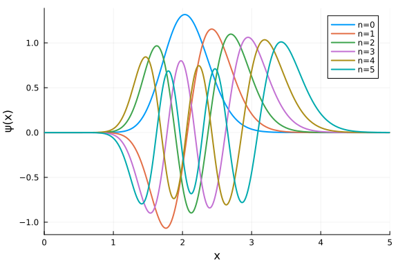
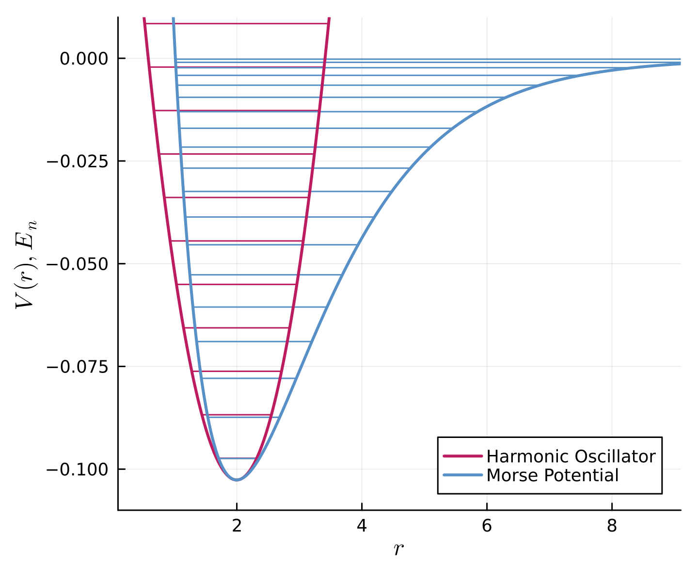

```@meta
CurrentModule = Antiq
```

# Morse Potential

The Morse potential is a model for inter-nuclear anharmonic vibration in a diatomic molecule.

## Definitions

``\xi := 2\lambda\mathrm{e}^{-a(r-r_e)}``, ``\omega := \sqrt{k/µ}``, ``k := 2D_\mathrm{e}a^2``, ``\lambda := \frac{\sqrt{2mD_\mathrm{e}}}{a\hbar}``, ``\chi := \frac{\hbar\omega}{4D_\mathrm{e}}``, ``N_n := \sqrt{\frac{n!(2\lambda-2n-1)a}{\Gamma(2\lambda-n)}}``, ``L_n^{(\alpha)}(x) := \frac{x^{-\alpha} \mathrm{e}^x}{n !} \frac{\mathrm{d}^n}{\mathrm{d} x^n}\left(\mathrm{e}^{-x} x^{n+\alpha}\right)`` are used.

#### Schrödinger Equation
```math
  \hat{H}\psi(r) = E \psi(r)
```

#### Hamiltonian
```math
  \hat{H} = - \frac{\hbar^2}{2\mu} \frac{\mathrm{d}^2}{\mathrm{d}r ^2} + V(r)
```

#### Potential
`V(r; rₑ=rₑ, Dₑ=Dₑ, k=k, a=sqrt(k/(2*Dₑ)))`
```math
  V(r) = D_\mathrm{e} \left( \mathrm{e}^{-2a(r-r_e)} - 2\mathrm{e}^{-a(r-r_e)} \right)
```

#### Eigen Values
`E(n; rₑ=rₑ, Dₑ=Dₑ, k=k, a=sqrt(k/(2*Dₑ)), µ=µ, ω=sqrt(k/µ), χ=ℏ*ω/(4*Dₑ), ℏ=ℏ)`
```math
  E_n = - D_\mathrm{e} + \hbar \omega \left( n + \frac{1}{2} \right) - \chi \hbar \omega \left( n + \frac{1}{2} \right)^2
```

#### Eigen Functions
`ψ(n, r; rₑ=rₑ, Dₑ=Dₑ, k=k, a=sqrt(k/(2*Dₑ)), µ=µ, ω=sqrt(k/µ), χ=ℏ*ω/(4*Dₑ), ℏ=ℏ)`
```math
  \psi_n(r) = N_n z^{\lambda-n-1/2} \mathrm{e}^{-z/2} L_n^{(2\lambda-2n-1)}(\xi)
```

#### Generalized Laguerre Polynomials
`L(x; n=0, α=0)`

Rodrigues' formula & closed-form:
```math
  \begin{aligned}
    L_n^{(\alpha)}(x)
    &= \frac{x^{-\alpha}e^x}{n!} \frac{d^n}{dx^n}\left(x^{n+\alpha}e^{-x}\right) \\
    &= \sum_{k=0}^n(-1)^k \left(\begin{array}{l} n+\alpha \\ n-k \end{array}\right) \frac{x^k}{k !} \\
    &= \sum_{k=0}^n(-1)^k \frac{\Gamma(\alpha+n+1)}{\Gamma(\alpha+k+1)\Gamma(n-k+1)} \frac{x^k}{k !}.
  \end{aligned}
```
Examples:
```math
  \begin{aligned}
    L_0^{(0)}(x) &= 1, \\
    L_1^{(0)}(x) &= 1 - x, \\
    L_1^{(1)}(x) &= 2 - x, \\
    L_2^{(0)}(x) &= 1 - 2 x + 1/2 x^{2}, \\
    L_2^{(1)}(x) &= 3 - 3 x + 1/2 x^{2}, \\
    L_2^{(2)}(x) &= 6 - 4 x + 1/2 x^{2}, \\
    L_3^{(0)}(x) &= 1 - 3 x + 3/2 x^{2} - 1/6 x^{3}, \\
    L_3^{(1)}(x) &= 4 - 6 x + 2 x^{2} - 1/6 x^{3}, \\
    L_3^{(2)}(x) &= 10 - 10 x + 5/2 x^{2} - 1/6 x^{3}, \\
    L_3^{(3)}(x) &= 20 - 15 x + 3 x^{2} - 1/6 x^{3}, \\
    L_4^{(0)}(x) &= 1 - 4 x + 3 x^{2} - 2/3 x^{3} + 1/24 x^{4}, \\
    L_4^{(1)}(x) &= 5 - 10 x + 5 x^{2} - 5/6 x^{3} + 1/24 x^{4}, \\
    L_4^{(2)}(x) &= 15 - 20 x + 15/2 x^{2} - 1 x^{3} + 1/24 x^{4}, \\
    L_4^{(3)}(x) &= 35 - 35 x + 21/2 x^{2} - 7/6 x^{3} + 1/24 x^{4}, \\
    L_4^{(4)}(x) &= 70 - 56 x + 14 x^{2} - 4/3 x^{3} + 1/24 x^{4}, \\
    \vdots
  \end{aligned}
```

#### References
- [P. M. Morse, Phys. Rev. 34, 57 (1929)](https://doi.org/10.1103/PhysRev.34.57)
- [J. P. Dahl, M. Springborg, J. Chem. Phys. 88, 4535 (1988). (62), (63)](https://doi.org/10.1063/1.453761)
- [W. K. Shao, Y. He, J. Pan, J. Nonlinear Sci. Appl., 9, 5, 3388 (2016). (1.6)](http://dx.doi.org/10.22436/jnsa.009.05.124) 
- The Digital Library of Mathematical Functions (DLMF) [18.3 Table1](https://dlmf.nist.gov/18.3#T1), [18.5 Table1](https://dlmf.nist.gov/18.5#T1), [18.5.12](https://dlmf.nist.gov/18.5#E12)

## Usage

[Install Antiq.jl](@ref Install) the first time. Run following command before use.

```julia
julia> using Antiq
```


The model name is `MorsePotential`.

```julia
MP = antiq(:MorsePotential)
```


You can check the values of the parameters using the following commands.

```julia
julia> MP.rₑ
1.997193319969992

julia> MP.Dₑ
0.10263461910653993

julia> MP.k
0.1027265041900817

julia> MP.µ
918.076336715

julia> MP.ℏ
1.0
```


## Examples

Eigen values:

```julia
julia> MP.E(n=0)
-0.09741377794418261

julia> MP.E(n=1)
-0.08738092406760907
```


Wave functions:

```julia
using Plots
plot(xlim=(0,5), xlabel="x", ylabel="ψ(x)")
plot!(x -> MP.ψ(x, n=0), label="n=0", lw=2)
plot!(x -> MP.ψ(x, n=1), label="n=1", lw=2)
plot!(x -> MP.ψ(x, n=2), label="n=2", lw=2)
plot!(x -> MP.ψ(x, n=3), label="n=3", lw=2)
plot!(x -> MP.ψ(x, n=4), label="n=4", lw=2)
plot!(x -> MP.ψ(x, n=5), label="n=5", lw=2)
```




Potential curve, Energy levels, Comparison with harmonic oscillator:

```julia
HO = antiq(:HarmonicOscillator, k=MP.k, m=MP.μ)
using Plots
plot(xlims=(0.1,9.1), ylims=(-0.11,0.01), xlabel="\$r\$", ylabel="\$V(r), E_n\$", legend=:bottomright, size=(480,400), dpi=400)
for n in 0:MP.nₘₐₓ()
  # energy
  EM = MP.E(n=n)
  EH = HO.E(n=n) - MP.Dₑ
  plot!(0.1:0.01:15, r -> EH > HO.V(r-MP.rₑ) - MP.Dₑ ? EH : NaN, lc="#BC1C5F", lw=1, label="")
  plot!(0.1:0.01:15, r -> EM > MP.V(r) ? EM : NaN, lc="#578FC7", lw=1, label="")
end
# potential
plot!(0.1:0.01:15, r -> HO.V(r-MP.rₑ) - MP.Dₑ, lc="#BC1C5F", lw=2, label="Morse Potential")
plot!(0.1:0.01:15, r -> MP.V(r), lc="#578FC7", lw=2, label="Harmonic Oscillator")
```




where, the potential of harmonic oscillator is defined as $V(r) \simeq \frac{1}{2} k (r - r_\mathrm{e})^2 + V_0$.

## Testing

Unit testing and Integration testing were done using computer algebra system ([Symbolics.jl](https://symbolics.juliasymbolics.org/stable/)) and numerical integration ([QuadGK.jl](https://juliamath.github.io/QuadGK.jl/stable/)).

#### Generalized Laguerre Polynomials $L_n^{(\alpha)}(x)$

```math
  \begin{aligned}
    L_n^{(\alpha)}(x)
    &= \frac{x^{-\alpha}e^x}{n!} \frac{d^n}{dx^n}\left(x^{n+\alpha}e^{-x}\right) \\
    &= \sum_{k=0}^n(-1)^k \frac{\Gamma(\alpha+n+1)}{\Gamma(\alpha+k+1)\Gamma(n-k+1)} \frac{x^k}{k !}.
  \end{aligned}
```

``n=0, α=0:`` ✔
```math
\begin{aligned}
  L_{0}^{(0)}(x)
   = e^{x} e^{ - x}
  &= 1 \\
  &= 1
\end{aligned}
```

``n=1, α=0:`` ✔
```math
\begin{aligned}
  L_{1}^{(0)}(x)
   = e^{x} \frac{\mathrm{d}}{\mathrm{d}x} x e^{ - x}
  &= 1 - x \\
  &= 1 - x
\end{aligned}
```

``n=1, α=1:`` ✔
```math
\begin{aligned}
  L_{1}^{(1)}(x)
   = \frac{e^{x} \frac{\mathrm{d}}{\mathrm{d}x} x^{2} e^{ - x}}{x}
  &= 2 - x \\
  &= 2 - x
\end{aligned}
```

``n=2, α=0:`` ✔
```math
\begin{aligned}
  L_{2}^{(0)}(x)
   = \frac{1}{2} e^{x} \frac{\mathrm{d}^{2}}{\mathrm{d}x^{2}} x^{2} e^{ - x}
  &= 1 + \frac{1}{2} x^{2} - 2 x \\
  &= 1 + \frac{1}{2} x^{2} - 2 x
\end{aligned}
```

``n=2, α=1:`` ✔
```math
\begin{aligned}
  L_{2}^{(1)}(x)
   = \frac{\frac{1}{2} e^{x} \frac{\mathrm{d}^{2}}{\mathrm{d}x^{2}} x^{3} e^{ - x}}{x}
  &= 3 + \frac{1}{2} x^{2} - 3 x \\
  &= 3 + \frac{1}{2} x^{2} - 3 x
\end{aligned}
```

``n=2, α=2:`` ✔
```math
\begin{aligned}
  L_{2}^{(2)}(x)
   = \frac{\frac{1}{2} e^{x} \frac{\mathrm{d}^{2}}{\mathrm{d}x^{2}} x^{4} e^{ - x}}{x^{2}}
  &= 6 + \frac{1}{2} x^{2} - 4 x \\
  &= 6 + \frac{1}{2} x^{2} - 4 x
\end{aligned}
```

``n=3, α=0:`` ✔
```math
\begin{aligned}
  L_{3}^{(0)}(x)
   = \frac{1}{6} e^{x} \frac{\mathrm{d}^{3}}{\mathrm{d}x^{3}} x^{3} e^{ - x}
  &= 1 + \frac{3}{2} x^{2} - \frac{1}{6} x^{3} - 3 x \\
  &= 1 + \frac{3}{2} x^{2} - \frac{1}{6} x^{3} - 3 x
\end{aligned}
```

``n=3, α=1:`` ✔
```math
\begin{aligned}
  L_{3}^{(1)}(x)
   = \frac{\frac{1}{6} e^{x} \frac{\mathrm{d}^{3}}{\mathrm{d}x^{3}} x^{4} e^{ - x}}{x}
  &= 4 + 2 x^{2} - \frac{1}{6} x^{3} - 6 x \\
  &= 4 + 2 x^{2} - \frac{1}{6} x^{3} - 6 x
\end{aligned}
```

``n=3, α=2:`` ✔
```math
\begin{aligned}
  L_{3}^{(2)}(x)
   = \frac{\frac{1}{6} e^{x} \frac{\mathrm{d}^{3}}{\mathrm{d}x^{3}} x^{5} e^{ - x}}{x^{2}}
  &= 10 + \frac{5}{2} x^{2} - \frac{1}{6} x^{3} - 10 x \\
  &= 10 + \frac{5}{2} x^{2} - \frac{1}{6} x^{3} - 10 x
\end{aligned}
```

``n=3, α=3:`` ✔
```math
\begin{aligned}
  L_{3}^{(3)}(x)
   = \frac{\frac{1}{6} e^{x} \frac{\mathrm{d}^{3}}{\mathrm{d}x^{3}} x^{6} e^{ - x}}{x^{3}}
  &= 20 + 3 x^{2} - \frac{1}{6} x^{3} - 15 x \\
  &= 20 + 3 x^{2} - \frac{1}{6} x^{3} - 15 x
\end{aligned}
```

``n=4, α=0:`` ✔
```math
\begin{aligned}
  L_{4}^{(0)}(x)
   = \frac{1}{24} e^{x} \frac{\mathrm{d}^{4}}{\mathrm{d}x^{4}} x^{4} e^{ - x}
  &= 1 + 3 x^{2} + \frac{1}{24} x^{4} - \frac{2}{3} x^{3} - 4 x \\
  &= 1 + 3 x^{2} + \frac{1}{24} x^{4} - \frac{2}{3} x^{3} - 4 x
\end{aligned}
```

``n=4, α=1:`` ✔
```math
\begin{aligned}
  L_{4}^{(1)}(x)
   = \frac{\frac{1}{24} e^{x} \frac{\mathrm{d}^{4}}{\mathrm{d}x^{4}} x^{5} e^{ - x}}{x}
  &= 5 + 5 x^{2} + \frac{1}{24} x^{4} - \frac{5}{6} x^{3} - 10 x \\
  &= 5 + 5 x^{2} + \frac{1}{24} x^{4} - \frac{5}{6} x^{3} - 10 x
\end{aligned}
```

``n=4, α=2:`` ✔
```math
\begin{aligned}
  L_{4}^{(2)}(x)
   = \frac{\frac{1}{24} e^{x} \frac{\mathrm{d}^{4}}{\mathrm{d}x^{4}} x^{6} e^{ - x}}{x^{2}}
  &= 15 + \frac{15}{2} x^{2} + \frac{1}{24} x^{4} - x^{3} - 20 x \\
  &= 15 + \frac{15}{2} x^{2} + \frac{1}{24} x^{4} - x^{3} - 20 x
\end{aligned}
```

``n=4, α=3:`` ✔
```math
\begin{aligned}
  L_{4}^{(3)}(x)
   = \frac{\frac{1}{24} e^{x} \frac{\mathrm{d}^{4}}{\mathrm{d}x^{4}} x^{7} e^{ - x}}{x^{3}}
  &= 35 + \frac{21}{2} x^{2} + \frac{1}{24} x^{4} - \frac{7}{6} x^{3} - 35 x \\
  &= 35 + \frac{21}{2} x^{2} + \frac{1}{24} x^{4} - \frac{7}{6} x^{3} - 35 x
\end{aligned}
```

``n=4, α=4:`` ✔
```math
\begin{aligned}
  L_{4}^{(4)}(x)
   = \frac{\frac{1}{24} e^{x} \frac{\mathrm{d}^{4}}{\mathrm{d}x^{4}} x^{8} e^{ - x}}{x^{4}}
  &= 70 + 14 x^{2} + \frac{1}{24} x^{4} - \frac{4}{3} x^{3} - 56 x \\
  &= 70 + 14 x^{2} + \frac{1}{24} x^{4} - \frac{4}{3} x^{3} - 56 x
\end{aligned}
```

```
Test Summary:                      | Pass  Total  Time
Lₙ⁽ᵅ⁾(x) = x⁻ᵅeˣ/n! dⁿ/dxⁿ xⁿ⁺ᵅe⁻ˣ |   15     15  5.7s
```

#### Normalization & Orthogonality of $L_n^{(\alpha)}(x)$

```math
\int_0^\infty L_i^{(\alpha)}(x) L_j^{(\alpha)}(x) x^\alpha \mathrm{e}^{-x} \mathrm{d}x = \frac{\Gamma(n+\alpha+1)}{n!} \delta_{ij}
```

```
 α	  n	  m	numerical         	analytical        	|error|
0.1	  0	  0	1.7724538509055159	1.7724538509055159	0.0000000000000000%	✔
0.1	  0	  1	0.0000000000000000	0.0000000000000000	0.0000000000000000%	✔
0.1	  0	  2	0.0000000000000000	0.0000000000000000	0.0000000000000000%	✔
0.1	  0	  3	0.0000000000000000	0.0000000000000000	0.0000000000000000%	✔
0.1	  0	  4	0.0000000000000000	0.0000000000000000	0.0000000000000000%	✔
0.1	  0	  5	0.0000000000000000	0.0000000000000000	0.0000000000000000%	✔
0.1	  0	  6	0.0000000000000000	0.0000000000000000	0.0000000000000000%	✔
0.1	  0	  7	0.0000000000000000	0.0000000000000000	0.0000000000000000%	✔
0.1	  0	  8	0.0000000000000000	0.0000000000000000	0.0000000000000000%	✔
0.1	  0	  9	0.0000000000000000	0.0000000000000000	0.0000000000000000%	✔
0.1	  1	  0	0.0000000000000000	0.0000000000000000	0.0000000000000000%	✔
0.1	  1	  1	3.5449077018110318	3.5449077018110318	0.0000000000000000%	✔
0.1	  1	  2	0.0000000000000000	0.0000000000000000	0.0000000000000000%	✔
0.1	  1	  3	0.0000000000000000	0.0000000000000000	0.0000000000000000%	✔
0.1	  1	  4	0.0000000000000000	0.0000000000000000	0.0000000000000000%	✔
0.1	  1	  5	0.0000000000000000	0.0000000000000000	0.0000000000000000%	✔
0.1	  1	  6	0.0000000000000000	0.0000000000000000	0.0000000000000000%	✔
0.1	  1	  7	0.0000000000000000	0.0000000000000000	0.0000000000000000%	✔
0.1	  1	  8	0.0000000000000000	0.0000000000000000	0.0000000000000000%	✔
0.1	  1	  9	0.0000000000000000	0.0000000000000000	0.0000000000000000%	✔
0.1	  2	  0	0.0000000000000000	0.0000000000000000	0.0000000000000000%	✔
0.1	  2	  1	0.0000000000000000	0.0000000000000000	0.0000000000000000%	✔
0.1	  2	  2	14.1796308072441271	14.1796308072441271	0.0000000000000000%	✔
0.1	  2	  3	0.0000000000000000	0.0000000000000000	0.0000000000000000%	✔
0.1	  2	  4	0.0000000000000000	0.0000000000000000	0.0000000000000000%	✔
0.1	  2	  5	0.0000000000000000	0.0000000000000000	0.0000000000000000%	✔
0.1	  2	  6	0.0000000000000000	0.0000000000000000	0.0000000000000000%	✔
0.1	  2	  7	0.0000000000000000	0.0000000000000000	0.0000000000000000%	✔
0.1	  2	  8	0.0000000000000000	0.0000000000000000	0.0000000000000000%	✔
0.1	  2	  9	0.0000000000000000	0.0000000000000000	0.0000000000000000%	✔
0.1	  3	  0	0.0000000000000000	0.0000000000000000	0.0000000000000000%	✔
0.1	  3	  1	0.0000000000000000	0.0000000000000000	0.0000000000000000%	✔
0.1	  3	  2	0.0000000000000000	0.0000000000000000	0.0000000000000000%	✔
0.1	  3	  3	85.0777848434647694	85.0777848434647694	0.0000000000000000%	✔
0.1	  3	  4	0.0000000000000000	0.0000000000000000	0.0000000000000000%	✔
0.1	  3	  5	0.0000000000000000	0.0000000000000000	0.0000000000000000%	✔
0.1	  3	  6	0.0000000000000000	0.0000000000000000	0.0000000000000000%	✔
0.1	  3	  7	0.0000000000000000	0.0000000000000000	0.0000000000000000%	✔
0.1	  3	  8	0.0000000000000000	0.0000000000000000	0.0000000000000000%	✔
0.1	  3	  9	0.0000000000000000	0.0000000000000000	0.0000000000000000%	✔
0.1	  4	  0	0.0000000000000000	0.0000000000000000	0.0000000000000000%	✔
0.1	  4	  1	0.0000000000000000	0.0000000000000000	0.0000000000000000%	✔
0.1	  4	  2	0.0000000000000000	0.0000000000000000	0.0000000000000000%	✔
0.1	  4	  3	0.0000000000000000	0.0000000000000000	0.0000000000000000%	✔
0.1	  4	  4	680.6222787477181555	680.6222787477181555	0.0000000000000000%	✔
0.1	  4	  5	0.0000000000000000	0.0000000000000000	0.0000000000000000%	✔
0.1	  4	  6	0.0000000000000000	0.0000000000000000	0.0000000000000000%	✔
0.1	  4	  7	0.0000000000000000	0.0000000000000000	0.0000000000000000%	✔
0.1	  4	  8	0.0000000000000000	0.0000000000000000	0.0000000000000000%	✔
0.1	  4	  9	0.0000000000000000	0.0000000000000000	0.0000000000000000%	✔
0.1	  5	  0	0.0000000000000000	0.0000000000000000	0.0000000000000000%	✔
0.1	  5	  1	0.0000000000000000	0.0000000000000000	0.0000000000000000%	✔
0.1	  5	  2	0.0000000000000000	0.0000000000000000	0.0000000000000000%	✔
0.1	  5	  3	0.0000000000000000	0.0000000000000000	0.0000000000000000%	✔
0.1	  5	  4	0.0000000000000000	0.0000000000000000	0.0000000000000000%	✔
0.1	  5	  5	6806.2227874771806455	6806.2227874771806455	0.0000000000000000%	✔
0.1	  5	  6	0.0000000000000000	0.0000000000000000	0.0000000000000000%	✔
0.1	  5	  7	0.0000000000000000	0.0000000000000000	0.0000000000000000%	✔
0.1	  5	  8	0.0000000000000000	0.0000000000000000	0.0000000000000000%	✔
0.1	  5	  9	0.0000000000000000	0.0000000000000000	0.0000000000000000%	✔
0.1	  6	  0	0.0000000000000000	0.0000000000000000	0.0000000000000000%	✔
0.1	  6	  1	0.0000000000000000	0.0000000000000000	0.0000000000000000%	✔
0.1	  6	  2	0.0000000000000000	0.0000000000000000	0.0000000000000000%	✔
0.1	  6	  3	0.0000000000000000	0.0000000000000000	0.0000000000000000%	✔
0.1	  6	  4	0.0000000000000000	0.0000000000000000	0.0000000000000000%	✔
0.1	  6	  5	0.0000000000000000	0.0000000000000000	0.0000000000000000%	✔
0.1	  6	  6	81674.6734497261786601	81674.6734497261786601	0.0000000000000000%	✔
0.1	  6	  7	0.0000000000000000	0.0000000000000000	0.0000000000000000%	✔
0.1	  6	  8	0.0000000000000000	0.0000000000000000	0.0000000000000000%	✔
0.1	  6	  9	0.0000000000000000	0.0000000000000000	0.0000000000000000%	✔
0.1	  7	  0	0.0000000000000000	0.0000000000000000	0.0000000000000000%	✔
0.1	  7	  1	0.0000000000000000	0.0000000000000000	0.0000000000000000%	✔
0.1	  7	  2	0.0000000000000000	0.0000000000000000	0.0000000000000000%	✔
0.1	  7	  3	0.0000000000000000	0.0000000000000000	0.0000000000000000%	✔
0.1	  7	  4	0.0000000000000000	0.0000000000000000	0.0000000000000000%	✔
0.1	  7	  5	0.0000000000000000	0.0000000000000000	0.0000000000000000%	✔
0.1	  7	  6	0.0000000000000000	0.0000000000000000	0.0000000000000000%	✔
0.1	  7	  7	1143445.4282961664721370	1143445.4282961664721370	0.0000000000000000%	✔
0.1	  7	  8	0.0000000000000000	0.0000000000000000	0.0000000000000000%	✔
0.1	  7	  9	0.0000000000000000	0.0000000000000000	0.0000000000000000%	✔
0.1	  8	  0	0.0000000000000000	0.0000000000000000	0.0000000000000000%	✔
0.1	  8	  1	0.0000000000000000	0.0000000000000000	0.0000000000000000%	✔
0.1	  8	  2	0.0000000000000000	0.0000000000000000	0.0000000000000000%	✔
0.1	  8	  3	0.0000000000000000	0.0000000000000000	0.0000000000000000%	✔
0.1	  8	  4	0.0000000000000000	0.0000000000000000	0.0000000000000000%	✔
0.1	  8	  5	0.0000000000000000	0.0000000000000000	0.0000000000000000%	✔
0.1	  8	  6	0.0000000000000000	0.0000000000000000	0.0000000000000000%	✔
0.1	  8	  7	0.0000000000000000	0.0000000000000000	0.0000000000000000%	✔
0.1	  8	  8	18295126.8527386635541916	18295126.8527386635541916	0.0000000000000000%	✔
0.1	  8	  9	0.0000000000000000	0.0000000000000000	0.0000000000000000%	✔
0.1	  9	  0	0.0000000000000000	0.0000000000000000	0.0000000000000000%	✔
0.1	  9	  1	0.0000000000000000	0.0000000000000000	0.0000000000000000%	✔
0.1	  9	  2	0.0000000000000000	0.0000000000000000	0.0000000000000000%	✔
0.1	  9	  3	0.0000000000000000	0.0000000000000000	0.0000000000000000%	✔
0.1	  9	  4	0.0000000000000000	0.0000000000000000	0.0000000000000000%	✔
0.1	  9	  5	0.0000000000000000	0.0000000000000000	0.0000000000000000%	✔
0.1	  9	  6	0.0000000000000000	0.0000000000000000	0.0000000000000000%	✔
0.1	  9	  7	0.0000000000000000	0.0000000000000000	0.0000000000000000%	✔
0.1	  9	  8	0.0000000000000000	0.0000000000000000	0.0000000000000000%	✔
0.1	  9	  9	329312283.3492959141731262	329312283.3492959141731262	0.0000000000000000%	✔
0.5	  0	  0	1.7724538509055159	1.7724538509055159	0.0000000000000000%	✔
0.5	  0	  1	0.0000000000000000	0.0000000000000000	0.0000000000000000%	✔
0.5	  0	  2	0.0000000000000000	0.0000000000000000	0.0000000000000000%	✔
0.5	  0	  3	0.0000000000000000	0.0000000000000000	0.0000000000000000%	✔
0.5	  0	  4	0.0000000000000000	0.0000000000000000	0.0000000000000000%	✔
0.5	  0	  5	0.0000000000000000	0.0000000000000000	0.0000000000000000%	✔
0.5	  0	  6	0.0000000000000000	0.0000000000000000	0.0000000000000000%	✔
0.5	  0	  7	0.0000000000000000	0.0000000000000000	0.0000000000000000%	✔
0.5	  0	  8	0.0000000000000000	0.0000000000000000	0.0000000000000000%	✔
0.5	  0	  9	0.0000000000000000	0.0000000000000000	0.0000000000000000%	✔
0.5	  1	  0	0.0000000000000000	0.0000000000000000	0.0000000000000000%	✔
0.5	  1	  1	3.5449077018110318	3.5449077018110318	0.0000000000000000%	✔
0.5	  1	  2	0.0000000000000000	0.0000000000000000	0.0000000000000000%	✔
0.5	  1	  3	0.0000000000000000	0.0000000000000000	0.0000000000000000%	✔
0.5	  1	  4	0.0000000000000000	0.0000000000000000	0.0000000000000000%	✔
0.5	  1	  5	0.0000000000000000	0.0000000000000000	0.0000000000000000%	✔
0.5	  1	  6	0.0000000000000000	0.0000000000000000	0.0000000000000000%	✔
0.5	  1	  7	0.0000000000000000	0.0000000000000000	0.0000000000000000%	✔
0.5	  1	  8	0.0000000000000000	0.0000000000000000	0.0000000000000000%	✔
0.5	  1	  9	0.0000000000000000	0.0000000000000000	0.0000000000000000%	✔
0.5	  2	  0	0.0000000000000000	0.0000000000000000	0.0000000000000000%	✔
0.5	  2	  1	0.0000000000000000	0.0000000000000000	0.0000000000000000%	✔
0.5	  2	  2	14.1796308072441271	14.1796308072441271	0.0000000000000000%	✔
0.5	  2	  3	0.0000000000000000	0.0000000000000000	0.0000000000000000%	✔
0.5	  2	  4	0.0000000000000000	0.0000000000000000	0.0000000000000000%	✔
0.5	  2	  5	0.0000000000000000	0.0000000000000000	0.0000000000000000%	✔
0.5	  2	  6	0.0000000000000000	0.0000000000000000	0.0000000000000000%	✔
0.5	  2	  7	0.0000000000000000	0.0000000000000000	0.0000000000000000%	✔
0.5	  2	  8	0.0000000000000000	0.0000000000000000	0.0000000000000000%	✔
0.5	  2	  9	0.0000000000000000	0.0000000000000000	0.0000000000000000%	✔
0.5	  3	  0	0.0000000000000000	0.0000000000000000	0.0000000000000000%	✔
0.5	  3	  1	0.0000000000000000	0.0000000000000000	0.0000000000000000%	✔
0.5	  3	  2	0.0000000000000000	0.0000000000000000	0.0000000000000000%	✔
0.5	  3	  3	85.0777848434647694	85.0777848434647694	0.0000000000000000%	✔
0.5	  3	  4	0.0000000000000000	0.0000000000000000	0.0000000000000000%	✔
0.5	  3	  5	0.0000000000000000	0.0000000000000000	0.0000000000000000%	✔
0.5	  3	  6	0.0000000000000000	0.0000000000000000	0.0000000000000000%	✔
0.5	  3	  7	0.0000000000000000	0.0000000000000000	0.0000000000000000%	✔
0.5	  3	  8	0.0000000000000000	0.0000000000000000	0.0000000000000000%	✔
0.5	  3	  9	0.0000000000000000	0.0000000000000000	0.0000000000000000%	✔
0.5	  4	  0	0.0000000000000000	0.0000000000000000	0.0000000000000000%	✔
0.5	  4	  1	0.0000000000000000	0.0000000000000000	0.0000000000000000%	✔
0.5	  4	  2	0.0000000000000000	0.0000000000000000	0.0000000000000000%	✔
0.5	  4	  3	0.0000000000000000	0.0000000000000000	0.0000000000000000%	✔
0.5	  4	  4	680.6222787477181555	680.6222787477181555	0.0000000000000000%	✔
0.5	  4	  5	0.0000000000000000	0.0000000000000000	0.0000000000000000%	✔
0.5	  4	  6	0.0000000000000000	0.0000000000000000	0.0000000000000000%	✔
0.5	  4	  7	0.0000000000000000	0.0000000000000000	0.0000000000000000%	✔
0.5	  4	  8	0.0000000000000000	0.0000000000000000	0.0000000000000000%	✔
0.5	  4	  9	0.0000000000000000	0.0000000000000000	0.0000000000000000%	✔
0.5	  5	  0	0.0000000000000000	0.0000000000000000	0.0000000000000000%	✔
0.5	  5	  1	0.0000000000000000	0.0000000000000000	0.0000000000000000%	✔
0.5	  5	  2	0.0000000000000000	0.0000000000000000	0.0000000000000000%	✔
0.5	  5	  3	0.0000000000000000	0.0000000000000000	0.0000000000000000%	✔
0.5	  5	  4	0.0000000000000000	0.0000000000000000	0.0000000000000000%	✔
0.5	  5	  5	6806.2227874771806455	6806.2227874771806455	0.0000000000000000%	✔
0.5	  5	  6	0.0000000000000000	0.0000000000000000	0.0000000000000000%	✔
0.5	  5	  7	0.0000000000000000	0.0000000000000000	0.0000000000000000%	✔
0.5	  5	  8	0.0000000000000000	0.0000000000000000	0.0000000000000000%	✔
0.5	  5	  9	0.0000000000000000	0.0000000000000000	0.0000000000000000%	✔
0.5	  6	  0	0.0000000000000000	0.0000000000000000	0.0000000000000000%	✔
0.5	  6	  1	0.0000000000000000	0.0000000000000000	0.0000000000000000%	✔
0.5	  6	  2	0.0000000000000000	0.0000000000000000	0.0000000000000000%	✔
0.5	  6	  3	0.0000000000000000	0.0000000000000000	0.0000000000000000%	✔
0.5	  6	  4	0.0000000000000000	0.0000000000000000	0.0000000000000000%	✔
0.5	  6	  5	0.0000000000000000	0.0000000000000000	0.0000000000000000%	✔
0.5	  6	  6	81674.6734497261786601	81674.6734497261786601	0.0000000000000000%	✔
0.5	  6	  7	0.0000000000000000	0.0000000000000000	0.0000000000000000%	✔
0.5	  6	  8	0.0000000000000000	0.0000000000000000	0.0000000000000000%	✔
0.5	  6	  9	0.0000000000000000	0.0000000000000000	0.0000000000000000%	✔
0.5	  7	  0	0.0000000000000000	0.0000000000000000	0.0000000000000000%	✔
0.5	  7	  1	0.0000000000000000	0.0000000000000000	0.0000000000000000%	✔
0.5	  7	  2	0.0000000000000000	0.0000000000000000	0.0000000000000000%	✔
0.5	  7	  3	0.0000000000000000	0.0000000000000000	0.0000000000000000%	✔
0.5	  7	  4	0.0000000000000000	0.0000000000000000	0.0000000000000000%	✔
0.5	  7	  5	0.0000000000000000	0.0000000000000000	0.0000000000000000%	✔
0.5	  7	  6	0.0000000000000000	0.0000000000000000	0.0000000000000000%	✔
0.5	  7	  7	1143445.4282961664721370	1143445.4282961664721370	0.0000000000000000%	✔
0.5	  7	  8	0.0000000000000000	0.0000000000000000	0.0000000000000000%	✔
0.5	  7	  9	0.0000000000000000	0.0000000000000000	0.0000000000000000%	✔
0.5	  8	  0	0.0000000000000000	0.0000000000000000	0.0000000000000000%	✔
0.5	  8	  1	0.0000000000000000	0.0000000000000000	0.0000000000000000%	✔
0.5	  8	  2	0.0000000000000000	0.0000000000000000	0.0000000000000000%	✔
0.5	  8	  3	0.0000000000000000	0.0000000000000000	0.0000000000000000%	✔
0.5	  8	  4	0.0000000000000000	0.0000000000000000	0.0000000000000000%	✔
0.5	  8	  5	0.0000000000000000	0.0000000000000000	0.0000000000000000%	✔
0.5	  8	  6	0.0000000000000000	0.0000000000000000	0.0000000000000000%	✔
0.5	  8	  7	0.0000000000000000	0.0000000000000000	0.0000000000000000%	✔
0.5	  8	  8	18295126.8527386635541916	18295126.8527386635541916	0.0000000000000000%	✔
0.5	  8	  9	0.0000000000000000	0.0000000000000000	0.0000000000000000%	✔
0.5	  9	  0	0.0000000000000000	0.0000000000000000	0.0000000000000000%	✔
0.5	  9	  1	0.0000000000000000	0.0000000000000000	0.0000000000000000%	✔
0.5	  9	  2	0.0000000000000000	0.0000000000000000	0.0000000000000000%	✔
0.5	  9	  3	0.0000000000000000	0.0000000000000000	0.0000000000000000%	✔
0.5	  9	  4	0.0000000000000000	0.0000000000000000	0.0000000000000000%	✔
0.5	  9	  5	0.0000000000000000	0.0000000000000000	0.0000000000000000%	✔
0.5	  9	  6	0.0000000000000000	0.0000000000000000	0.0000000000000000%	✔
0.5	  9	  7	0.0000000000000000	0.0000000000000000	0.0000000000000000%	✔
0.5	  9	  8	0.0000000000000000	0.0000000000000000	0.0000000000000000%	✔
0.5	  9	  9	329312283.3492959141731262	329312283.3492959141731262	0.0000000000000000%	✔
1.0	  0	  0	1.7724538509055159	1.7724538509055159	0.0000000000000000%	✔
1.0	  0	  1	0.0000000000000000	0.0000000000000000	0.0000000000000000%	✔
1.0	  0	  2	0.0000000000000000	0.0000000000000000	0.0000000000000000%	✔
1.0	  0	  3	0.0000000000000000	0.0000000000000000	0.0000000000000000%	✔
1.0	  0	  4	0.0000000000000000	0.0000000000000000	0.0000000000000000%	✔
1.0	  0	  5	0.0000000000000000	0.0000000000000000	0.0000000000000000%	✔
1.0	  0	  6	0.0000000000000000	0.0000000000000000	0.0000000000000000%	✔
1.0	  0	  7	0.0000000000000000	0.0000000000000000	0.0000000000000000%	✔
1.0	  0	  8	0.0000000000000000	0.0000000000000000	0.0000000000000000%	✔
1.0	  0	  9	0.0000000000000000	0.0000000000000000	0.0000000000000000%	✔
1.0	  1	  0	0.0000000000000000	0.0000000000000000	0.0000000000000000%	✔
1.0	  1	  1	3.5449077018110318	3.5449077018110318	0.0000000000000000%	✔
1.0	  1	  2	0.0000000000000000	0.0000000000000000	0.0000000000000000%	✔
1.0	  1	  3	0.0000000000000000	0.0000000000000000	0.0000000000000000%	✔
1.0	  1	  4	0.0000000000000000	0.0000000000000000	0.0000000000000000%	✔
1.0	  1	  5	0.0000000000000000	0.0000000000000000	0.0000000000000000%	✔
1.0	  1	  6	0.0000000000000000	0.0000000000000000	0.0000000000000000%	✔
1.0	  1	  7	0.0000000000000000	0.0000000000000000	0.0000000000000000%	✔
1.0	  1	  8	0.0000000000000000	0.0000000000000000	0.0000000000000000%	✔
1.0	  1	  9	0.0000000000000000	0.0000000000000000	0.0000000000000000%	✔
1.0	  2	  0	0.0000000000000000	0.0000000000000000	0.0000000000000000%	✔
1.0	  2	  1	0.0000000000000000	0.0000000000000000	0.0000000000000000%	✔
1.0	  2	  2	14.1796308072441271	14.1796308072441271	0.0000000000000000%	✔
1.0	  2	  3	0.0000000000000000	0.0000000000000000	0.0000000000000000%	✔
1.0	  2	  4	0.0000000000000000	0.0000000000000000	0.0000000000000000%	✔
1.0	  2	  5	0.0000000000000000	0.0000000000000000	0.0000000000000000%	✔
1.0	  2	  6	0.0000000000000000	0.0000000000000000	0.0000000000000000%	✔
1.0	  2	  7	0.0000000000000000	0.0000000000000000	0.0000000000000000%	✔
1.0	  2	  8	0.0000000000000000	0.0000000000000000	0.0000000000000000%	✔
1.0	  2	  9	0.0000000000000000	0.0000000000000000	0.0000000000000000%	✔
1.0	  3	  0	0.0000000000000000	0.0000000000000000	0.0000000000000000%	✔
1.0	  3	  1	0.0000000000000000	0.0000000000000000	0.0000000000000000%	✔
1.0	  3	  2	0.0000000000000000	0.0000000000000000	0.0000000000000000%	✔
1.0	  3	  3	85.0777848434647694	85.0777848434647694	0.0000000000000000%	✔
1.0	  3	  4	0.0000000000000000	0.0000000000000000	0.0000000000000000%	✔
1.0	  3	  5	0.0000000000000000	0.0000000000000000	0.0000000000000000%	✔
1.0	  3	  6	0.0000000000000000	0.0000000000000000	0.0000000000000000%	✔
1.0	  3	  7	0.0000000000000000	0.0000000000000000	0.0000000000000000%	✔
1.0	  3	  8	0.0000000000000000	0.0000000000000000	0.0000000000000000%	✔
1.0	  3	  9	0.0000000000000000	0.0000000000000000	0.0000000000000000%	✔
1.0	  4	  0	0.0000000000000000	0.0000000000000000	0.0000000000000000%	✔
1.0	  4	  1	0.0000000000000000	0.0000000000000000	0.0000000000000000%	✔
1.0	  4	  2	0.0000000000000000	0.0000000000000000	0.0000000000000000%	✔
1.0	  4	  3	0.0000000000000000	0.0000000000000000	0.0000000000000000%	✔
1.0	  4	  4	680.6222787477181555	680.6222787477181555	0.0000000000000000%	✔
1.0	  4	  5	0.0000000000000000	0.0000000000000000	0.0000000000000000%	✔
1.0	  4	  6	0.0000000000000000	0.0000000000000000	0.0000000000000000%	✔
1.0	  4	  7	0.0000000000000000	0.0000000000000000	0.0000000000000000%	✔
1.0	  4	  8	0.0000000000000000	0.0000000000000000	0.0000000000000000%	✔
1.0	  4	  9	0.0000000000000000	0.0000000000000000	0.0000000000000000%	✔
1.0	  5	  0	0.0000000000000000	0.0000000000000000	0.0000000000000000%	✔
1.0	  5	  1	0.0000000000000000	0.0000000000000000	0.0000000000000000%	✔
1.0	  5	  2	0.0000000000000000	0.0000000000000000	0.0000000000000000%	✔
1.0	  5	  3	0.0000000000000000	0.0000000000000000	0.0000000000000000%	✔
1.0	  5	  4	0.0000000000000000	0.0000000000000000	0.0000000000000000%	✔
1.0	  5	  5	6806.2227874771806455	6806.2227874771806455	0.0000000000000000%	✔
1.0	  5	  6	0.0000000000000000	0.0000000000000000	0.0000000000000000%	✔
1.0	  5	  7	0.0000000000000000	0.0000000000000000	0.0000000000000000%	✔
1.0	  5	  8	0.0000000000000000	0.0000000000000000	0.0000000000000000%	✔
1.0	  5	  9	0.0000000000000000	0.0000000000000000	0.0000000000000000%	✔
1.0	  6	  0	0.0000000000000000	0.0000000000000000	0.0000000000000000%	✔
1.0	  6	  1	0.0000000000000000	0.0000000000000000	0.0000000000000000%	✔
1.0	  6	  2	0.0000000000000000	0.0000000000000000	0.0000000000000000%	✔
1.0	  6	  3	0.0000000000000000	0.0000000000000000	0.0000000000000000%	✔
1.0	  6	  4	0.0000000000000000	0.0000000000000000	0.0000000000000000%	✔
1.0	  6	  5	0.0000000000000000	0.0000000000000000	0.0000000000000000%	✔
1.0	  6	  6	81674.6734497261786601	81674.6734497261786601	0.0000000000000000%	✔
1.0	  6	  7	0.0000000000000000	0.0000000000000000	0.0000000000000000%	✔
1.0	  6	  8	0.0000000000000000	0.0000000000000000	0.0000000000000000%	✔
1.0	  6	  9	0.0000000000000000	0.0000000000000000	0.0000000000000000%	✔
1.0	  7	  0	0.0000000000000000	0.0000000000000000	0.0000000000000000%	✔
1.0	  7	  1	0.0000000000000000	0.0000000000000000	0.0000000000000000%	✔
1.0	  7	  2	0.0000000000000000	0.0000000000000000	0.0000000000000000%	✔
1.0	  7	  3	0.0000000000000000	0.0000000000000000	0.0000000000000000%	✔
1.0	  7	  4	0.0000000000000000	0.0000000000000000	0.0000000000000000%	✔
1.0	  7	  5	0.0000000000000000	0.0000000000000000	0.0000000000000000%	✔
1.0	  7	  6	0.0000000000000000	0.0000000000000000	0.0000000000000000%	✔
1.0	  7	  7	1143445.4282961664721370	1143445.4282961664721370	0.0000000000000000%	✔
1.0	  7	  8	0.0000000000000000	0.0000000000000000	0.0000000000000000%	✔
1.0	  7	  9	0.0000000000000000	0.0000000000000000	0.0000000000000000%	✔
1.0	  8	  0	0.0000000000000000	0.0000000000000000	0.0000000000000000%	✔
1.0	  8	  1	0.0000000000000000	0.0000000000000000	0.0000000000000000%	✔
1.0	  8	  2	0.0000000000000000	0.0000000000000000	0.0000000000000000%	✔
1.0	  8	  3	0.0000000000000000	0.0000000000000000	0.0000000000000000%	✔
1.0	  8	  4	0.0000000000000000	0.0000000000000000	0.0000000000000000%	✔
1.0	  8	  5	0.0000000000000000	0.0000000000000000	0.0000000000000000%	✔
1.0	  8	  6	0.0000000000000000	0.0000000000000000	0.0000000000000000%	✔
1.0	  8	  7	0.0000000000000000	0.0000000000000000	0.0000000000000000%	✔
1.0	  8	  8	18295126.8527386635541916	18295126.8527386635541916	0.0000000000000000%	✔
1.0	  8	  9	0.0000000000000000	0.0000000000000000	0.0000000000000000%	✔
1.0	  9	  0	0.0000000000000000	0.0000000000000000	0.0000000000000000%	✔
1.0	  9	  1	0.0000000000000000	0.0000000000000000	0.0000000000000000%	✔
1.0	  9	  2	0.0000000000000000	0.0000000000000000	0.0000000000000000%	✔
1.0	  9	  3	0.0000000000000000	0.0000000000000000	0.0000000000000000%	✔
1.0	  9	  4	0.0000000000000000	0.0000000000000000	0.0000000000000000%	✔
1.0	  9	  5	0.0000000000000000	0.0000000000000000	0.0000000000000000%	✔
1.0	  9	  6	0.0000000000000000	0.0000000000000000	0.0000000000000000%	✔
1.0	  9	  7	0.0000000000000000	0.0000000000000000	0.0000000000000000%	✔
1.0	  9	  8	0.0000000000000000	0.0000000000000000	0.0000000000000000%	✔
1.0	  9	  9	329312283.3492959141731262	329312283.3492959141731262	0.0000000000000000%	✔
7.0	  0	  0	1.7724538509055159	1.7724538509055159	0.0000000000000000%	✔
7.0	  0	  1	0.0000000000000000	0.0000000000000000	0.0000000000000000%	✔
7.0	  0	  2	0.0000000000000000	0.0000000000000000	0.0000000000000000%	✔
7.0	  0	  3	0.0000000000000000	0.0000000000000000	0.0000000000000000%	✔
7.0	  0	  4	0.0000000000000000	0.0000000000000000	0.0000000000000000%	✔
7.0	  0	  5	0.0000000000000000	0.0000000000000000	0.0000000000000000%	✔
7.0	  0	  6	0.0000000000000000	0.0000000000000000	0.0000000000000000%	✔
7.0	  0	  7	0.0000000000000000	0.0000000000000000	0.0000000000000000%	✔
7.0	  0	  8	0.0000000000000000	0.0000000000000000	0.0000000000000000%	✔
7.0	  0	  9	0.0000000000000000	0.0000000000000000	0.0000000000000000%	✔
7.0	  1	  0	0.0000000000000000	0.0000000000000000	0.0000000000000000%	✔
7.0	  1	  1	3.5449077018110318	3.5449077018110318	0.0000000000000000%	✔
7.0	  1	  2	0.0000000000000000	0.0000000000000000	0.0000000000000000%	✔
7.0	  1	  3	0.0000000000000000	0.0000000000000000	0.0000000000000000%	✔
7.0	  1	  4	0.0000000000000000	0.0000000000000000	0.0000000000000000%	✔
7.0	  1	  5	0.0000000000000000	0.0000000000000000	0.0000000000000000%	✔
7.0	  1	  6	0.0000000000000000	0.0000000000000000	0.0000000000000000%	✔
7.0	  1	  7	0.0000000000000000	0.0000000000000000	0.0000000000000000%	✔
7.0	  1	  8	0.0000000000000000	0.0000000000000000	0.0000000000000000%	✔
7.0	  1	  9	0.0000000000000000	0.0000000000000000	0.0000000000000000%	✔
7.0	  2	  0	0.0000000000000000	0.0000000000000000	0.0000000000000000%	✔
7.0	  2	  1	0.0000000000000000	0.0000000000000000	0.0000000000000000%	✔
7.0	  2	  2	14.1796308072441271	14.1796308072441271	0.0000000000000000%	✔
7.0	  2	  3	0.0000000000000000	0.0000000000000000	0.0000000000000000%	✔
7.0	  2	  4	0.0000000000000000	0.0000000000000000	0.0000000000000000%	✔
7.0	  2	  5	0.0000000000000000	0.0000000000000000	0.0000000000000000%	✔
7.0	  2	  6	0.0000000000000000	0.0000000000000000	0.0000000000000000%	✔
7.0	  2	  7	0.0000000000000000	0.0000000000000000	0.0000000000000000%	✔
7.0	  2	  8	0.0000000000000000	0.0000000000000000	0.0000000000000000%	✔
7.0	  2	  9	0.0000000000000000	0.0000000000000000	0.0000000000000000%	✔
7.0	  3	  0	0.0000000000000000	0.0000000000000000	0.0000000000000000%	✔
7.0	  3	  1	0.0000000000000000	0.0000000000000000	0.0000000000000000%	✔
7.0	  3	  2	0.0000000000000000	0.0000000000000000	0.0000000000000000%	✔
7.0	  3	  3	85.0777848434647694	85.0777848434647694	0.0000000000000000%	✔
7.0	  3	  4	0.0000000000000000	0.0000000000000000	0.0000000000000000%	✔
7.0	  3	  5	0.0000000000000000	0.0000000000000000	0.0000000000000000%	✔
7.0	  3	  6	0.0000000000000000	0.0000000000000000	0.0000000000000000%	✔
7.0	  3	  7	0.0000000000000000	0.0000000000000000	0.0000000000000000%	✔
7.0	  3	  8	0.0000000000000000	0.0000000000000000	0.0000000000000000%	✔
7.0	  3	  9	0.0000000000000000	0.0000000000000000	0.0000000000000000%	✔
7.0	  4	  0	0.0000000000000000	0.0000000000000000	0.0000000000000000%	✔
7.0	  4	  1	0.0000000000000000	0.0000000000000000	0.0000000000000000%	✔
7.0	  4	  2	0.0000000000000000	0.0000000000000000	0.0000000000000000%	✔
7.0	  4	  3	0.0000000000000000	0.0000000000000000	0.0000000000000000%	✔
7.0	  4	  4	680.6222787477181555	680.6222787477181555	0.0000000000000000%	✔
7.0	  4	  5	0.0000000000000000	0.0000000000000000	0.0000000000000000%	✔
7.0	  4	  6	0.0000000000000000	0.0000000000000000	0.0000000000000000%	✔
7.0	  4	  7	0.0000000000000000	0.0000000000000000	0.0000000000000000%	✔
7.0	  4	  8	0.0000000000000000	0.0000000000000000	0.0000000000000000%	✔
7.0	  4	  9	0.0000000000000000	0.0000000000000000	0.0000000000000000%	✔
7.0	  5	  0	0.0000000000000000	0.0000000000000000	0.0000000000000000%	✔
7.0	  5	  1	0.0000000000000000	0.0000000000000000	0.0000000000000000%	✔
7.0	  5	  2	0.0000000000000000	0.0000000000000000	0.0000000000000000%	✔
7.0	  5	  3	0.0000000000000000	0.0000000000000000	0.0000000000000000%	✔
7.0	  5	  4	0.0000000000000000	0.0000000000000000	0.0000000000000000%	✔
7.0	  5	  5	6806.2227874771806455	6806.2227874771806455	0.0000000000000000%	✔
7.0	  5	  6	0.0000000000000000	0.0000000000000000	0.0000000000000000%	✔
7.0	  5	  7	0.0000000000000000	0.0000000000000000	0.0000000000000000%	✔
7.0	  5	  8	0.0000000000000000	0.0000000000000000	0.0000000000000000%	✔
7.0	  5	  9	0.0000000000000000	0.0000000000000000	0.0000000000000000%	✔
7.0	  6	  0	0.0000000000000000	0.0000000000000000	0.0000000000000000%	✔
7.0	  6	  1	0.0000000000000000	0.0000000000000000	0.0000000000000000%	✔
7.0	  6	  2	0.0000000000000000	0.0000000000000000	0.0000000000000000%	✔
7.0	  6	  3	0.0000000000000000	0.0000000000000000	0.0000000000000000%	✔
7.0	  6	  4	0.0000000000000000	0.0000000000000000	0.0000000000000000%	✔
7.0	  6	  5	0.0000000000000000	0.0000000000000000	0.0000000000000000%	✔
7.0	  6	  6	81674.6734497261786601	81674.6734497261786601	0.0000000000000000%	✔
7.0	  6	  7	0.0000000000000000	0.0000000000000000	0.0000000000000000%	✔
7.0	  6	  8	0.0000000000000000	0.0000000000000000	0.0000000000000000%	✔
7.0	  6	  9	0.0000000000000000	0.0000000000000000	0.0000000000000000%	✔
7.0	  7	  0	0.0000000000000000	0.0000000000000000	0.0000000000000000%	✔
7.0	  7	  1	0.0000000000000000	0.0000000000000000	0.0000000000000000%	✔
7.0	  7	  2	0.0000000000000000	0.0000000000000000	0.0000000000000000%	✔
7.0	  7	  3	0.0000000000000000	0.0000000000000000	0.0000000000000000%	✔
7.0	  7	  4	0.0000000000000000	0.0000000000000000	0.0000000000000000%	✔
7.0	  7	  5	0.0000000000000000	0.0000000000000000	0.0000000000000000%	✔
7.0	  7	  6	0.0000000000000000	0.0000000000000000	0.0000000000000000%	✔
7.0	  7	  7	1143445.4282961664721370	1143445.4282961664721370	0.0000000000000000%	✔
7.0	  7	  8	0.0000000000000000	0.0000000000000000	0.0000000000000000%	✔
7.0	  7	  9	0.0000000000000000	0.0000000000000000	0.0000000000000000%	✔
7.0	  8	  0	0.0000000000000000	0.0000000000000000	0.0000000000000000%	✔
7.0	  8	  1	0.0000000000000000	0.0000000000000000	0.0000000000000000%	✔
7.0	  8	  2	0.0000000000000000	0.0000000000000000	0.0000000000000000%	✔
7.0	  8	  3	0.0000000000000000	0.0000000000000000	0.0000000000000000%	✔
7.0	  8	  4	0.0000000000000000	0.0000000000000000	0.0000000000000000%	✔
7.0	  8	  5	0.0000000000000000	0.0000000000000000	0.0000000000000000%	✔
7.0	  8	  6	0.0000000000000000	0.0000000000000000	0.0000000000000000%	✔
7.0	  8	  7	0.0000000000000000	0.0000000000000000	0.0000000000000000%	✔
7.0	  8	  8	18295126.8527386635541916	18295126.8527386635541916	0.0000000000000000%	✔
7.0	  8	  9	0.0000000000000000	0.0000000000000000	0.0000000000000000%	✔
7.0	  9	  0	0.0000000000000000	0.0000000000000000	0.0000000000000000%	✔
7.0	  9	  1	0.0000000000000000	0.0000000000000000	0.0000000000000000%	✔
7.0	  9	  2	0.0000000000000000	0.0000000000000000	0.0000000000000000%	✔
7.0	  9	  3	0.0000000000000000	0.0000000000000000	0.0000000000000000%	✔
7.0	  9	  4	0.0000000000000000	0.0000000000000000	0.0000000000000000%	✔
7.0	  9	  5	0.0000000000000000	0.0000000000000000	0.0000000000000000%	✔
7.0	  9	  6	0.0000000000000000	0.0000000000000000	0.0000000000000000%	✔
7.0	  9	  7	0.0000000000000000	0.0000000000000000	0.0000000000000000%	✔
7.0	  9	  8	0.0000000000000000	0.0000000000000000	0.0000000000000000%	✔
7.0	  9	  9	329312283.3492959141731262	329312283.3492959141731262	0.0000000000000000%	✔
Test Summary:                               | Pass  Total  Time
∫Lᵢ⁽ᵅ⁾Lⱼ⁽ᵅ⁾(x)xᵅexp(-x)dx = Γ(i+α+1)/i! δᵢⱼ |  400    400  0.1s
```

#### Normalization & Orthogonality of $\psi_n(r)$

```math
\int_0^\infty \psi_i^\ast(r) \psi_j(r) \mathrm{d}r = \delta_{ij}
```

```
  i	  j	numerical         	analytical        	|error|
  0	  0	1.0000000000000000	1.0000000000000000	0.0000000000000000%	✔
  0	  1	0.0000000000000010	0.0000000000000000	0.0000000000000000%	✔
  0	  2	-0.0000000000000028	0.0000000000000000	0.0000000000000000%	✔
  0	  3	0.0000000000000107	0.0000000000000000	0.0000000000000000%	✔
  0	  4	0.0000000000001308	0.0000000000000000	0.0000000000000000%	✔
  0	  5	-0.0000000000001160	0.0000000000000000	0.0000000000000000%	✔
  0	  6	-0.0000000000000148	0.0000000000000000	0.0000000000000000%	✔
  0	  7	0.0000000000024863	0.0000000000000000	0.0000000000000000%	✔
  0	  8	-0.0000000000256450	0.0000000000000000	0.0000000000000000%	✔
  0	  9	-0.0000000001036846	0.0000000000000000	0.0000000000000000%	✔
  1	  0	0.0000000000000010	0.0000000000000000	0.0000000000000000%	✔
  1	  1	0.9999999999999992	1.0000000000000000	0.0000000000000777%	✔
  1	  2	-0.0000000000000010	0.0000000000000000	0.0000000000000000%	✔
  1	  3	0.0000000000000054	0.0000000000000000	0.0000000000000000%	✔
  1	  4	0.0000000000000185	0.0000000000000000	0.0000000000000000%	✔
  1	  5	-0.0000000000002839	0.0000000000000000	0.0000000000000000%	✔
  1	  6	0.0000000000000085	0.0000000000000000	0.0000000000000000%	✔
  1	  7	0.0000000000014165	0.0000000000000000	0.0000000000000000%	✔
  1	  8	-0.0000000000217631	0.0000000000000000	0.0000000000000000%	✔
  1	  9	-0.0000000000667054	0.0000000000000000	0.0000000000000000%	✔
  2	  0	-0.0000000000000028	0.0000000000000000	0.0000000000000000%	✔
  2	  1	-0.0000000000000010	0.0000000000000000	0.0000000000000000%	✔
  2	  2	1.0000000000000004	1.0000000000000000	0.0000000000000444%	✔
  2	  3	-0.0000000000000019	0.0000000000000000	0.0000000000000000%	✔
  2	  4	0.0000000000000070	0.0000000000000000	0.0000000000000000%	✔
  2	  5	-0.0000000000001934	0.0000000000000000	0.0000000000000000%	✔
  2	  6	0.0000000000002637	0.0000000000000000	0.0000000000000000%	✔
  2	  7	0.0000000000000954	0.0000000000000000	0.0000000000000000%	✔
  2	  8	-0.0000000000088982	0.0000000000000000	0.0000000000000000%	✔
  2	  9	-0.0000000000304947	0.0000000000000000	0.0000000000000000%	✔
  3	  0	0.0000000000000107	0.0000000000000000	0.0000000000000000%	✔
  3	  1	0.0000000000000054	0.0000000000000000	0.0000000000000000%	✔
  3	  2	-0.0000000000000019	0.0000000000000000	0.0000000000000000%	✔
  3	  3	1.0000000000000002	1.0000000000000000	0.0000000000000222%	✔
  3	  4	-0.0000000000000056	0.0000000000000000	0.0000000000000000%	✔
  3	  5	-0.0000000000000417	0.0000000000000000	0.0000000000000000%	✔
  3	  6	0.0000000000002512	0.0000000000000000	0.0000000000000000%	✔
  3	  7	-0.0000000000006396	0.0000000000000000	0.0000000000000000%	✔
  3	  8	-0.0000000000016690	0.0000000000000000	0.0000000000000000%	✔
  3	  9	-0.0000000000058517	0.0000000000000000	0.0000000000000000%	✔
  4	  0	0.0000000000001308	0.0000000000000000	0.0000000000000000%	✔
  4	  1	0.0000000000000185	0.0000000000000000	0.0000000000000000%	✔
  4	  2	0.0000000000000070	0.0000000000000000	0.0000000000000000%	✔
  4	  3	-0.0000000000000056	0.0000000000000000	0.0000000000000000%	✔
  4	  4	0.9999999999999821	1.0000000000000000	0.0000000000017875%	✔
  4	  5	0.0000000000000129	0.0000000000000000	0.0000000000000000%	✔
  4	  6	0.0000000000002184	0.0000000000000000	0.0000000000000000%	✔
  4	  7	0.0000000000001733	0.0000000000000000	0.0000000000000000%	✔
  4	  8	-0.0000000000012127	0.0000000000000000	0.0000000000000000%	✔
  4	  9	0.0000000000009228	0.0000000000000000	0.0000000000000000%	✔
  5	  0	-0.0000000000001160	0.0000000000000000	0.0000000000000000%	✔
  5	  1	-0.0000000000002839	0.0000000000000000	0.0000000000000000%	✔
  5	  2	-0.0000000000001934	0.0000000000000000	0.0000000000000000%	✔
  5	  3	-0.0000000000000417	0.0000000000000000	0.0000000000000000%	✔
  5	  4	0.0000000000000129	0.0000000000000000	0.0000000000000000%	✔
  5	  5	1.0000000000000182	1.0000000000000000	0.0000000000018208%	✔
  5	  6	-0.0000000000000032	0.0000000000000000	0.0000000000000000%	✔
  5	  7	-0.0000000000007341	0.0000000000000000	0.0000000000000000%	✔
  5	  8	0.0000000000002908	0.0000000000000000	0.0000000000000000%	✔
  5	  9	-0.0000000000005260	0.0000000000000000	0.0000000000000000%	✔
  6	  0	-0.0000000000000148	0.0000000000000000	0.0000000000000000%	✔
  6	  1	0.0000000000000085	0.0000000000000000	0.0000000000000000%	✔
  6	  2	0.0000000000002637	0.0000000000000000	0.0000000000000000%	✔
  6	  3	0.0000000000002512	0.0000000000000000	0.0000000000000000%	✔
  6	  4	0.0000000000002184	0.0000000000000000	0.0000000000000000%	✔
  6	  5	-0.0000000000000032	0.0000000000000000	0.0000000000000000%	✔
  6	  6	1.0000000000002365	1.0000000000000000	0.0000000000236478%	✔
  6	  7	-0.0000000000001816	0.0000000000000000	0.0000000000000000%	✔
  6	  8	-0.0000000000018256	0.0000000000000000	0.0000000000000000%	✔
  6	  9	-0.0000000000029103	0.0000000000000000	0.0000000000000000%	✔
  7	  0	0.0000000000024863	0.0000000000000000	0.0000000000000000%	✔
  7	  1	0.0000000000014165	0.0000000000000000	0.0000000000000000%	✔
  7	  2	0.0000000000000954	0.0000000000000000	0.0000000000000000%	✔
  7	  3	-0.0000000000006396	0.0000000000000000	0.0000000000000000%	✔
  7	  4	0.0000000000001733	0.0000000000000000	0.0000000000000000%	✔
  7	  5	-0.0000000000007341	0.0000000000000000	0.0000000000000000%	✔
  7	  6	-0.0000000000001816	0.0000000000000000	0.0000000000000000%	✔
  7	  7	0.9999999999995498	1.0000000000000000	0.0000000000450195%	✔
  7	  8	-0.0000000000001716	0.0000000000000000	0.0000000000000000%	✔
  7	  9	0.0000000000041122	0.0000000000000000	0.0000000000000000%	✔
  8	  0	-0.0000000000256450	0.0000000000000000	0.0000000000000000%	✔
  8	  1	-0.0000000000217631	0.0000000000000000	0.0000000000000000%	✔
  8	  2	-0.0000000000088982	0.0000000000000000	0.0000000000000000%	✔
  8	  3	-0.0000000000016690	0.0000000000000000	0.0000000000000000%	✔
  8	  4	-0.0000000000012127	0.0000000000000000	0.0000000000000000%	✔
  8	  5	0.0000000000002908	0.0000000000000000	0.0000000000000000%	✔
  8	  6	-0.0000000000018256	0.0000000000000000	0.0000000000000000%	✔
  8	  7	-0.0000000000001716	0.0000000000000000	0.0000000000000000%	✔
  8	  8	0.9999999999948437	1.0000000000000000	0.0000000005156320%	✔
  8	  9	0.0000000000003093	0.0000000000000000	0.0000000000000000%	✔
  9	  0	-0.0000000001036846	0.0000000000000000	0.0000000000000000%	✔
  9	  1	-0.0000000000667054	0.0000000000000000	0.0000000000000000%	✔
  9	  2	-0.0000000000304947	0.0000000000000000	0.0000000000000000%	✔
  9	  3	-0.0000000000058517	0.0000000000000000	0.0000000000000000%	✔
  9	  4	0.0000000000009228	0.0000000000000000	0.0000000000000000%	✔
  9	  5	-0.0000000000005260	0.0000000000000000	0.0000000000000000%	✔
  9	  6	-0.0000000000029103	0.0000000000000000	0.0000000000000000%	✔
  9	  7	0.0000000000041122	0.0000000000000000	0.0000000000000000%	✔
  9	  8	0.0000000000003093	0.0000000000000000	0.0000000000000000%	✔
  9	  9	1.0000000000154354	1.0000000000000000	0.0000000015435431%	✔
Test Summary: | Pass  Total  Time
<ψᵢ|ψⱼ> = δᵢⱼ |  100    100  1.2s
```

#### Eigen Values

```math
  \begin{aligned}
    E_n
    &=      \int \psi^\ast_n(r) \hat{H} \psi_n(r) \mathrm{d}x \\
    &=      \int \psi^\ast_n(r) \left[ \hat{V} + \hat{T} \right] \psi(r) \mathrm{d}x \\
    &=      \int \psi^\ast_n(r) \left[ V(r) - \frac{\hbar^2}{2m} \frac{\mathrm{d}^{2}}{\mathrm{d} r^{2}} \right] \psi(r) \mathrm{d}x \\
    &\simeq \int \psi^\ast_n(r) \left[ V(r)\psi(r) -\frac{\hbar^2}{2m} \frac{\psi(r+\Delta r) - 2\psi(r) + \psi(r-\Delta r)}{\Delta r^{2}} \right] \mathrm{d}x.
  \end{aligned}
```

Where, the difference formula for the 2nd-order derivative:

```math
\begin{aligned}
  % 2\psi(r)
  % + \frac{\mathrm{d}^{2} \psi(r)}{\mathrm{d} r^{2}} \Delta r^{2}
  % + O\left(\Delta r^{4}\right)
  % &=
  % \psi(r+\Delta r)
  % + \psi(r-\Delta r)
  % \\
  % \frac{\mathrm{d}^{2} \psi(r)}{\mathrm{d} r^{2}} \Delta r^{2}
  % &=
  % \psi(r+\Delta r)
  % - 2\psi(r)
  % + \psi(r-\Delta r)
  % - O\left(\Delta r^{4}\right)
  % \\
  % \frac{\mathrm{d}^{2} \psi(r)}{\mathrm{d} r^{2}}
  % &=
  % \frac{\psi(r+\Delta r) - 2\psi(r) + \psi(r-\Delta r)}{\Delta r^{2}}
  % - \frac{O\left(\Delta r^{4}\right)}{\Delta r^{2}}
  % \\
  \frac{\mathrm{d}^{2} \psi(r)}{\mathrm{d} r^{2}}
  &=
  \frac{\psi(r+\Delta r) - 2\psi(r) + \psi(r-\Delta r)}{\Delta r^{2}}
  + O\left(\Delta r^{2}\right)
\end{aligned}
```

are given by the sum of 2 Taylor series:

```math
\begin{aligned}
\psi(r+\Delta r)
&= \psi(r)
+ \frac{\mathrm{d} \psi(r)}{\mathrm{d} r} \Delta r
+ \frac{1}{2!} \frac{\mathrm{d}^{2} \psi(r)}{\mathrm{d} r^{2}} \Delta r^{2}
+ \frac{1}{3!} \frac{\mathrm{d}^{3} \psi(r)}{\mathrm{d} r^{3}} \Delta r^{3}
+ O\left(\Delta r^{4}\right),
\\
\psi(r-\Delta r)
&= \psi(r)
- \frac{\mathrm{d} \psi(r)}{\mathrm{d} r} \Delta r
+ \frac{1}{2!} \frac{\mathrm{d}^{2} \psi(r)}{\mathrm{d} r^{2}} \Delta r^{2}
- \frac{1}{3!} \frac{\mathrm{d}^{3} \psi(r)}{\mathrm{d} r^{3}} \Delta r^{3}
+ O\left(\Delta r^{4}\right).
\end{aligned}
```

```
       k	  n	numerical         	analytical        	|error|
0.10000	  0	-0.0974826299431356	-0.0974826299043344	0.0000000398031920%	✔
0.10000	  1	-0.0875766292083366	-0.0875766290728626	0.0000001546919476%	✔
0.10000	  2	-0.0782012653591236	-0.0782012650053099	0.0000004524398330%	✔
0.10000	  3	-0.0693565382661101	-0.0693565377016763	0.0000008138149329%	✔
0.10000	  4	-0.0610424487769010	-0.0610424471619618	0.0000026456004304%	✔
0.10000	  5	-0.0532589961311517	-0.0532589933861664	0.0000051540315631%	✔
0.10000	  6	-0.0460061778289177	-0.0460061763742900	0.0000031618096040%	✔
0.10000	  7	-0.0392839977431083	-0.0392839961263328	0.0000041156085192%	✔
0.10000	  8	-0.0330924678509620	-0.0330924526422947	0.0000459581146490%	✔
0.10000	  9	-0.0274314677918593	-0.0274315459221756	0.0002848192245706%	✔
0.20000	  0	-0.0953874611439631	-0.0953874610810323	0.0000000659738844%	✔
0.20000	  1	-0.0816891004273675	-0.0816891001758958	0.0000003078400078%	✔
0.20000	  2	-0.0690520133797856	-0.0690520127985975	0.0000008416671348%	✔
0.20000	  3	-0.0574761998667120	-0.0574761989491373	0.0000015964429232%	✔
0.20000	  4	-0.0469616603170172	-0.0469616586275153	0.0000035976196186%	✔
0.20000	  5	-0.0375083932021688	-0.0375083918337316	0.0000036483494226%	✔
0.20000	  6	-0.0291164003400069	-0.0291163985677860	0.0000060866763527%	✔
0.20000	  7	-0.0217856840623444	-0.0217856788296786	0.0000240188326428%	✔
0.20000	  8	-0.0155162375387778	-0.0155162326194094	0.0000317046571552%	✔
0.20000	  9	-0.0103080627546147	-0.0103080599369784	0.0000273343029443%	✔
0.30000	  0	-0.0937952146950324	-0.0937952146053093	0.0000000956584648%	✔
0.30000	  1	-0.0773103386936924	-0.0773103383216661	0.0000004812114878%	✔
0.30000	  2	-0.0624173731668509	-0.0624173723297802	0.0000013410860668%	✔
0.30000	  3	-0.0491163180291512	-0.0491163166296516	0.0000028493577729%	✔
0.30000	  4	-0.0374071730726919	-0.0374071712212802	0.0000049493494821%	✔
0.30000	  5	-0.0272899380273731	-0.0272899361046662	0.0000070454797707%	✔
0.30000	  6	-0.0187646136934960	-0.0187646112798094	0.0000128629716864%	✔
0.30000	  7	-0.0118311981022458	-0.0118311967467099	0.0000114573015073%	✔
0.30000	  8	-0.0064896942752905	-0.0064896925053676	0.0000272728303901%	✔
0.30000	  9	-0.0027401008929208	-0.0027400985557827	0.0000852939413987%	✔
0.10273	  0	-0.0974137779681661	-0.0974137779441826	0.0000000246202580%	✔
0.10273	  1	-0.0873809242053181	-0.0873809240676091	0.0000001575961943%	✔
0.10273	  2	-0.0778931751450495	-0.0778931747885570	0.0000004576684890%	✔
0.10273	  3	-0.0689505306599348	-0.0689505301070264	0.0000008018914211%	✔
0.10273	  4	-0.0605529890953712	-0.0605529900230172	0.0000015319574295%	✔
0.10273	  5	-0.0527005572549315	-0.0527005545365296	0.0000051582036490%	✔
0.10273	  6	-0.0453932228176848	-0.0453932236475634	0.0000018281991459%	✔
0.10273	  7	-0.0386310171570861	-0.0386309973561186	0.0000512566820760%	✔
0.10273	  8	-0.0324138862460414	-0.0324138756621953	0.0000326522081163%	✔
0.10273	  9	-0.0267420183757886	-0.0267418585657935	0.0005976024244662%	✔
Test Summary:              | Pass  Total  Time
<ψₙ|H|ψₙ> = ∫ψₙ*Hψₙdx = Eₙ |   40     40  2.5s
```
