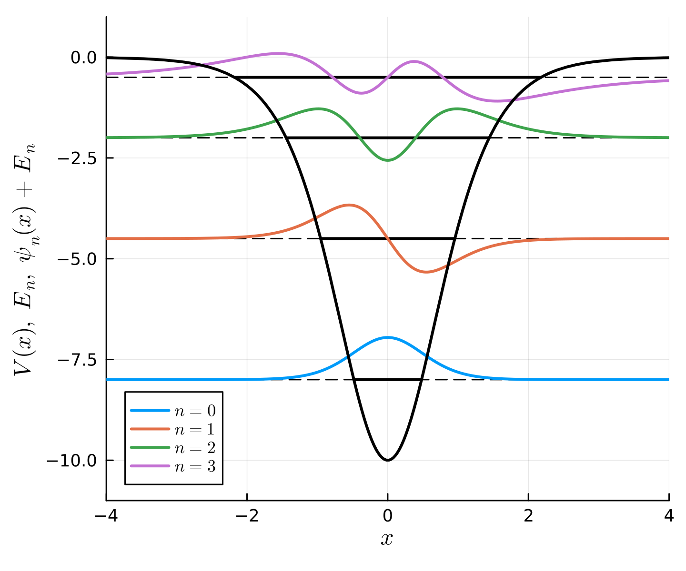

```@meta
CurrentModule = Antique
```

# Pöschl-Teller Potential

The Pöschl-Teller potential is one of the few potentials for which the quantum mechanical Schrödinger equation has an analytical solution. It has a finite number of bound states, which can be inferred easily from its potential strength parameter λ. It is defined for one-dimensional systems.

## Definitions

This model is described with the time-independent Schrödinger equation
```math
  \hat{H} \psi(x) = E \psi(x),
```
and the Hamiltonian
```math
  \hat{H} = - \frac{\hbar^2}{2 m} \frac{\mathrm{d}^2}{\mathrm{d}x ^2} - \frac{\hbar^2}{m x_0^2} \frac{\lambda(\lambda+1)}{2}  \frac{1}{\mathrm{cosh}(x/x_0)^2}.
```

After introducing the dimensionless variables
```math
  x' \equiv x/x_0,\qquad E' \equiv \frac{\hbar^2}{m x_0^2} E
```
the Schrödinger equation reduces to
```math
  \hat{H}' \psi(x') = E' \psi(x'),
```
with
```math
  \hat{H}' = - \frac{1}{2} \frac{\mathrm{d}^2}{\mathrm{d}x'^2} - \frac{\lambda(\lambda+1)}{2}  \frac{1}{\mathrm{cosh}(x')^2}.
```
Parameters are specified within the following struct.

#### Parameters
```@docs; canonical=false
Antique.PoschlTeller
```

#### Potential
```@docs; canonical=false
Antique.V(::PoschlTeller, ::Any)
```

#### Number of Bound States
```@docs; canonical=false
Antique.nmax(::PoschlTeller)
```

#### Eigen Values
```@docs; canonical=false
Antique.E(::PoschlTeller)
```

#### Eigen Functions
```@docs; canonical=false
Antique.ψ(::PoschlTeller, ::Any)
```

## Usage & Examples

[Install Antique.jl](@ref Install) for the first use and run `using Antique` before each use. The energy `E()`, wavefunction `ψ()`, potential `V()` and some other functions are suppoted. In this system, the model is generated by `PoschlTeller` and the parameters `λ`, `m`, `ℏ`, `x0`.

```julia
using Antique
PT = PoschlTeller(λ=4.0)
```


Parameters:

```julia
julia> PT.λ
4.0

julia> PT.m
1.0

julia> PT.ℏ
1.0

julia> PT.x0
1.0
```


Eigen values:

```julia
julia> E(PT,n=0)
-8.0

julia> E(PT,n=1)
-4.5

julia> E(PT,n=2)
-2.0

julia> E(PT,n=3)
-0.5
```


Wave functions:

```julia
λ = 4.0
PT = PoschlTeller(λ=λ)

using Plots
plot(xlim=(-4,4), ylim=(-11.0,1.0), xlabel="\$x/x_0\$", ylabel="\$V(x),~E_n,~\\psi_n(x)+E_n\$", size=(480,400), dpi=300)
for n in 0:3
  # classical turning point:
  xE = acosh(sqrt(λ*(λ+1)/abs(E(PT,n=n))/2))
  # energy
  hline!([E(PT, n=n)], lc=:black, ls=:dash, label="")
  plot!([-xE,xE], fill(E(PT, n=n),2), lc=:black, lw=2, label="")
  # wave function
  plot!(x -> E(PT, n=n) + ψ(PT, x,n=n), lc=n+1, lw=2, label="\$n = $n\$")
end
# potential
plot!(x -> V(PT, x), lc=:black, lw=2, label="")
```


Potential energy curve, Energy levels, Wave functions:

```julia
λ = 4.0
PT = PoschlTeller(λ=λ)

using Plots
plot(xlim=(-4,4), ylim=(-11.0,1.0), xlabel="\$x/x_0\$", ylabel="\$V(x),~E_n,~\\psi_n(x)+E_n\$", size=(480,400), dpi=300)
for n in 0:3
  # classical turning point:
  xE = acosh(sqrt(λ*(λ+1)/abs(E(PT,n=n))/2))
  # energy
  hline!([E(PT, n=n)], lc=:black, ls=:dash, label="")
  plot!([-xE,xE], fill(E(PT, n=n),2), lc=:black, lw=2, label="")
  # wave function
  plot!(x -> E(PT, n=n) + ψ(PT, x,n=n), lc=n+1, lw=2, label="\$n = $n\$")
end
# potential
plot!(x -> V(PT, x), lc=:black, lw=2, label="")
```




## Testing

Unit testing and Integration testing were done using numerical integration ([QuadGK.jl](https://juliamath.github.io/QuadGK.jl/stable/)). The test script is [here](https://github.com/ohno/Antique.jl/blob/main/test/PoschlTeller.jl).

#### Normalization & Orthogonality of $\psi_n(x)$

```math
\int \psi_i^\ast(x) \psi_j(x) \mathrm{d}x = \delta_{ij}
```

```
 i |  j |        analytical |         numerical 
-- | -- | ----------------- | ----------------- 
 0 |  0 |    1.000000000000 |    1.000000000000 ✔
 0 |  1 |    0.000000000000 |   -0.000000000000 ✔
 0 |  2 |    0.000000000000 |    0.000000000000 ✔
 0 |  3 |    0.000000000000 |    0.000000000000 ✔
 0 |  4 |    0.000000000000 |   -0.000000000000 ✔
 0 |  5 |    0.000000000000 |   -0.000000000000 ✔
 0 |  6 |    0.000000000000 |    0.000000000000 ✔
 0 |  7 |    0.000000000000 |   -0.000000000000 ✔
 0 |  8 |    0.000000000000 |   -0.000000000000 ✔
 0 |  9 |    0.000000000000 |    0.000000000000 ✔
 1 |  0 |    0.000000000000 |   -0.000000000000 ✔
 1 |  1 |    1.000000000000 |    1.000000000000 ✔
 1 |  2 |    0.000000000000 |   -0.000000000000 ✔
 1 |  3 |    0.000000000000 |    0.000000000000 ✔
 1 |  4 |    0.000000000000 |    0.000000000000 ✔
 1 |  5 |    0.000000000000 |   -0.000000000000 ✔
 1 |  6 |    0.000000000000 |   -0.000000000000 ✔
 1 |  7 |    0.000000000000 |    0.000000000000 ✔
 1 |  8 |    0.000000000000 |   -0.000000000000 ✔
 1 |  9 |    0.000000000000 |    0.000000000000 ✔
 2 |  0 |    0.000000000000 |    0.000000000000 ✔
 2 |  1 |    0.000000000000 |   -0.000000000000 ✔
 2 |  2 |    1.000000000000 |    1.000000000000 ✔
 2 |  3 |    0.000000000000 |    0.000000000000 ✔
 2 |  4 |    0.000000000000 |    0.000000000000 ✔
 2 |  5 |    0.000000000000 |   -0.000000000000 ✔
 2 |  6 |    0.000000000000 |   -0.000000000000 ✔
 2 |  7 |    0.000000000000 |    0.000000000000 ✔
 2 |  8 |    0.000000000000 |   -0.000000000000 ✔
 2 |  9 |    0.000000000000 |   -0.000000000000 ✔
 3 |  0 |    0.000000000000 |    0.000000000000 ✔
 3 |  1 |    0.000000000000 |    0.000000000000 ✔
 3 |  2 |    0.000000000000 |    0.000000000000 ✔
 3 |  3 |    1.000000000000 |    1.000000000000 ✔
 3 |  4 |    0.000000000000 |    0.000000000000 ✔
 3 |  5 |    0.000000000000 |    0.000000000000 ✔
 3 |  6 |    0.000000000000 |   -0.000000000000 ✔
 3 |  7 |    0.000000000000 |    0.000000000000 ✔
 3 |  8 |    0.000000000000 |    0.000000000000 ✔
 3 |  9 |    0.000000000000 |    0.000000000000 ✔
 4 |  0 |    0.000000000000 |   -0.000000000000 ✔
 4 |  1 |    0.000000000000 |    0.000000000000 ✔
 4 |  2 |    0.000000000000 |    0.000000000000 ✔
 4 |  3 |    0.000000000000 |    0.000000000000 ✔
 4 |  4 |    1.000000000000 |    0.999999999999 ✔
 4 |  5 |    0.000000000000 |   -0.000000000000 ✔
 4 |  6 |    0.000000000000 |    0.000000000000 ✔
 4 |  7 |    0.000000000000 |    0.000000000000 ✔
 4 |  8 |    0.000000000000 |    0.000000000000 ✔
 4 |  9 |    0.000000000000 |    0.000000000000 ✔
 5 |  0 |    0.000000000000 |   -0.000000000000 ✔
 5 |  1 |    0.000000000000 |   -0.000000000000 ✔
 5 |  2 |    0.000000000000 |   -0.000000000000 ✔
 5 |  3 |    0.000000000000 |    0.000000000000 ✔
 5 |  4 |    0.000000000000 |   -0.000000000000 ✔
 5 |  5 |    1.000000000000 |    1.000000000000 ✔
 5 |  6 |    0.000000000000 |   -0.000000000000 ✔
 5 |  7 |    0.000000000000 |   -0.000000000000 ✔
 5 |  8 |    0.000000000000 |    0.000000000000 ✔
 5 |  9 |    0.000000000000 |    0.000000000000 ✔
 6 |  0 |    0.000000000000 |    0.000000000000 ✔
 6 |  1 |    0.000000000000 |   -0.000000000000 ✔
 6 |  2 |    0.000000000000 |   -0.000000000000 ✔
 6 |  3 |    0.000000000000 |   -0.000000000000 ✔
 6 |  4 |    0.000000000000 |    0.000000000000 ✔
 6 |  5 |    0.000000000000 |   -0.000000000000 ✔
 6 |  6 |    1.000000000000 |    1.000000000000 ✔
 6 |  7 |    0.000000000000 |   -0.000000000000 ✔
 6 |  8 |    0.000000000000 |    0.000000000000 ✔
 6 |  9 |    0.000000000000 |   -0.000000000000 ✔
 7 |  0 |    0.000000000000 |   -0.000000000000 ✔
 7 |  1 |    0.000000000000 |    0.000000000000 ✔
 7 |  2 |    0.000000000000 |    0.000000000000 ✔
 7 |  3 |    0.000000000000 |    0.000000000000 ✔
 7 |  4 |    0.000000000000 |    0.000000000000 ✔
 7 |  5 |    0.000000000000 |   -0.000000000000 ✔
 7 |  6 |    0.000000000000 |   -0.000000000000 ✔
 7 |  7 |    1.000000000000 |    1.000000000000 ✔
 7 |  8 |    0.000000000000 |    0.000000000000 ✔
 7 |  9 |    0.000000000000 |    0.000000000000 ✔
 8 |  0 |    0.000000000000 |   -0.000000000000 ✔
 8 |  1 |    0.000000000000 |   -0.000000000000 ✔
 8 |  2 |    0.000000000000 |   -0.000000000000 ✔
 8 |  3 |    0.000000000000 |    0.000000000000 ✔
 8 |  4 |    0.000000000000 |    0.000000000000 ✔
 8 |  5 |    0.000000000000 |    0.000000000000 ✔
 8 |  6 |    0.000000000000 |    0.000000000000 ✔
 8 |  7 |    0.000000000000 |    0.000000000000 ✔
 8 |  8 |    1.000000000000 |    1.000000000000 ✔
 8 |  9 |    0.000000000000 |    0.000000000000 ✔
 9 |  0 |    0.000000000000 |    0.000000000000 ✔
 9 |  1 |    0.000000000000 |    0.000000000000 ✔
 9 |  2 |    0.000000000000 |   -0.000000000000 ✔
 9 |  3 |    0.000000000000 |    0.000000000000 ✔
 9 |  4 |    0.000000000000 |    0.000000000000 ✔
 9 |  5 |    0.000000000000 |    0.000000000000 ✔
 9 |  6 |    0.000000000000 |   -0.000000000000 ✔
 9 |  7 |    0.000000000000 |    0.000000000000 ✔
 9 |  8 |    0.000000000000 |    0.000000000000 ✔
 9 |  9 |    1.000000000000 |    1.000000000000 ✔

```
