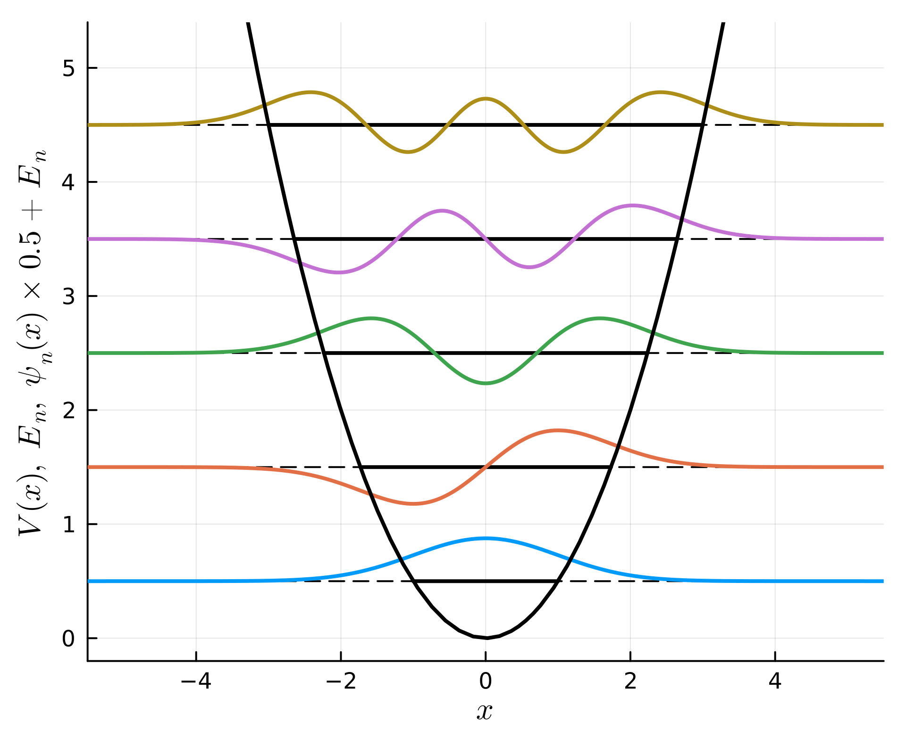

```@meta
CurrentModule = Antique
```

# Antique.jl

Self-contained, Well-Tested, Well-Documented **An**aly**ti**cal Solutions of **Qu**antum Mechanical **E**quations.

## Install

To install this package, run the following code in your Jupyter Notebook:

```julia
using Pkg; Pkg.add("Antique")
```

## Usage & Examples

[Install Antique.jl](@ref Install) for the first use and run `using Antique` before each use. The energy `E()`, wavefunction `ψ()`, potential `V()` and some other functions are suppoted. Here are examples in hydrogen-like atom. The analytical notation of energy (eigen value of the Hamiltonian) is written as

```math
E_n = -\frac{Z^2}{2n^2} E_\mathrm{h}.
```

Hydrogen atom has symbol $\mathrm{H}$ and atomic number 1 ($Z=1$). Therefore the ground state ($n=1$) energy is $-\frac{1}{2} E_\mathrm{h}$.

```julia
using Antique
H = HydrogenAtom(Z=1)
E(H)
# output> -0.5
```

Helium cation has symbol $\mathrm{He}^+$ and atomic number 2 ($Z=2$). Therefore the ground state ($n=1$) energy is $-2 E_\mathrm{h}$.

```julia
using Antique
He⁺ = HydrogenAtom(Z=2)
E(He⁺)
# output> -2.0
```

There are more examples on each model page.

## Supported Models

```@raw html
<div class="catalog">
  <div class="item">
    <a target="_blank" href="./InfinitePotentialWell">
      
    </a>
    <code>InfinitePotentialWell</code>
  </div>
  <div class="item">
    <a target="_blank" href="./HarmonicOscillator">
      
    </a>
    <code>HarmonicOscillator</code>
  </div>
  <div class="item">
    <a target="_blank" href="./MorsePotential">
      
    </a>
    <code>MorsePotential</code>
  </div>
  <div class="item">
    <a target="_blank" href="./HydrogenAtom">
      
    </a>
    <code>HydrogenAtom</code>
  </div>
</div>
```

## Future Works

[List of quantum-mechanical systems with analytical solutions](https://en.wikipedia.org/wiki/List_of_quantum-mechanical_systems_with_analytical_solutions)

## Acknowledgment

This package was named by [@KB-satou](https://github.com/KB-satou) and [@ultimatile](https://github.com/ultimatile).