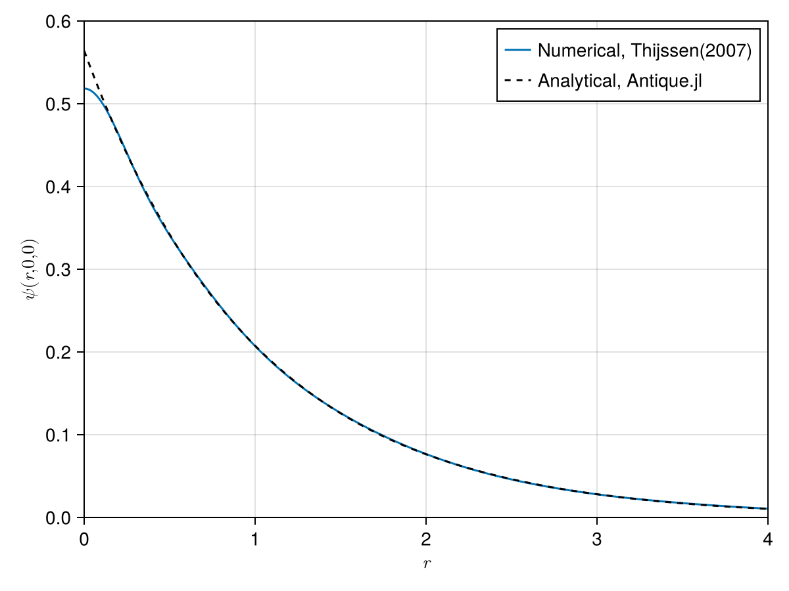

```@meta
CurrentModule = Antique
```

# Antique.jl

[](https://github.com/ohno/Antique.jl/actions/workflows/CI.yml?query=branch%3Amain) 
[](https://ohno.github.io/Antique.jl/stable/)
[](https://ohno.github.io/Antique.jl/dev/)

Antique.jl provides self-contained, well-tested, and well-documented implementations of **an**aly**ti**cal solutions to solvable **qu**antum m**e**chanical models. Analytical solutions are the most reliable benchmarks for software testing in the development of numerical methods. In addition to testing numerical methods, this package is useful for teaching quantum mechanics. We aim to support researchers, lecturers, students, and any person who is interested in quantum mechanics.

## Install

Run the following code on the REPL to install this package.

```julia
]add Antique@0.12.0
```

Or run `import Pkg; Pkg.add(; name="Antique", version="0.12.0")` to install on Jupyter Notebook. The version of this package can be found at `]status Antique` or `import Pkg; Pkg.status("Antique")`.

## Usage & Examples

[Install Antique.jl](@ref Install) for the first use and run `using Antique` before each use.

```julia
using Antique
```

The energy `E()`, the wave function `ψ()`, the potential `V()` and some other functions will be exported. There are two ways to avoid function name conflicts. Run `import Antique` instead of `using Antique`, and use the energy `Antique.E()`, the wave function `Antique.ψ()` and the potential `Antique.V()`. 
In the current version, one can access the Greek letters in the section [Greek Letters and Symbols](#greek-letters-and-symbols).
Or try giving other function names like `using Antique: V as potential, E as energy, ψ as wavefuntion, HydrogenAtom`.
Here we show two examples: (1) the infinite potential well, and (2) the hydrogen-like atom. There are more examples on each model page.


### (1) the infinite potential well

First, we demonstrate one of the simplest models: the infinite potential well. We choose `InfinitePotentialWell` as the model.  Then, we specify the model parameters as follows:

```julia
IPW = InfinitePotentialWell(L=1.0, m=1.0, ℏ=1.0)
```

We can access each parameter as follows:
```julia
IPW.L
# output> 1.0
IPW.m
# output> 1.0
IPW.ℏ
# output> 1.0
```

The eigenvalues 
```math
E_n = \frac{\hbar^2 n^2 \pi^2}{2 m L^2}
```
can be computed as follows:
```julia
E(IPW, n=1)
# output> 4.934802200544679
E(IPW, n=2)
# output> 19.739208802178716
```

One of the important features is the wave function 
```math
\psi_n(x) = \sqrt{\frac{2}{L}} \sin \frac{n\pi x}{L}
```
for different values of `n` and position `x`. We can plot the wave function as follows:

```julia
using CairoMakie

# settings
f = Figure()
ax = Axis(f[1,1], xlabel=L"$x$", ylabel=L"$\psi(x)$")

# plot
w1 = lines!(ax, 0..1, x -> ψ(IPW, x, n=1))
w2 = lines!(ax, 0..1, x -> ψ(IPW, x, n=2))
w3 = lines!(ax, 0..1, x -> ψ(IPW, x, n=3))
w4 = lines!(ax, 0..1, x -> ψ(IPW, x, n=4))
w5 = lines!(ax, 0..1, x -> ψ(IPW, x, n=5))

# legend
axislegend(ax, [w1, w2, w3, w4, w5], [L"n=1", L"n=2", L"n=3", L"n=4", L"n=5"], position=:lb)

f
```


### (2) the hydrogen-like atom

For the hydrogen atom, one need to choose `HydrogenAtom` model and the parameters can be set as 
```julia
H = HydrogenAtom(Z=1, mₑ=1.0, a₀=1.0, Eₕ=1.0, ℏ=1.0)
```
Or you can simply use
```julia
H = HydrogenAtom(Z=1)
```
The the other parameters use default value.
The Hydrogen atom has the symbol $\mathrm{H}$ and atomic number 1 ($Z=1$). 

The analytical notation of the energy (the eigen value of the Hamiltonian) is written as

```math
E_n = -\frac{Z^2}{2n^2} E_\mathrm{h}.
```
Therefore the ground state ($n=1$) energy is $-\frac{1}{2} E_\mathrm{h}$.

```julia
E(H, n=1)
# output> -0.5
```

The Helium cation has the symbol $\mathrm{He}^+$ and atomic number 2 ($Z=2$). Therefore the ground state ($n=1$) energy is $-2 E_\mathrm{h}$.

```julia
He⁺ = HydrogenAtom(Z=2)
E(He⁺, n=1)
# output> -2.0
```

One important application is plotting the radial wave function of the hydrogen atom:
```math
R_{nl}(r) = -\sqrt{\frac{(n-l-1)!}{2n(n+l)!} \left(\frac{2Z}{n a_0}\right)^3} \left(\frac{2Zr}{n a_0}\right)^l \exp \left(-\frac{Zr}{n a_0}\right) L_{n+l}^{2l+1} \left(\frac{2Zr}{n a_0}\right)
```
Details of this formula can be found on the **HydrogenAtom** model page.  
We can plot the radial probability density for several states using the following code:

```julia
using CairoMakie
using LaTeXStrings

# setting
f = Figure()
ax = Axis(f[1,1], xlabel=L"$r~/~a_0$", ylabel=L"$r^2|R_{nl}(r)|^2~/~a_0^{-1}$", limits=(0,20,0,0.58))

# plot
ws = []
ls = []
for n in 1:3
  for l in 0:n-1
    w = lines!(
        ax,
        0..20,
        r -> r^2 * Antique.R(H,r,n=n,l=l)^2,
        linewidth = 2,
        linestyle = [:solid,:dash,:dot,:dashdot,:dashdotdot][l+1],
        color = n,
        colormap = :tab10,
        colorrange = (1,10)
    )
    push!(ws, w)
    push!(ls, latexstring("n=$n, l=$l"))
  end
end

# legend
axislegend(ax, ws, ls, position=:rt)

f
```


## Greek Letters and Symbols

This section lists the Greek letters and symbols used in various models in this package. These symbols are sometimes not easily accessible, so we provide them here for convenience. You may copy them as needed to call the relevant functions or quantities.

| Symbol | Meaning |
|--------|---------|
| E | Energy |
| V | Potential |
| ψ | Wave function |
| ℏ | Planck constant |
| Eₕ | Hartree energy |
| λ | Potential strength |
| α | Potential strength / Exponent in generalized Laguerre polynomial |
| m | Particle mass / z-component of angular momentum (l) |
| m₁ | Mass of particle 1 |
| m₂ | Mass of particle 2 |
| mₑ | Electron mass |
| µ | Reduced mass |
| Dₑ | Well depth |
| L | Length of the box / Laguerre polynomial |
| l | Angular momentum quantum number |
| θ | Polar angle |
| φ | Azimuthal angle |
| k | Force constant / Exponent in associated Laguerre polynomial |
| n | Excitation level |
| nₘₐₓ | Maximum excitation level |
| Y | Spherical harmonics |
| P | Legendre polynomial |
| x | Position |
| x₀ | Characteristic length or dimension |
| r | Position vector |
| rₑ | Equilibrium bond distance |
| a₀ | Bohr radius |
| R | Distance |
| Z | Atomic number |
| z₁ | Charge of particle 1 |
| z₂ | Charge of particle 2 |


## Supported Models

```@raw html
<div class="catalog">
  <div class="item">
    <a target="_blank" href="./InfinitePotentialWell">
      
    </a>
    <code>InfinitePotentialWell</code>
  </div>
  <div class="item">
    <a target="_blank" href="./HarmonicOscillator">
      
    </a>
    <code>HarmonicOscillator</code>
  </div>
  <div class="item">
    <a target="_blank" href="./PoschlTeller">
      
    </a>
    <code>PoschlTeller</code>
  </div>
  <div class="item">
    <a target="_blank" href="./MorsePotential">
      
    </a>
    <code>MorsePotential</code>
  </div>
</div>
```

- [Delta Potential](https://ohno.github.io/Antique.jl/stable/DeltaPotential/) `DeltaPotential`
- [Infinite Potential Well](https://ohno.github.io/Antique.jl/stable/InfinitePotentialWell/) `InfinitePotentialWell`
- [Harmonic Oscillator](https://ohno.github.io/Antique.jl/stable/HarmonicOscillator/) `HarmonicOscillator`
- [PoschlTeller](https://ohno.github.io/Antique.jl/stable/PoschlTeller/) `PoschlTeller`
- [Morse Potential](https://ohno.github.io/Antique.jl/stable/MorsePotential/) `MorsePotential`
- [Rigid Rotor](https://ohno.github.io/Antique.jl/stable/RigidRotor/) `RigidRotor`
- [Infinite PotentialWell 3D](https://ohno.github.io/Antique.jl/stable/InfinitePotentialWell3D/) `InfinitePotentialWell3D`
- [Spherical Oscillator](https://ohno.github.io/Antique.jl/stable/SphericalOscillator/) `SphericalOscillator`
- [Hydrogen Atom](https://ohno.github.io/Antique.jl/stable/HydrogenAtom/) `HydrogenAtom`
- [Coulomb 2-Body System](https://ohno.github.io/Antique.jl/stable/HydrogenAtom/) `CoulombTwoBody`

## Demonstration

This is an example of a variational calculation for the hydrogen atom based on [Thijssen(2007)](https://doi.org/10.1017/CBO9781139171397). We check the accuracy of the numerical solution by comparison with the analytical solution. Comparing wave functions can be difficult, but Antique.jl makes it easy. You can extend it to excited states ($n>1$) as well as the ground state ($n=1$). Thus, Antique.jl is useful for testing numerical methods. We hope many numerical methods to be developed using Antique.jl.

```@example demonstration
# calculations based on Thijssen(2007) https://doi.org/10.1017/CBO9781139171397
using LinearAlgebra
α = [13.00773, 1.962079, 0.444529, 0.1219492] 
nₘₐₓ = length(α)
S = [(pi/(α[i]+α[j]))^(3/2) for i=1:nₘₐₓ, j=1:nₘₐₓ]
H = [3*pi^(3/2)*α[i]*α[j]/(α[i]+α[j])^(5/2) - 2*pi/(α[i]+α[j]) for i=1:nₘₐₓ, j=1:nₘₐₓ]
E, C = eigen(Symmetric(H),Symmetric(S))

# norm & energy
import Antique
HA = Antique.HydrogenAtom(Z=1, Eₕ=1.0, a₀=1.0, mₑ=1.0, ℏ=1.0)
println("Norm")
println("  numerical : ", transpose(C[:,1]) * S * C[:,1])
println("  analytical: ", 1)
println("Energy")
println("  numerical : ", E[1])
println("  analytical: ", Antique.E(HA,n=1))

# wave function
using CairoMakie
fig = Figure(size=(420,300), fontsize=11, backgroundcolor=:transparent)
axis = Axis(fig[1,1], xlabel=L"$r$", ylabel=L"$\psi(r,0,0)$", limits=(0,4,0,0.6), ylabelsize=16.5, xlabelsize=16.5)
lines!(axis, 0:0.01:10, r -> sum(C[:,1] .* exp.(-α*r^2)), label="Numerical, Thijssen(2007)")
lines!(axis, 0:0.01:10, r -> real(Antique.ψ(HA,r,0,0)), color=:black, linestyle=:dash, label="Analytical, Antique.jl")
axislegend(axis, position=:rt, framevisible=false)
fig
save("assets/fig/demonstration.png", fig) # hide
; # hide
```



## Future Works

The candidate models are listed on the Wikipedia page of [List of quantum-mechanical systems with analytical solutions](https://en.wikipedia.org/wiki/List_of_quantum-mechanical_systems_with_analytical_solutions). Please submit your requests and suggestions as [issues on GitHub](https://github.com/ohno/Antique.jl/issues).

## Developer's Guide

[Here](https://github.com/ohno/Antique.jl?tab=readme-ov-file#developers-guide) is the guideline for adding new models.

## Acknowledgment

Thanks to all contributors. This package was named by [@KB-satou](https://github.com/KB-satou) and [@ultimatile](https://github.com/ultimatile). [@MartinMikkelsen](https://github.com/MartinMikkelsen) contributed to writing docstrings. Special thanks to [@hyrodium](https://github.com/hyrodium) for his help with managing the documentation and advice on coding style. [@lhapp27](https://github.com/lhapp27) implemented 2 models, and [@ajarifi](https://github.com/ajarifi) implemented 3 models.
