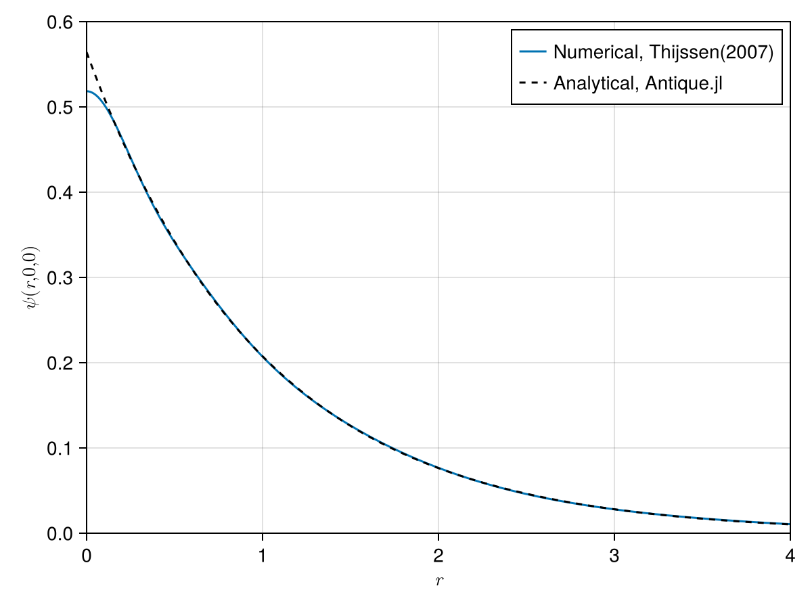

```@meta
CurrentModule = Antique
```

# Antique.jl

[](https://github.com/ohno/Antique.jl/actions/workflows/CI.yml?query=branch%3Amain) 
[](https://ohno.github.io/Antique.jl/stable/)
[](https://ohno.github.io/Antique.jl/dev/)

Antique.jl provides self-contained, well-tested, and well-documented implementations of **an**aly**ti**cal solutions to solvable **qu**antum m**e**chanical models. Analytical solutions serve as reliable test oracles for software testing in the development of numerical methods. In addition to testing numerical methods, this package is also useful for teaching quantum mechanics. We aim to support researchers, lecturers, students, and anyone interested in quantum mechanics.

## Install

Run the following code on the REPL to install this package.

```julia
]add Antique@0.15.0
```

Or run `import Pkg; Pkg.add(; name="Antique", version="0.15.0")` to install on Jupyter Notebook. The version of this package can be found at `]status Antique` or `import Pkg; Pkg.status("Antique")`.

## Usage & Examples

[Install Antique.jl](@ref Install) for the first use and run `using Antique` before each use.

```@example usage
using Antique
```

The three main functions are `energy(model; ...)` for the energy $E$, `potential(model, ...)` for the potential $V$, and `wavefunction(model, ...; ...)` for the wave function $\psi$. They are exported by `using Antique`. To avoid name conflicts, run `import Antique` and qualify them as `Antique.energy()`, `Antique.potential()`, and `Antique.wavefunction()`, or import only the names you need, for example `using Antique: potential, energy, wavefunction, HarmonicOscillator`.

First, create a [harmonic oscillator](@ref Harmonic-Oscillator) with unit force constant, mass, and reduced Planck constant.

```@example usage
HO = HarmonicOscillator(k=1.0, m=1.0, hbar=1.0)
; #hide
```

The model parameters can be accessed as properties.

```@repl usage
HO.k
HO.m
HO.hbar
```

Use [`energy`](@ref Harmonic-Oscillator-Potential) to calculate the energy of each state specified by the quantum number `n`.

```@repl usage
energy(HO, n=0)
energy(HO, n=1)
energy(HO, n=2)
```

Use [`potential`](@ref Harmonic-Oscillator-Eigenvalues) to evaluate the harmonic potential at a position `x`.

```@repl usage
potential(HO, 0.0)
potential(HO, 1.0)
potential(HO, 2.0)
```

Use [`wavefunction`](@ref Harmonic-Oscillator-Eigenfunctions) to evaluate a wave function for a state `n` at a position `x`.

```@repl usage
wavefunction(HO, 0.0, n=0)
wavefunction(HO, 0.0, n=1)
wavefunction(HO, 1.0, n=1)
wavefunction(HO, 100.0, n=1)
```

There are more examples on each model page.

## Supported Models

```@raw html
<div class="catalog">
  <div class="item">
    <a target="_blank" href="./InfinitePotentialWell">
      
    </a>
    <code>InfinitePotentialWell</code>
  </div>
  <div class="item">
    <a target="_blank" href="./HarmonicOscillator">
      
    </a>
    <code>HarmonicOscillator</code>
  </div>
  <div class="item">
    <a target="_blank" href="./PoschlTeller">
      
    </a>
    <code>PoschlTeller</code>
  </div>
  <div class="item">
    <a target="_blank" href="./MorsePotential">
      
    </a>
    <code>MorsePotential</code>
  </div>
</div>
```

- [Delta Potential](https://ohno.github.io/Antique.jl/stable/DeltaPotential/) `DeltaPotential`
- [Infinite Potential Well](https://ohno.github.io/Antique.jl/stable/InfinitePotentialWell/) `InfinitePotentialWell`
- [Harmonic Oscillator](https://ohno.github.io/Antique.jl/stable/HarmonicOscillator/) `HarmonicOscillator`
- [PoschlTeller](https://ohno.github.io/Antique.jl/stable/PoschlTeller/) `PoschlTeller`
- [Morse Potential](https://ohno.github.io/Antique.jl/stable/MorsePotential/) `MorsePotential`
- [Rigid Rotor](https://ohno.github.io/Antique.jl/stable/RigidRotor/) `RigidRotor`
- [Infinite PotentialWell 3D](https://ohno.github.io/Antique.jl/stable/InfinitePotentialWell3D/) `InfinitePotentialWell3D`
- [Spherical Oscillator](https://ohno.github.io/Antique.jl/stable/SphericalOscillator/) `SphericalOscillator`
- [Hydrogen Atom](https://ohno.github.io/Antique.jl/stable/HydrogenAtom/) `HydrogenAtom`
- [Coulomb 2-Body System](https://ohno.github.io/Antique.jl/stable/HydrogenAtom/) `CoulombTwoBody`

## Demonstration

This is an example of a variational calculation for the hydrogen atom based on [Thijssen(2007)](https://doi.org/10.1017/CBO9781139171397). We check the accuracy of the numerical solution by comparison with the analytical solution. Comparing wave functions can be difficult, but Antique.jl makes it easy. You can extend it to excited states ($n>1$) as well as the ground state ($n=1$). Thus, Antique.jl is useful for testing numerical methods. We hope many numerical methods to be developed using Antique.jl.

```@example demonstration
# calculations based on Thijssen(2007) https://doi.org/10.1017/CBO9781139171397
using LinearAlgebra
α = [13.00773, 1.962079, 0.444529, 0.1219492] 
nₘₐₓ = length(α)
S = [(pi/(α[i]+α[j]))^(3/2) for i=1:nₘₐₓ, j=1:nₘₐₓ]
H = [3*pi^(3/2)*α[i]*α[j]/(α[i]+α[j])^(5/2) - 2*pi/(α[i]+α[j]) for i=1:nₘₐₓ, j=1:nₘₐₓ]
E, C = eigen(Symmetric(H),Symmetric(S))

# norm & energy
import Antique
HA = Antique.HydrogenAtom(Z=1, E_h=1.0, a_0=1.0, m_e=1.0, hbar=1.0)
println("Norm")
println("  numerical : ", transpose(C[:,1]) * S * C[:,1])
println("  analytical: ", 1)
println("Energy")
println("  numerical : ", E[1])
println("  analytical: ", Antique.energy(HA,n=1))

# wave function
using CairoMakie
fig = Figure(size=(420,300), fontsize=11, backgroundcolor=:transparent)
axis = Axis(fig[1,1], xlabel=L"$r$", ylabel=L"$\psi(r,0,0)$", limits=(0,4,0,0.6), ylabelsize=16.5, xlabelsize=16.5)
lines!(axis, 0:0.01:10, r -> sum(C[:,1] .* exp.(-α*r^2)), label="Numerical, Thijssen(2007)")
lines!(axis, 0:0.01:10, r -> real(Antique.wavefunction(HA,r,0,0)), color=:black, linestyle=:dash, label="Analytical, Antique.jl")
axislegend(axis, position=:rt, framevisible=false)
fig
save("assets/fig/demonstration.png", fig) # hide
; # hide
```



## Future Works

The candidate models are listed on the Wikipedia page of [List of quantum-mechanical systems with analytical solutions](https://en.wikipedia.org/wiki/List_of_quantum-mechanical_systems_with_analytical_solutions). Please submit your requests and suggestions as [issues on GitHub](https://github.com/ohno/Antique.jl/issues).

## Developer Guide

[Here](@ref developer-guide) is the guideline for adding new models.

## Citation

Use [CITATION.bib](https://github.com/ohno/Antique.jl/blob/main/CITATION.bib) to cite this package.

```@example
println(Base.read("../../CITATION.bib", String)) # hide
```

## Acknowledgment

Thanks to all contributors. This package was named by [@KB-satou](https://github.com/KB-satou) and [@ultimatile](https://github.com/ultimatile). [@MartinMikkelsen](https://github.com/MartinMikkelsen) contributed to writing docstrings. Special thanks to [@hyrodium](https://github.com/hyrodium) for his help with managing the documentation and advice on coding style. [@lhapp27](https://github.com/lhapp27) implemented 2 models, and [@ajarifi](https://github.com/ajarifi) implemented 3 models.
